# FileViewer Smooth Sidebar Resize Blueprint

## Problem

The FileViewer sidebar toggle must resize the document smoothly.

The desired motion is:

- smooth
- linear
- no back and forth
- no visual freeze
- native to FileViewer, not tied to PDF
- as much HTML/CSS as possible
- no renderer-specific DOM measurement loop driving the visible transition

The previous stable-rail attempt solved the wrong problem. It made the document stop resizing. The product requirement is the opposite: the document should resize, but it should resize on the same visual clock as the sidebar.

## Measurement Context

Measured page:

```text
http://localhost:3100/files
```

Measured viewport:

```text
1980 x 1280
```

Measured showcase state:

```text
FileViewer root width:      718px
Header height:              40px
Body width:                718px
Body height:               718px
Sidebar width expanded:    128px
Surface width expanded:    590px
Surface width collapsed:   718px
PDF document expanded:     590px
PDF document collapsed:    718px in live simulation
```

Important DOM slots in the current showcase:

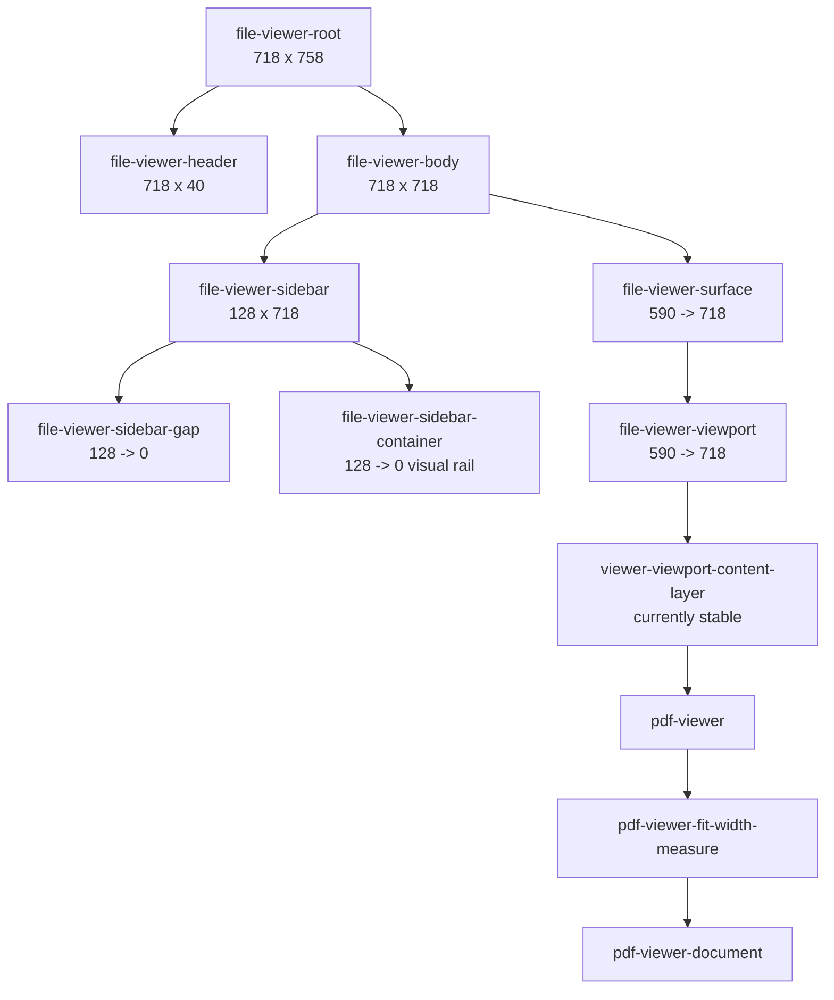

## Current Measured Behavior

### Stable Rail Behavior

The stable rail keeps the document fixed while the sidebar animates.

```text
expanded:
gap       128
surface x 511
surface w 590
document x 511
document w 590
document right 1101

collapsed:
gap       0
surface x 383
surface w 718
document x 511
document w 590
document right 1101
```

Diagram:

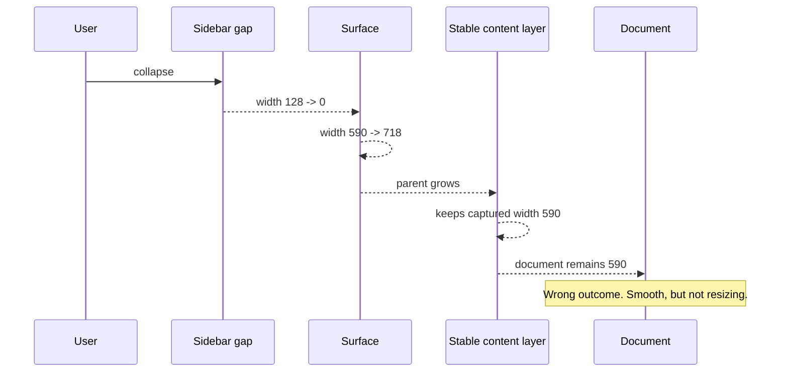

This is not acceptable because the document does not resize.

### Simulated Live Behavior

When the stable layer is removed and the document is allowed to follow the surface, collapse mostly tracks correctly.

```text
collapse at about 100ms:
gap       85.33
surface x 468.33
surface w 632.67
document x 468.33
document w 632.67
document right 1101
```

But expand reveals the problem.

```text
expand at about 109ms:
gap       64.08
surface x 447.08
surface w 653.92
document x 447.08
document w 665.00
document right 1112.08
```

The document is wider than the surface by about `11px` mid-transition. That is the visible overshoot. It happens because layout has already changed, but the renderer-derived document width is still catching up.

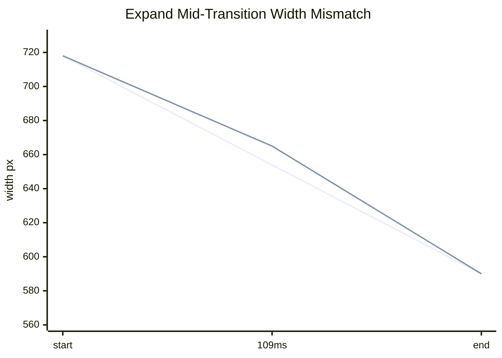

The mismatch is small numerically, but visually it is exactly the back-and-forth: the surface moves first, the document scale catches up later.

## Root Cause

There are currently three clocks:

1. CSS animates sidebar width.
2. ResizeObserver measures the viewport.
3. React/PDF computes a new fit-width scale and commits document dimensions.

Those clocks do not commit on the same frame.

```mermaid
flowchart LR
  Toggle["toggle sidebar"] --> Css["CSS transition<br/>sidebar width"]
  Css --> Layout["browser layout<br/>surface width changes now"]
  Layout --> Observer["ResizeObserver<br/>read viewport width"]
  Observer --> Raf["requestAnimationFrame<br/>throttled update"]
  Raf --> React["React state commit"]
  React --> Scale["PDF fit-width scale"]
  Scale --> Doc["document width"]

  Layout -. already visible .-> Screen["screen"]
  Doc -. one or more frames later .-> Screen

  Screen --> Jag["jagged resize<br/>overshoot or correction"]
```

The current PDF fit path is:

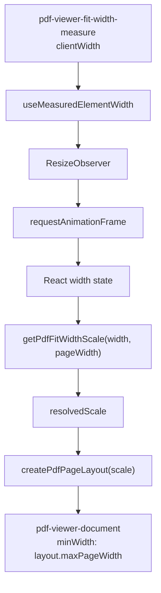

That is correct for steady-state fit-width, but wrong as the visual resize driver during a 200ms chrome transition.

## Required Mental Model

There must be one visual clock.

The sidebar width is the clock. Everything visible must be a deterministic function of that same clock.

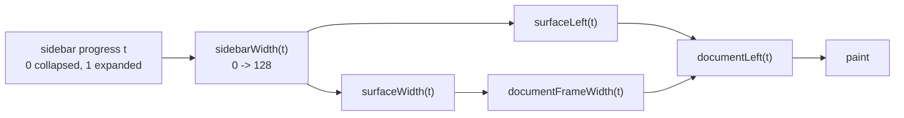

No visible geometry should depend on this path during the transition:

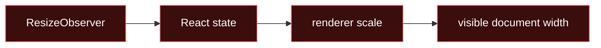

ResizeObserver can still exist, but it must be for settled renderer quality, virtualization, scroll anchoring, or controls. It cannot be the authoritative animation driver.

## Pure HTML/CSS Constraint System

The FileViewer body should be a simple layout equation.

```text
bodyWidth = constant during toggle
sidebarWidth(t) = 0..sidebarWidth
surfaceWidth(t) = bodyWidth - sidebarWidth(t)
surfaceRight = bodyRight
documentFrameWidth(t) = min(surfaceWidth(t), documentMaxWidth)
documentRight = surfaceRight
documentLeft(t) = documentRight - documentFrameWidth(t)
```

Diagram:

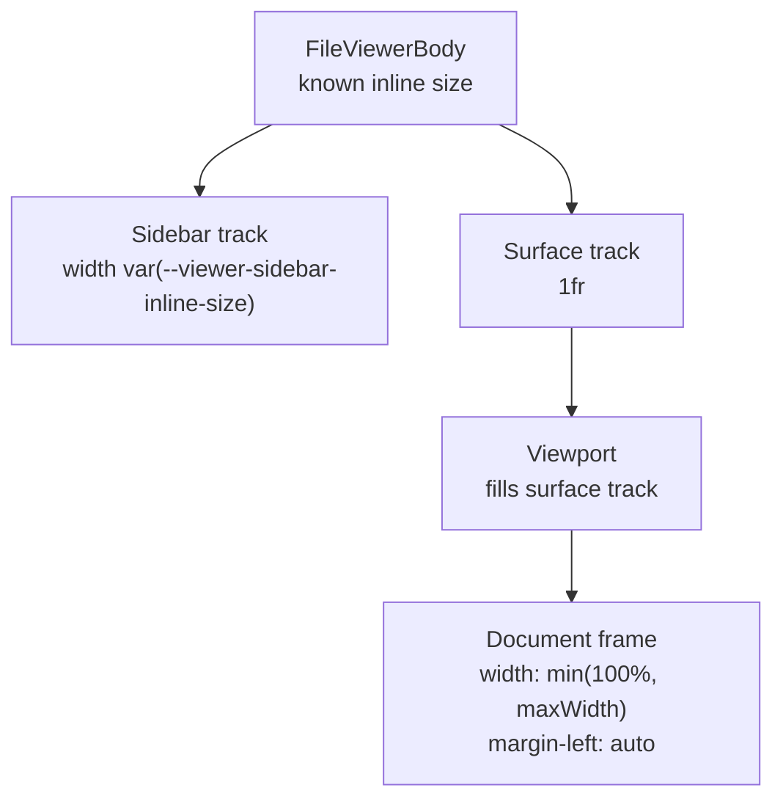

The layout should behave like this:

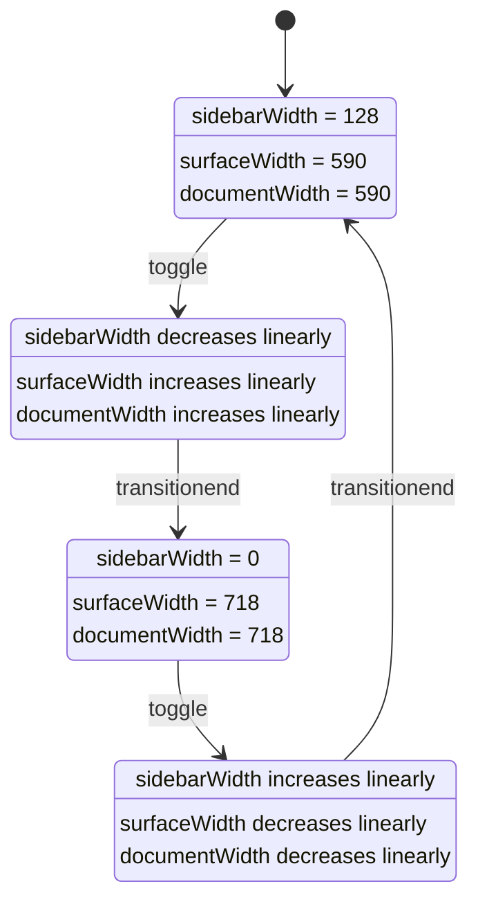

## Native FileViewer Contract

This should be a FileViewer primitive, not a PDF-specific patch.

The native contract:

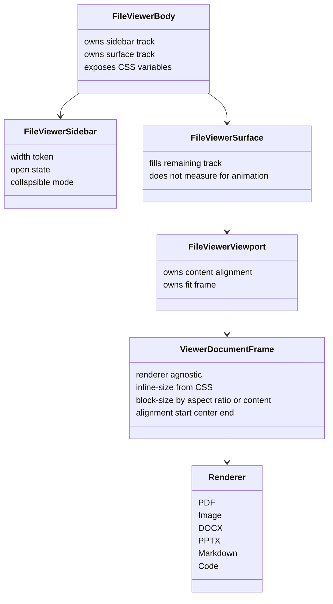

Renderer responsibilities:

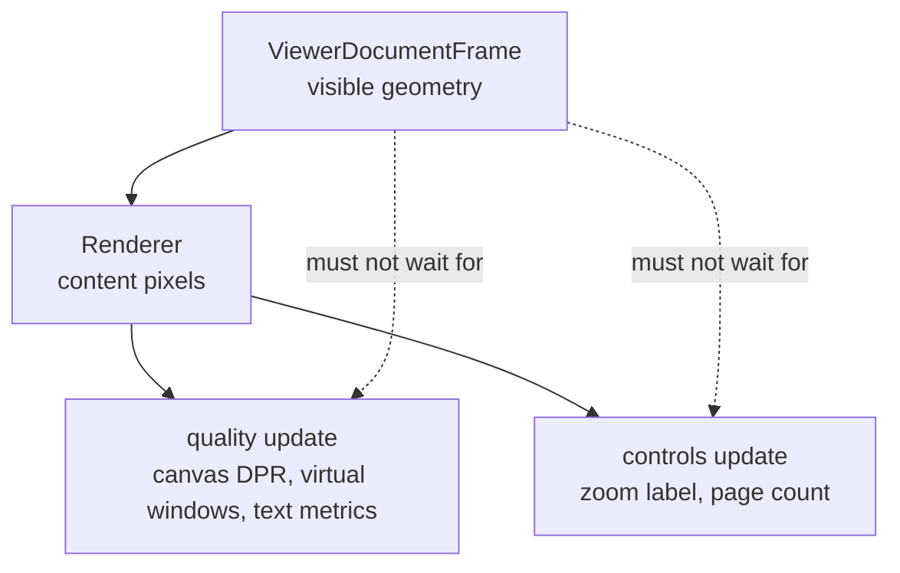

The visible frame may resize immediately. The renderer can render sharper pixels after. This is the same separation browsers use for responsive images and canvases: layout first, high-quality backing store second.

## Correct Ownership Boundaries

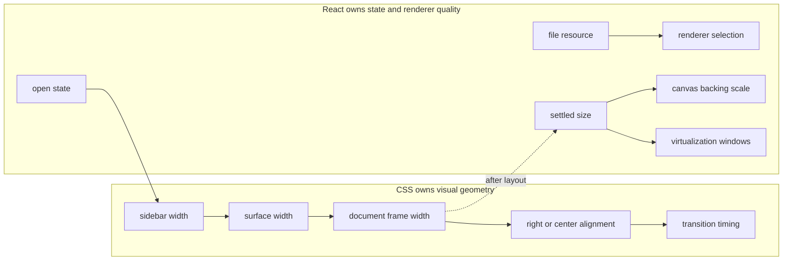

If React owns the visible width, smoothness depends on React commit timing. If CSS owns the visible width, smoothness depends on the browser layout engine.

## Bad Designs To Avoid

### Bad: freeze document width

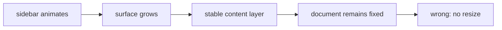

### Bad: two animations fight

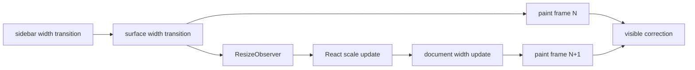

### Bad: animate transform scale as the source of truth

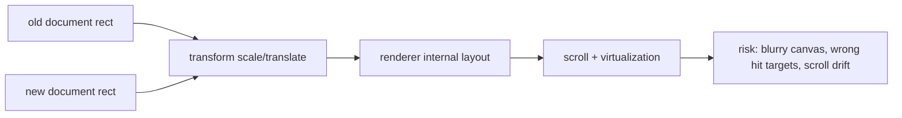

Transform-based FLIP can hide one jump, but it does not fix ownership. It also makes scroll, selection, canvas rasterization, and hit testing harder.

## Preferred Design

Use a native `ViewerDocumentFrame` style primitive.

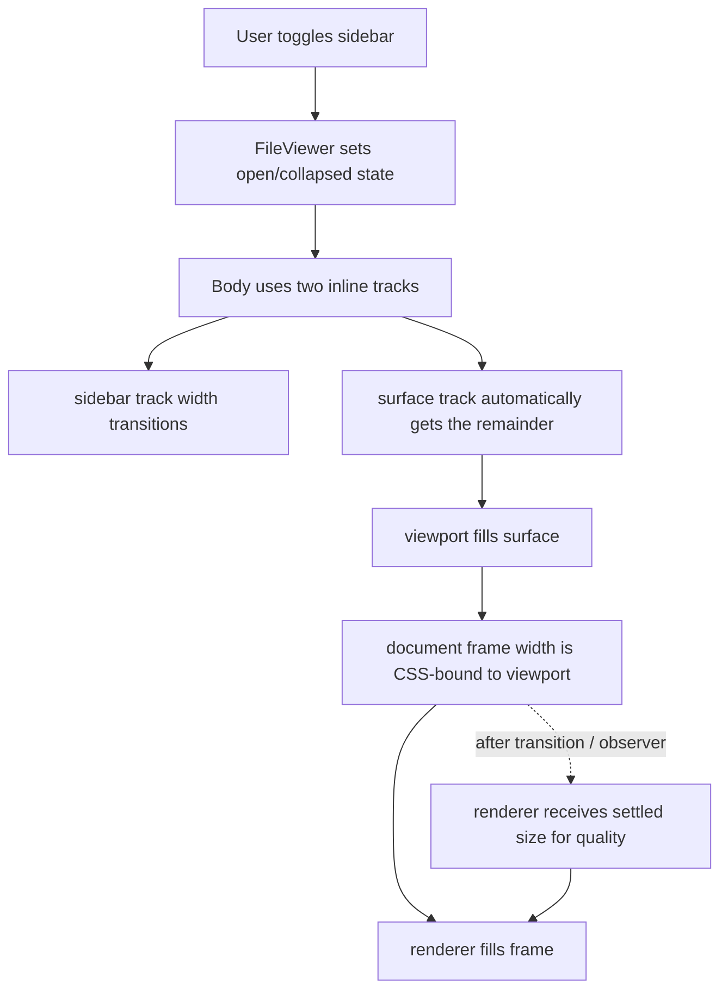

Important detail: the document frame is the thing that resizes smoothly. PDF layout scale should not be the thing that visually resizes the outer frame during sidebar motion.

For PDF specifically:

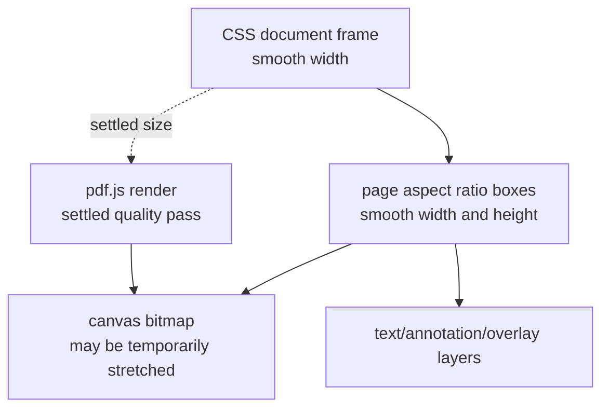

The frame can resize at 60fps. The canvas can rerender at the final or throttled size. During the 200ms transition, a slight temporary raster stretch is preferable to layout jitter.

## Families Of Approaches

There is not only one valid approach. There are several families. They differ by who owns visible geometry, when measurements happen, and whether the animation is real layout or a visual compensation layer.

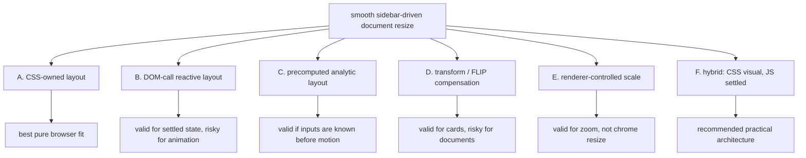

### Family A: CSS-Owned Layout

CSS owns the visual geometry. React only flips state, classes, or custom properties.

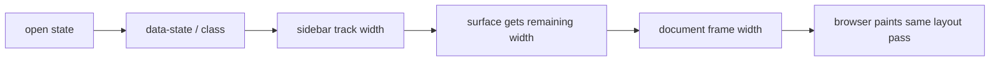

Characteristics:

- one visual clock
- no per-frame JavaScript
- no `getBoundingClientRect` loop
- no `ResizeObserver` dependency for visible width
- best match for a pure HTML/CSS mindset

This is valid when the visible document frame can be expressed from layout constraints:

```text
documentWidth = min(availableInlineSize, maxDocumentInlineSize)
```

This family is the cleanest when the browser can compute the relation directly through grid, flex, container queries, percentages, max sizes, and aspect ratios.

### Family B: DOM-Call Reactive Layout

The DOM is measured, then React or renderer state updates geometry.

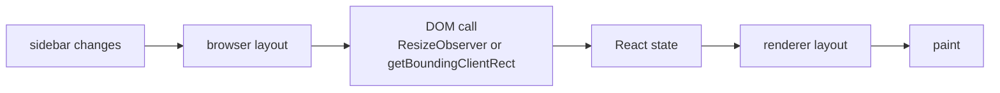

This is the current PDF fit-width family.

It is valid for:

- initial mount
- settled resize
- window resize
- measuring unknown content
- updating toolbar metadata
- rerendering canvas at better resolution
- virtualization bookkeeping

It is weak for sidebar animation because it has two clocks:

```mermaid
sequenceDiagram
  participant CSS
  participant Browser
  participant RO as ResizeObserver
  participant React
  participant Renderer

  CSS->>Browser: surface width changes now
  Browser->>Browser: paint can happen now
  Browser->>RO: notify size changed
  RO->>React: schedule width state
  React->>Renderer: compute new scale
  Renderer->>Browser: commit document width later
```

This family produced the measured overshoot:

```text
surface width:  653.92
document width: 665.00
overshoot:       11.08
```

The conclusion is not "never use DOM calls." The conclusion is "do not make DOM calls the authoritative visual animation path."

### Family C: Precomputed Analytic Layout

The transition path is computed before the motion starts. During the animation, CSS consumes known numbers.

```mermaid
flowchart LR
  Inputs["known inputs<br/>body width, sidebar width, padding, aspect ratio"]
  Compute["compute start/end geometry"]
  Vars["write CSS vars"]
  Animate["CSS animates deterministic path"]
  Paint["paint"]

  Inputs --> Compute
  Compute --> Vars
  Vars --> Animate
  Animate --> Paint
```

This is the "pretext-style" family: avoid discovering layout during the motion. Treat layout as data with a contract.

There are two subfamilies.

#### C1: CSS-Precomputed

No JavaScript measurement is needed because CSS already has all inputs through the layout tree.

```mermaid
flowchart LR
  SidebarVar["--sidebar-width"] --> Grid["grid/flex track"]
  Grid --> Container["container inline size"]
  Container --> Frame["frame width: min(100%, max)"]
```

This is basically Family A.

#### C2: JS-Precomputed

One measurement can happen before the animation starts. Then the animation runs from fixed variables, not from repeated measurement.

```mermaid
sequenceDiagram
  participant User
  participant JS
  participant CSS
  participant Browser

  User->>JS: click toggle
  JS->>JS: read one stable root rect
  JS->>JS: compute start/end widths
  JS->>CSS: set start/end CSS variables
  CSS->>Browser: animate with no more reads
```

This is valid if:

- all relevant inputs are known at click time
- the root does not resize from another cause during the 200ms motion
- the renderer can visually follow CSS variables

It is more deterministic than a DOM-call feedback loop, but less pure than CSS-owned layout.

### Family D: Transform / FLIP Compensation

Measure old and new geometry, then animate a transform that visually bridges them.

```mermaid
flowchart LR
  First["First rect"] --> Invert["invert delta"]
  Last["Last rect"] --> Invert
  Invert --> Transform["apply transform"]
  Transform --> Play["animate transform to none"]
```

This is valid for:

- cards
- menus
- simple panels
- layout transitions where content is not deeply interactive

It is risky for FileViewer documents:

- canvas can blur while scaled
- PDF text selection and overlays can drift
- scroll metrics do not match visual pixels
- sticky and virtualized layers become harder to reason about
- it can hide a jump without fixing ownership

This family is a patch, not the ideal FileViewer primitive.

### Family E: Renderer-Controlled Scale

The renderer receives a scale value and derives document geometry from it.

```mermaid
flowchart LR
  ViewportWidth["viewport width"] --> Scale["renderer scale"]
  Scale --> Layout["renderer layout"]
  Layout --> Document["document width"]
```

This is valid for user zoom:

```text
zoom in
zoom out
fit width
fixed 100%
```

It is not ideal for sidebar chrome motion, because chrome animation is a layout problem, not a document-rendering state problem.

The PDF viewer currently conflates:

```mermaid
flowchart TB
  Scale["resolvedScale"] --> Visual["visible document width"]
  Scale --> Scroll["scroll height and virtualization"]
  Scale --> Raster["canvas raster quality"]
  Scale --> Controls["toolbar zoom label"]
```

For smooth chrome resize, these should split:

```mermaid
flowchart TB
  CSSFrame["CSS visual frame"] --> Visual["visible document width"]
  SettledSize["settled measured size"] --> Raster["canvas raster quality"]
  SettledSize --> Scroll["virtualization bookkeeping"]
  UserScale["user zoom state"] --> Controls["toolbar zoom label"]
```

### Family F: Hybrid CSS Visual, JS Settled

This is the recommended practical architecture.

```mermaid
flowchart LR
  CSS["CSS owns visual geometry"] --> Smooth["smooth resize"]
  Smooth --> Settled["settled frame size"]
  Settled --> JS["JS updates renderer quality"]
  JS --> Sharp["sharp final render"]
```

It combines the strengths:

- CSS gives smooth, linear, browser-native motion.
- JS still handles PDF quality, virtualization, controls, and unknown content after the layout is stable enough.
- DOM calls are allowed, but not as the visual clock.

The ownership boundary is:

```mermaid
flowchart TB
  subgraph DuringMotion["during sidebar motion"]
    CSSMotion["CSS layout and frame sizing"]
  end

  subgraph AfterOrAlongside["after or alongside motion"]
    DOMRead["ResizeObserver / settled reads"]
    Quality["canvas quality"]
    Virtualization["virtual windows"]
    Controls["control labels"]
  end

  CSSMotion --> DOMRead
  DOMRead --> Quality
  DOMRead --> Virtualization
  DOMRead --> Controls
```

## Alternative Designs

### Option A: Pure CSS Frame, Settled Renderer Quality

```mermaid
flowchart LR
  CSS["CSS frame width"] --> Smooth["smooth visible resize"]
  Smooth --> Settled["settled size event"]
  Settled --> Renderer["renderer rerenders quality"]
```

Pros:

- most native
- one visual clock
- FileViewer-wide primitive
- no sidebar-specific PDF hack
- smooth by construction

Cons:

- PDF canvas can be briefly stretched during transition
- renderer internals need a clean distinction between visual frame size and raster quality size

This is the preferred option.

### Option B: Numeric CSS Variable Drives Both Sidebar And Scale

```mermaid
flowchart LR
  Progress["--viewer-sidebar-progress"] --> Sidebar["sidebar width"]
  Progress --> Surface["surface width calc"]
  Progress --> Scale["document transform scale"]
```

Pros:

- one declared progress value
- can keep exact mathematical sync

Cons:

- CSS cannot generally compute PDF page layout internals
- transform scale risks blur and hit-test mismatch
- still not truly renderer-native

This is acceptable only as a visual shim, not as the core primitive.

### Option C: JS Animation Loop

```mermaid
flowchart LR
  Raf["requestAnimationFrame"] --> Measure["measure"]
  Measure --> SetState["set React state"]
  SetState --> Render["render PDF scale"]
  Render --> Raf
```

Pros:

- precise custom control

Cons:

- not pure HTML/CSS
- expensive
- easy to drift with React scheduling
- worst option for this problem

This should be rejected.

## Proposed Public Concepts

The primitive should express intent, not implementation hacks.

```mermaid
flowchart TB
  FileViewerViewport["FileViewerViewport"]
  FitFrame["ViewerDocumentFrame"]
  Props["fit = inline<br/>align = end<br/>maxInlineSize<br/>aspectRatio optional"]
  RendererChild["renderer child"]

  FileViewerViewport --> FitFrame
  FitFrame --> Props
  FitFrame --> RendererChild
```

Potential API shape conceptually:

```text
FileViewerViewport
  ViewerDocumentFrame fit="inline" align="end" maxInlineSize="..."
    PdfViewerPages
```

This is not a PDF API. PDF is just one child.

## Detailed Layout Equation

Expanded:

```mermaid
flowchart LR
  Body["body 718"] --> Sidebar["sidebar 128"]
  Body --> Surface["surface 590"]
  Surface --> Document["document 590"]
```

Collapsed:

```mermaid
flowchart LR
  Body["body 718"] --> Sidebar["sidebar 0"]
  Body --> Surface["surface 718"]
  Surface --> Document["document 718"]
```

Mid-transition:

```mermaid
flowchart LR
  Body["body 718"] --> Sidebar["sidebar 64"]
  Body --> Surface["surface 654"]
  Surface --> Document["document 654"]
```

The critical invariant:

```text
documentWidth(t) === surfaceWidth(t)
```

or if max width is reached:

```text
documentWidth(t) === min(surfaceWidth(t), documentMaxWidth)
```

The document must never be wider than the surface mid-transition unless deliberate overflow is part of the design.

## Acceptance Measurements

During collapse:

```text
gap width:        128 -> 0
surface width:    590 -> 718
document width:   590 -> 718
document right:   constant if align=end
overshoot:        0px
```

During expand:

```text
gap width:        0 -> 128
surface width:    718 -> 590
document width:   718 -> 590
document right:   constant if align=end
overshoot:        0px
```

Frame sampler invariant:

```mermaid
flowchart TB
  Sample["for each animation frame"]
  ReadGap["read sidebar gap width"]
  ReadSurface["read surface rect"]
  ReadDoc["read document frame rect"]
  Check1["abs(doc.width - min(surface.width, maxWidth)) <= 1"]
  Check2["doc.right remains monotonic or fixed by alignment"]
  Check3["doc.width monotonic in expected direction"]

  Sample --> ReadGap
  Sample --> ReadSurface
  Sample --> ReadDoc
  ReadDoc --> Check1
  ReadDoc --> Check2
  ReadDoc --> Check3
```

The current simulated-live expand failed this invariant:

```text
surface width:  653.92
document width: 665.00
overshoot:       11.08
```

## Implementation Order

Do not start by patching PDF scale. Start by making the geometry owner correct.

```mermaid
flowchart TB
  Step1["1. Remove stable content rail from showcase"]
  Step2["2. Add renderer-agnostic document frame primitive"]
  Step3["3. Make frame width pure CSS from viewport"]
  Step4["4. Align frame with CSS, likely end for this showcase"]
  Step5["5. Let PDF fill frame visually"]
  Step6["6. Move PDF canvas quality update to settled measurement"]
  Step7["7. Verify with frame-by-frame geometry sampler"]

  Step1 --> Step2
  Step2 --> Step3
  Step3 --> Step4
  Step4 --> Step5
  Step5 --> Step6
  Step6 --> Step7
```

## Verification Plan

Use the browser to sample every animation frame after clicking the sidebar trigger.

```mermaid
sequenceDiagram
  participant Test
  participant Browser
  participant Sidebar
  participant Surface
  participant Doc

  Test->>Browser: open /files
  Test->>Sidebar: click toggle
  loop every requestAnimationFrame for 420ms
    Test->>Sidebar: read gap rect
    Test->>Surface: read surface rect
    Test->>Doc: read document frame rect
    Test->>Test: assert monotonic widths
    Test->>Test: assert no overshoot
  end
```

Assertions:

```text
collapse:
gap width decreases monotonically
surface width increases monotonically
document frame width increases monotonically
document frame width <= surface width + 1

expand:
gap width increases monotonically
surface width decreases monotonically
document frame width decreases monotonically
document frame width <= surface width + 1

both:
no direction reversal
no delayed snap after transitionend
no document right-edge overshoot
no renderer-specific sidebar special case
```

## Final Call

The right call is not to freeze the file and not to chase the sidebar with React measurements.

The right call is:

```mermaid
flowchart LR
  CSS["CSS owns visual resize"] --> Smooth["smooth file resize"]
  React["React owns settled renderer work"] --> Sharp["sharp final render"]
  CSS --> React
```

The FileViewer primitive should expose a renderer-agnostic document frame. The frame resizes with CSS because it belongs to layout. PDF, image, DOCX, PPTX, markdown, code, and text renderers then adapt inside that frame. If they need expensive measuring or raster rerendering, they do it after or alongside the transition, but never as the source of visible geometry.
