# Markdown Viewer FileViewer Geometry Perfect Design

## Verdict

The Markdown engine is strong, but the FileViewer integration is not yet the
platonic design.

The engine already has the right internal ideas:

- async document parsing
- precomputed chunk geometry
- measured-height correction
- inverse-sticky virtualization
- bounded rich block rendering
- native-find indexing

The flaw is at the shell boundary. Markdown still derives layout width from its
own live `ResizeObserver` during parent geometry changes. That makes Markdown a
private layout island inside a FileViewer shell that now has a shared chrome
motion contract.

The perfect design is not a new Markdown renderer. It is a sharper geometry
contract:

> FileViewer owns chrome geometry. Markdown owns document geometry. During
> chrome motion, Markdown freezes logical layout and lets FileViewer visually
> transform the registered document surface.

## Current Runtime

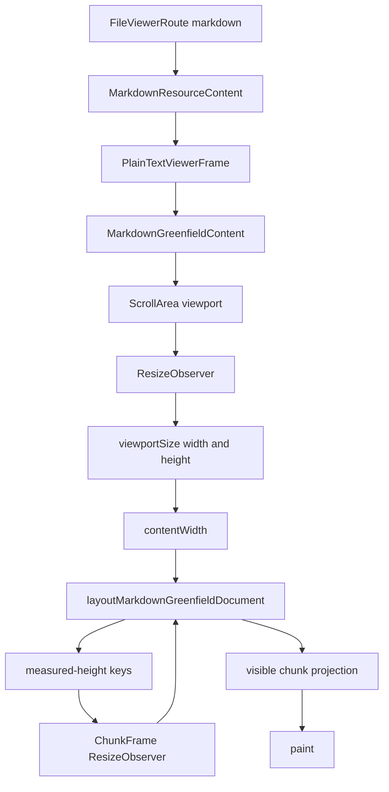

This is locally coherent. The problem appears when the parent shell changes
width.

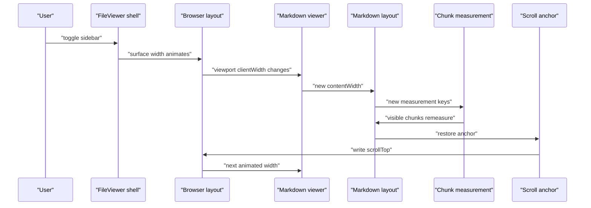

The renderer is doing high-quality work at the wrong time. A sidebar animation
should not invalidate Markdown's logical document model every frame.

## Root Smell

There are two geometry owners.

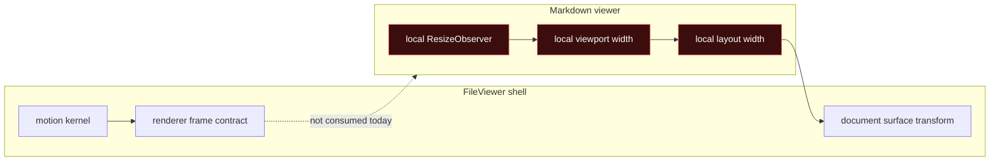

This is the same class of bug that made PDF, DOCX, image, text, and PPTX feel
unstable before they moved to the shared renderer-frame contract.

## Iteration 1: Add Overscan

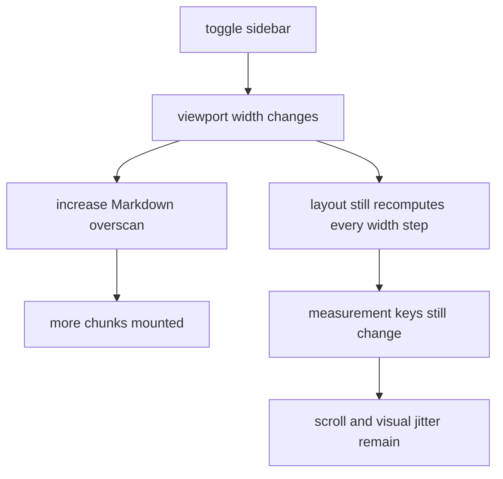

Verdict: rejected.

Overscan can reduce blanking. It cannot fix geometry ownership. The issue is
not an undersized virtual window; it is a live layout clock competing with
FileViewer's motion clock.

## Iteration 2: Throttle ResizeObserver

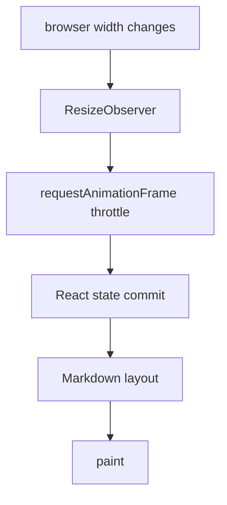

Verdict: rejected.

RAF throttling makes the wrong clock less noisy. It does not make it the right
clock. FileViewer already has the geometry clock; Markdown should consume it
instead of sampling the DOM during chrome motion.

## Iteration 3: Freeze Width Internally

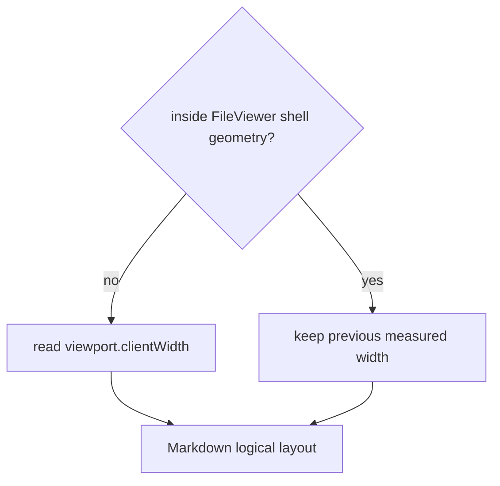

Verdict: necessary, but incomplete.

This prevents animated width steps from invalidating Markdown layout. But it
does not give FileViewer a registered document surface to visually compensate.
Without a registered surface, FileViewer cannot apply its transform policy to
Markdown the way it does for PDF, DOCX, PPTX, and image.

## Iteration 4: Register The Scroll Viewport

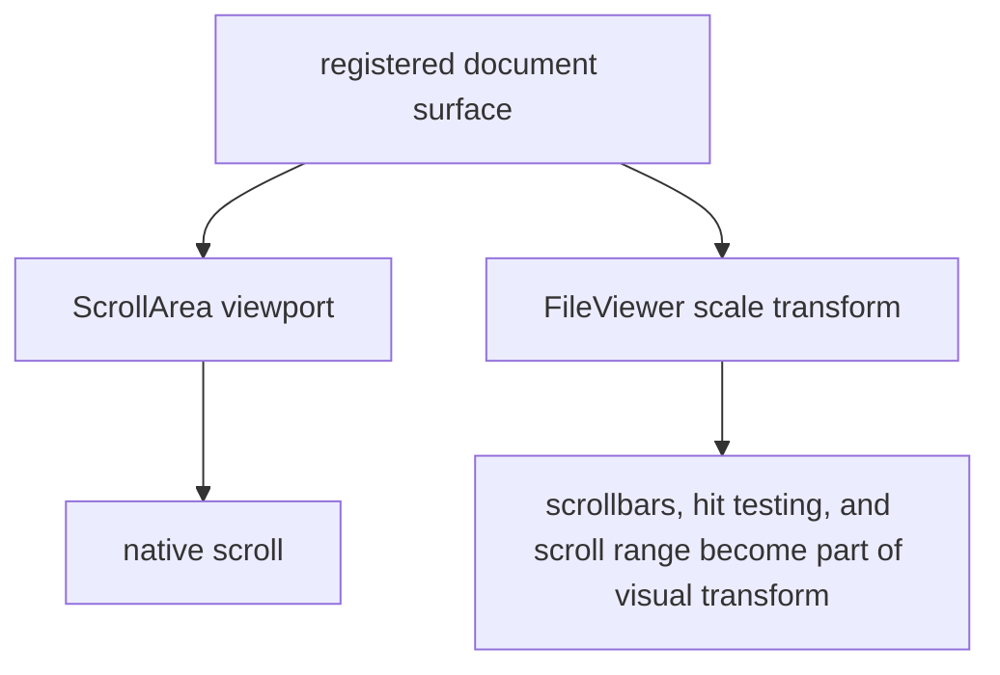

Verdict: rejected.

The scroll viewport is not the document. It is the native scroll owner. Scaling
or visually holding it risks making scrollbars, scroll range, and pointer
geometry part of the motion effect.

## Iteration 5: Register The Virtual Canvas

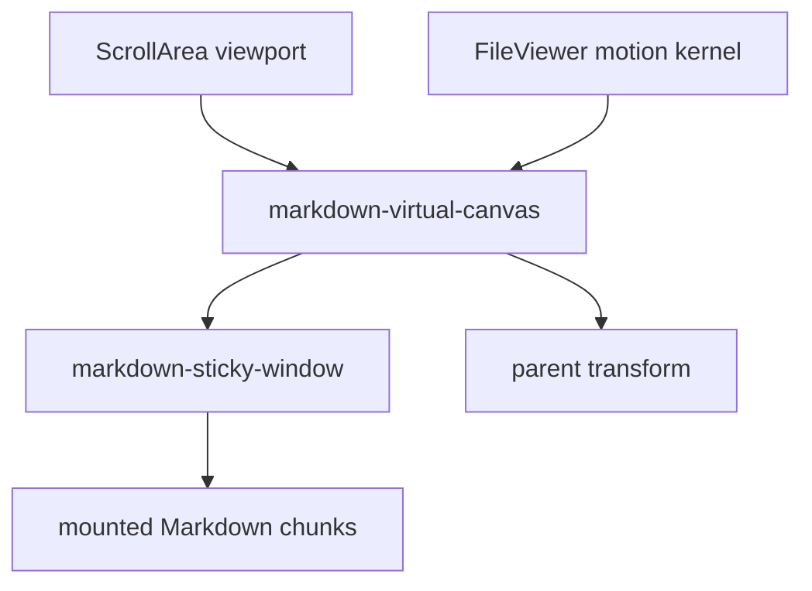

Verdict: closer.

The virtual canvas is the right kind of surface because it is the visual
document body. Native scroll remains owned by the viewport. FileViewer can
transform the document surface without transforming the scroll owner.

The remaining question is scroll continuity. Markdown must capture its anchor
before chrome resize and settle once at the final width.

## Final Design

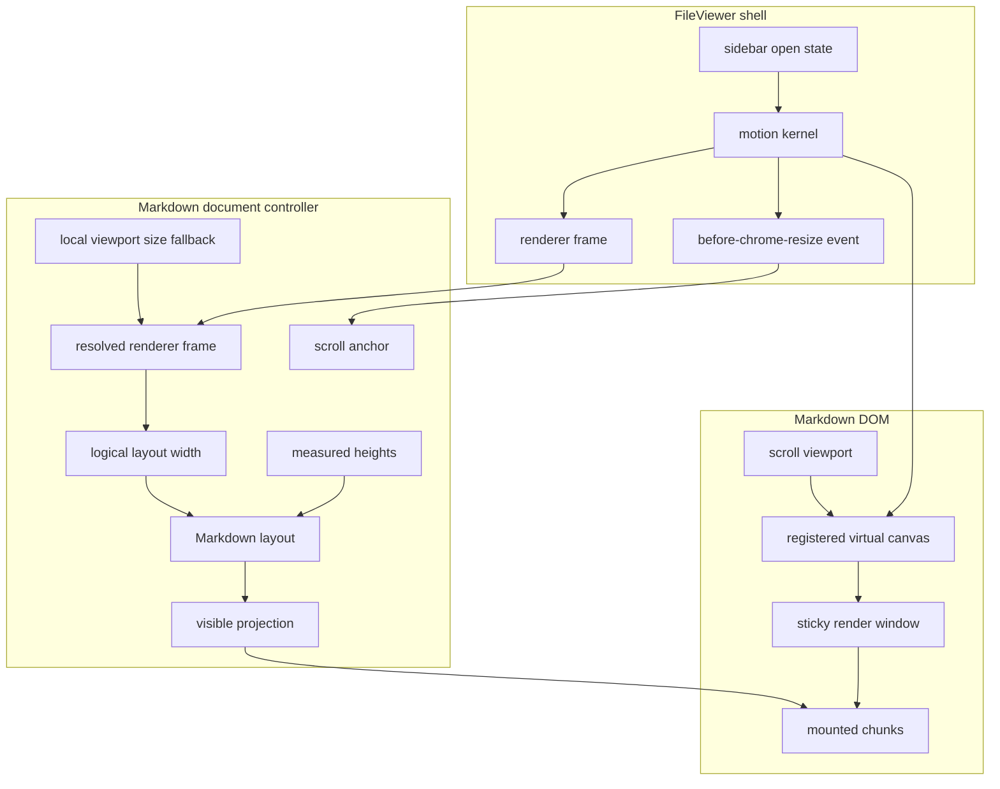

The final renderer has one geometry entry point:

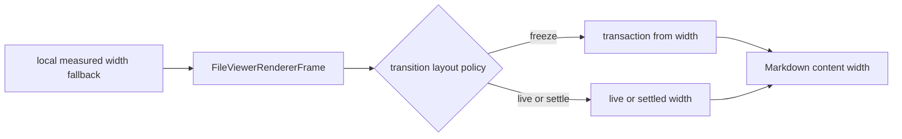

## Final Transition Sequence

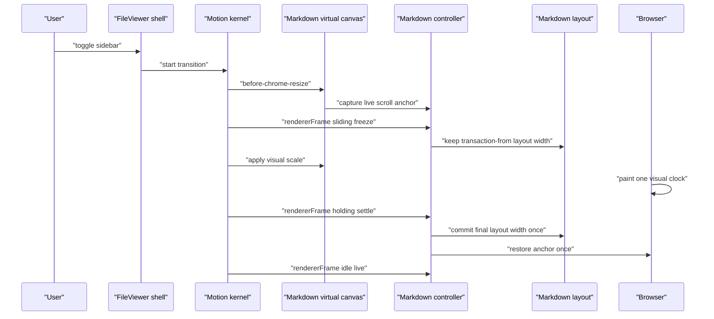

During `sliding`, Markdown does not recompute layout width from DOM reads.
During `holding`, Markdown commits the final width and performs one anchored
scroll restore. During `idle`, local measurement can resume for standalone and
settled quality.

## Final State Machine

```mermaid
stateDiagram-v2
  [*] --> StandaloneLive
  StandaloneLive --> ShellLive: "mounted inside FileViewer shell"
  ShellLive --> Preflight: "chrome resize requested"
  Preflight --> SlidingFrozen: "anchor captured"
  SlidingFrozen --> HoldingSettle: "motion elapsed"
  HoldingSettle --> AnchorRestore: "final layout committed"
  AnchorRestore --> ShellLive: "restore accepted"
  ShellLive --> StandaloneLive: "unmounted from shell"

  SlidingFrozen --> SlidingFrozen: "visual frames; logical width frozen"
  StandaloneLive --> StandaloneLive: "local ResizeObserver drives layout"
  ShellLive --> ShellLive: "settled renderer frame drives layout"
```

## Module Shape

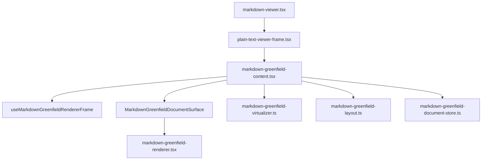

This is intentionally modest. Do not create a new public API. Do not fork the
Markdown renderer. The ideal pass should only sharpen ownership:

- `markdown-viewer.tsx` stays public.
- `plain-text-viewer-frame.tsx` stays the resource/error/suspense adapter.
- `markdown-greenfield-content.tsx` becomes a controller plus a small rendered
  surface.
- `useMarkdownGreenfieldRendererFrame` owns FileViewer geometry bridging.
- pure layout and virtualizer modules remain pure.

## Contract Checklist

The final implementation must satisfy these invariants:

- Markdown never reads DOM width as the authoritative layout width during
  FileViewer chrome motion.
- Markdown consumes `FileViewerRendererFrame` when inside `FileViewer`.
- Markdown keeps local `ResizeObserver` only as standalone fallback and settled
  measurement.
- The registered document surface is the virtual canvas, not the scroll
  viewport.
- The scroll viewport remains the native scroll owner.
- `before-chrome-resize` captures the live Markdown scroll anchor before the
  shell mutates layout.
- `sliding` freezes logical layout width.
- `holding` commits the final layout width once.
- measurement keys do not churn every animation frame.
- visible chunk projection does not remount because of chrome animation frames.
- tests prove canvas width, scrollTop, mounted chunk window, and measurement key
  width stay stable during sidebar motion.

## Perfect Runtime

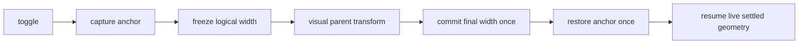

That is the platonic shape: one motion clock, one layout owner at a time, one
scroll restore, no redundant concepts.
