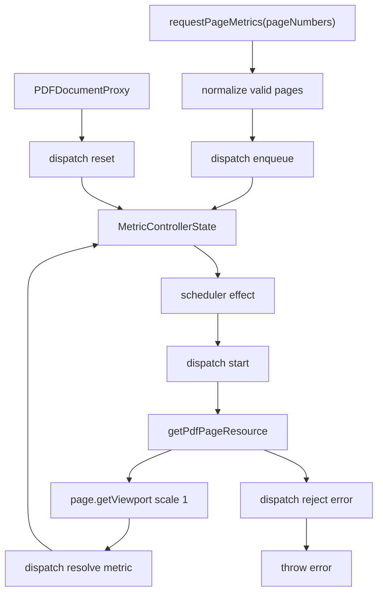

# PDF Thumbnail Page Metrics Blueprint

## Ideal

`usePdfThumbnailPageMetrics` is a small asynchronous controller for PDF page
metadata.

It receives a PDF document, accepts requests for page numbers, loads exact page
metrics with bounded concurrency, and exposes a sparse immutable metric map.

It does not know about thumbnails, rail scrolling, active pages, canvases, or
layout. It only answers: "which page dimensions are known, and what work is
still running?"

## Public Contract

```ts
type PdfThumbnailPageMetric = {
  pageNumber: number
  width: number
  height: number
}

type PdfThumbnailPageMetrics = {
  pageCount: number
  metricByPageNumber: ReadonlyMap<number, PdfThumbnailPageMetric>
  requestPageMetrics: (pageNumbers: Iterable<number>) => void
  status: "idle" | "loading"
}
```

Rules:

- `pageCount` is `doc.numPages`.
- `metricByPageNumber` contains exact metrics only.
- `requestPageMetrics` is idempotent.
- `status` is derived from controller state, not independently assigned.
- Errors throw to the nearest viewer error boundary.

## Non-Negotiable Invariants

- Never request an invalid page.
- Never request a loaded page again.
- Never request an in-flight page again.
- Never exceed `PDF_THUMBNAIL_PAGE_METRIC_CONCURRENCY`.
- Never commit stale results after document switch.
- Never mutate a metric map already exposed to React.
- Never store the same concept in both React state and refs.
- Never encode control flow in ad hoc boolean refs.

## Desired Shape

The hook should have one React state object and one imperative sequence handle.

React state is the visible model:

```ts
type MetricControllerState = {
  documentKey: unknown
  pageCount: number
  metricByPageNumber: ReadonlyMap<number, PdfThumbnailPageMetric>
  queuedPageNumbers: readonly number[]
  loadingPageNumbers: ReadonlySet<number>
  error: unknown
}
```

Derived values:

```ts
status =
  queuedPageNumbers.length || loadingPageNumbers.size ? "loading" : "idle"
```

The sequence handle owns only the mechanic that cannot live in React render
state:

```ts
type WorkerSequence = number
```

The sequence handle is not a second state model. It exists only to invalidate
asynchronous completions after a document switch. `getPdfPageResource` does not
accept an `AbortSignal`, so cancellation is expressed by ignoring obsolete
completions.

## Reducer

All state transitions go through a reducer.

```ts
type MetricAction =
  | { type: "reset"; documentKey: unknown; pageCount: number }
  | {
      type: "enqueue"
      documentKey: unknown
      pageCount: number
      pageNumbers: readonly number[]
    }
  | { type: "start"; documentKey: unknown; pageNumbers: readonly number[] }
  | { type: "resolve"; documentKey: unknown; metric: PdfThumbnailPageMetric }
  | { type: "reject"; documentKey: unknown; error: unknown }
```

Reducer rules:

- `reset` clears metrics, queue, loading, and error.
- `enqueue` appends only pages that are not loaded, queued, or loading.
- `start` moves pages from queue to loading.
- `resolve` removes one page from loading and writes a new metric map.
- `reject` stores the error and clears queue/loading.
- The reducer never starts async work.
- The reducer never reads PDF.js.

## Scheduler

The scheduler is a single effect driven by state:

```txt
state.queuedPageNumbers + state.loadingPageNumbers
  -> available slots
  -> dispatch(start(pages))
  -> start PDF.js requests
```

Rules:

- available slots are `CONCURRENCY - loadingPageNumbers.size`.
- take pages from the front of the queue.
- one effect owns all request starts.
- each request captures the current sequence.
- completion is ignored if the sequence no longer matches.
- document switches increment the sequence and reset reducer state.

## Hook Flow



## Naming

Use one vocabulary:

- `queuedPageNumbers`
- `loadingPageNumbers`
- `metricByPageNumber`
- `documentKey`
- `pageCount`
- `requestPageMetrics`

Do not use:

- `pending` for both queued and loading
- `generation`
- `activeRequestCount`
- `currentState`
- `nextPageNumbers` when the value is actually requested pages

## Tests

Required tests:

- requesting invalid pages starts no work
- requesting loaded pages starts no work
- requesting queued/loading pages deduplicates work
- concurrency is bounded
- resolving one page starts exactly one queued page
- document reset ignores stale resolves
- document reset clears queue/loading/metrics
- rejection throws through the hook
- exposed metric maps are immutable snapshots

## Migration Plan

1. Replace ref-driven queue state with `useReducer`.
2. Keep one ref only for the worker sequence handle.
3. Move scheduling into one effect that reacts to reducer state.
4. Keep `requestPageMetrics` as the only public imperative callback.
5. Update tests to assert reducer-level invariants.
6. Re-run unit, lint, e2e, registry build, format, and typecheck.

## Success Bar

The finished hook should read like a state machine:

```txt
request -> enqueue -> scheduler starts work -> resolve/reject -> state updates
```

There should be no mystery refs, no duplicate sources of truth, no hidden
loading counters, and no state mutation outside reducer actions.
