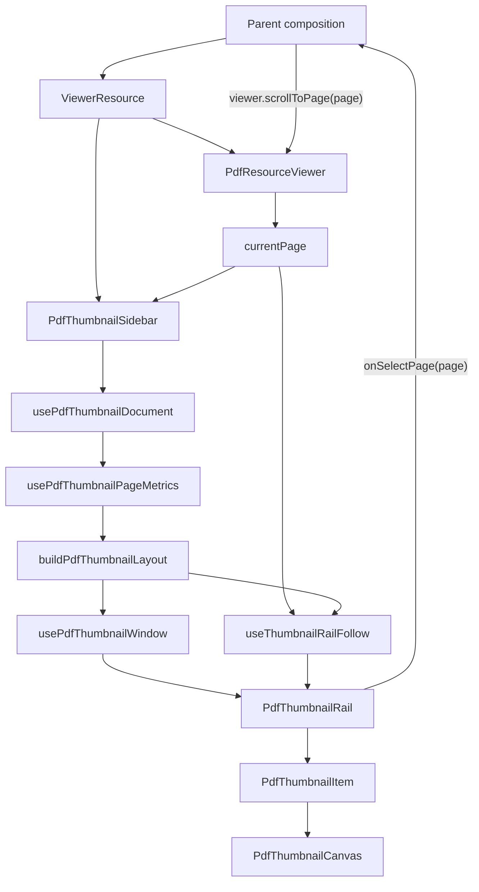

# PDF Thumbnail Sidebar Blueprint

## Ideal

The PDF thumbnail sidebar is a page navigation instrument for a PDF viewer.

It shows one thumbnail per page, highlights the page currently visible in the
document, keeps that thumbnail reachable without fighting the user's hand, and
emits one command when the user chooses a page.

Everything else is outside the component.

## First Principles

The document viewer owns the document.

The document scroller owns document position.

The thumbnail sidebar owns thumbnail navigation.

The current page is a fact, not state to be guessed. It enters the sidebar from
the viewer. The highlighted thumbnail is derived from that fact. A click in the
sidebar does not mutate hidden sidebar state; it asks the viewer to go to a
page.

The sidebar must scale with what is visible, not with the size of the PDF.
Rendering and metadata loading are lazy. Layout remains deterministic while
exact measurements arrive.

## Public Contract

```ts
type PdfThumbnailSidebarProps = {
  resource: ViewerResource
  currentPage?: number | null
  onSelectPage?: (page: number) => void
  width?: number
  className?: string
}
```

Rules:

- `resource` is the exact resource passed to `PdfResourceViewer`.
- `currentPage` is 1-based and controlled by the viewer.
- `onSelectPage(page)` is the only outbound event.
- `width` controls thumbnail image width only.
- The sidebar does not accept `src`.
- The sidebar does not own PDF document scroll.
- The sidebar does not store selected page state.

## System Shape



## Modules

```txt
pdf-thumbnail-sidebar.tsx         public API, boundary, composition
use-pdf-thumbnail-document.ts     PDF document read, retain, release
use-pdf-thumbnail-page-metrics.ts requested page metadata cache
pdf-thumbnail-layout.ts           pure sparse thumbnail geometry
use-pdf-thumbnail-window.ts       rail viewport -> mounted rows
use-thumbnail-rail-follow.ts      active thumbnail co-scroll policy
pdf-thumbnail-rail.tsx            navigation semantics and keyboard
pdf-thumbnail-item.tsx            page button and current state
pdf-thumbnail-canvas.tsx          mounted-page canvas rendering
```

Each module has one reason to change. No module exists only to preserve an old
API.

## Data Flow

```txt
ViewerResource
  -> PDFDocumentProxy
  -> pageCount
  -> requested page metrics
  -> sparse thumbnail layout
  -> visible thumbnail items
  -> mounted canvases

currentPage
  -> normalized current page
  -> aria-current thumbnail
  -> follow decision
```

The only sidebar-owned mutable state is operational state:

- loaded page metrics
- in-flight page metric requests
- rail scroll measurements
- follow suspension

The sidebar never owns semantic page state.

## Page Metrics

Page metrics are exact when known and estimated when unknown.

```ts
type PdfThumbnailPageMetric = {
  pageNumber: number
  width: number
  height: number
}
```

Metric loading rules:

- Request metrics only for visible thumbnail rows, overscan rows, and the
  current page.
- Deduplicate loaded and in-flight requests.
- Ignore stale results after document change.
- Use `page.getViewport({ scale: 1 })`.
- Do not mount a canvas to discover dimensions.
- Do not block first paint on full-document metadata.

The implementation uses a bounded queue so a fast scroll through a large PDF
cannot fan out unbounded page metadata work.

## Layout

Layout is pure. It receives `pageCount`, `width`, and a sparse metric map. It
returns deterministic geometry.

```ts
type PdfThumbnailLayout = {
  pageCount: number
  width: number
  estimatedImageHeight: number
  estimatedItemHeight: number
  labelAndGapHeight: number
  metricByPageNumber: ReadonlyMap<number, PdfThumbnailPageMetric>
  prefixHeightDeltas: readonly PdfThumbnailHeightDelta[]
  totalHeight: number
}
```

Accessors:

```ts
getPdfThumbnailLayoutItem(layout, pageNumber)
getVisiblePdfThumbnailItems({ layout, scrollTop, viewportHeight, overscan })
findPdfThumbnailPageByOffset(layout, offset)
```

Rules:

- Unknown pages use deterministic fallback geometry.
- Known pages apply exact aspect ratio.
- Sparse prefix deltas correct total height without materializing every row.
- Follow and virtualization read through accessors.
- Layout never reads DOM.
- Layout never asks PDF.js for a page.

## Windowing

The render window is derived from rail scroll metrics.

```ts
type PdfThumbnailWindow = {
  visibleItems: readonly PdfThumbnailLayoutItem[]
  totalHeight: number
}
```

Rules:

- Mount only visible rows plus overscan.
- Keep spacer height equal to `layout.totalHeight`.
- Update on rail scroll and resize.
- Never render all pages for a large PDF.
- Never request PDF metadata directly.

## Follow Policy

The rail follows the active page unless the user is interacting with the rail.

```ts
type ThumbnailFollowSuspension = "none" | "pointer" | "user-scroll"
```

Rules:

1. If `currentPage` is invalid, do nothing.
2. If the current thumbnail is already visible with margin, do nothing.
3. If the pointer is inside the rail, do not auto-scroll.
4. If the user is scrolling the rail, do not auto-scroll until idle.
5. If a thumbnail is activated, clear suspension and reveal that thumbnail.
6. If the document changes, clear suspension.
7. Programmatic rail scrolls must not be mistaken for user scrolls.

The follow controller has no epoch, no hidden reset signal, and no duplicated
highlight state.

## Semantics

The sidebar is navigation.

```txt
nav[aria-label="PDF pages"]
  ol
    li[data-index]
      button[aria-label="Page N"][aria-current="page" when current]
```

Rules:

- Use `aria-current="page"` for the current page.
- Do not use `aria-selected`.
- Do not use `role="listbox"` or `role="option"`.
- ArrowUp and ArrowDown activate previous/next page.
- Home and End activate first/last page.
- Enter and Space use native button behavior.

## Rendering

Canvas rendering is only rendering.

Rules:

- `PdfThumbnailCanvas` reads exactly the mounted page it renders.
- It caps device pixel ratio for predictable memory use.
- It cancels render tasks on unmount.
- It throws render failures to the viewer error boundary.
- It does not report layout measurements.

## Performance Contract

For a PDF with `N` pages and a rail that can show `V` rows:

- initial mounted thumbnail rows are `O(V + overscan)`
- initial metric requests are `O(V + overscan + 1)`
- layout lookup is logarithmic or constant per requested page
- document rendering is independent from thumbnail rendering
- no operation on mount is `O(N)` except representing `pageCount`

## Verification

Unit tests must cover:

- sparse layout with missing and exact metrics
- visible window bounds
- active page highlighting
- click and keyboard activation
- pointer suspension
- user-scroll suspension
- document switch cleanup
- render task cancellation
- no initial request for the final page of a large PDF

Browser tests must cover:

- opening the PDF thumbnails demo
- document scroll updates the current thumbnail
- active thumbnail is visible in the rail
- clicking a thumbnail scrolls the PDF document
- moving the pointer out of the rail does not leave stale hover state
- no thumbnail has `aria-selected`

## Non-Negotiable Invariants

- One shared `ViewerResource`.
- One current page fact.
- One navigation output.
- No all-page metadata loading.
- No all-page thumbnail rendering.
- No canvas-driven geometry.
- No selected-page shadow state.
- No hidden follow epochs.
- No compatibility shim for `src`.
- No module with more than one job.

This is the component at its ideal boundary: simple, fast, complete, and hard to
misuse.
