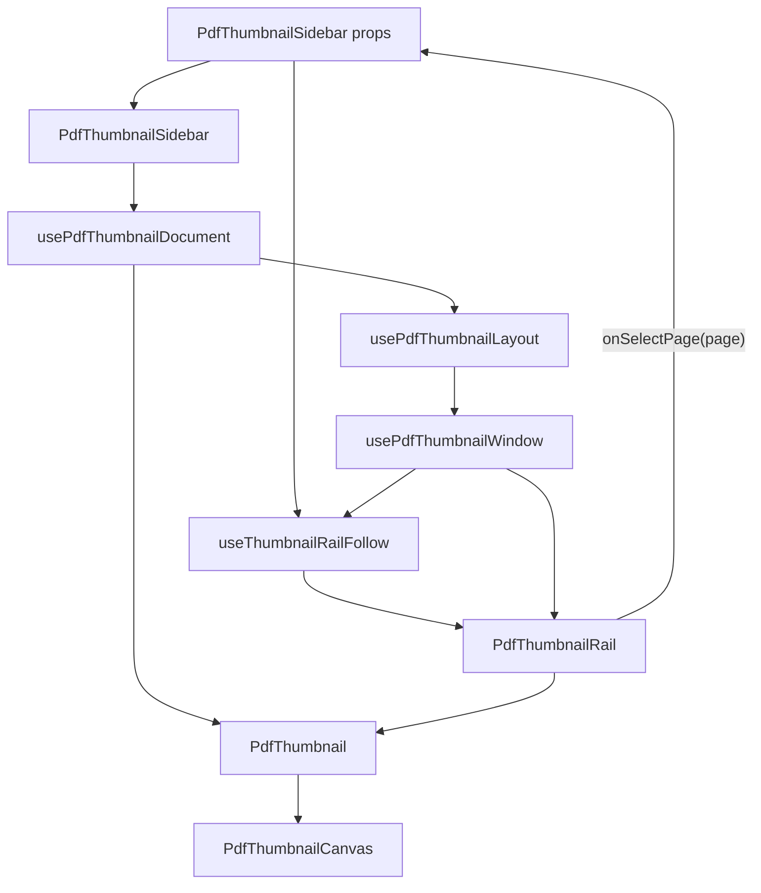

# PDF Thumbnail Sidebar Platonic Blueprint

## Standard

The PDF thumbnail sidebar is complete when it has:

- one explicit thumbnail layout model
- one explicit rail follow controller
- one active page input
- one page navigation output
- page-size-aware geometry
- virtualized rendering
- accessible listbox semantics
- no sticky selected state unless selection is a real operation
- no duplicated scroll math
- no implicit coupling to the PDF viewer internals

The sidebar is a document navigation surface. It does not own document scroll.
It receives `currentPage`, renders the active page, and emits
`onSelectPage(page)` when the user chooses a thumbnail.

## Inputs And Outputs

```ts
type PdfThumbnailSidebarProps = {
  src: string
  currentPage?: number | null
  onSelectPage?: (page: number) => void
  width?: number
  className?: string
}
```

Inputs:

```txt
src           PDF URL shared with PdfViewer resource cache
currentPage   1-based page reported by the document viewport
width         thumbnail image width in CSS pixels
```

Outputs:

```txt
onSelectPage(page)  user requested document navigation
```

No other state crosses the component boundary.

## Current Gap

The current implementation works, but it is not perfect.

Correct:

- shared PDF resource cache
- Suspense and inline error boundary
- retained document lifecycle
- fixed-row virtualization
- active thumbnail highlight
- click-to-page navigation
- nearest-visible co-scrolling
- pointer and user-scroll suspension

Not perfect:

- resource lifecycle, layout, follow policy, rendering, and canvas rendering live
  in one component
- row height is estimated from `THUMBNAIL_DEFAULT_ASPECT`
- follow math depends on fixed row height instead of page-size-aware layout
- thumbnail rail lacks listbox keyboard semantics
- tests verify the follow outcome, but not the full geometry contract

## Target Architecture



Each module gets one reason to change.

## Module Boundaries

### `pdf-thumbnail-sidebar.tsx`

Composition only:

- create viewer resource from `src`
- mount error boundary and Suspense
- retain/release PDF document
- call the layout/window/follow hooks
- render `PdfThumbnailRail`

It contains no scroll math and no canvas render code.

### `pdf-thumbnail-layout.ts`

Pure layout model:

```ts
type PdfThumbnailLayoutItem = {
  pageNumber: number
  pageIndex: number
  top: number
  height: number
  imageWidth: number
  imageHeight: number
}

type PdfThumbnailLayout = {
  items: readonly PdfThumbnailLayoutItem[]
  totalHeight: number
}
```

Inputs:

- page count
- page viewport sizes and rotations
- thumbnail width
- row gap
- label height
- padding

Rules:

- use real PDF page dimensions when available
- fall back to a deterministic default before page dimensions resolve
- include label and row gap in every row height
- expose `itemByPageNumber` lookup
- expose `getEstimatedItem(pageNumber)` for pages not yet measured

### `use-pdf-thumbnail-window.ts`

Virtualization only:

```ts
type PdfThumbnailWindow = {
  items: readonly PdfThumbnailLayoutItem[]
  totalHeight: number
}
```

Rules:

- derive visible items from rail scrollTop and clientHeight
- overscan by a fixed page count
- never render all pages for large PDFs
- expose stable item positions for follow math

### `use-thumbnail-rail-follow.ts`

Co-scrolling policy only:

```ts
type ThumbnailRailFollowApi = {
  viewportRef: React.RefCallback<HTMLDivElement>
  onPointerEnter: () => void
  onPointerLeave: () => void
  onScroll: () => void
}
```

Inputs:

- `currentPage`
- `layout`
- `isEnabled`

Rules:

1. If `currentPage` is invalid, do nothing.
2. If the active row is visible with margin, do nothing.
3. If the active row is outside the rail viewport, center it.
4. If the pointer is inside the rail, suspend follow.
5. If the user is scrolling the rail, suspend follow.
6. Programmatic scroll does not mark user scrolling.
7. Follow resumes after user-scroll idle timeout.
8. On document change, reset rail follow state.

Constants:

```ts
const THUMBNAIL_FOLLOW_MARGIN = 24
const THUMBNAIL_PROGRAMMATIC_SCROLL_WINDOW_MS = 120
const THUMBNAIL_USER_SCROLL_IDLE_MS = 400
```

### `pdf-thumbnail-rail.tsx`

Accessible rail only:

- `role="listbox"`
- `aria-label="PDF pages"`
- `aria-activedescendant` points to the current thumbnail option
- each thumbnail is `role="option"`
- current thumbnail uses `aria-current="page"`
- selected state is absent unless multi-page operation selection exists
- supports ArrowUp, ArrowDown, Home, End, Enter, and Space
- keyboard navigation calls `onSelectPage`
- pointer click calls `onSelectPage`

### `pdf-thumbnail.tsx`

Thumbnail button only:

- render active/current state
- render page label
- call `onSelectPage(page)`
- no resource loading
- no rail scroll policy

### `pdf-thumbnail-canvas.tsx`

Canvas render only:

- read page resource
- compute scaled viewport
- cap DPR
- render page to canvas
- cancel stale render task
- surface render failures as PDF render errors

## State Model

Mutable state:

```txt
rail scrollTop             DOM-owned
rail clientHeight          measured
isPointerInsideRail        ref
isUserScrollingRail        ref
lastProgrammaticScrollAt   ref
idleTimer                  ref
```

Derived state:

```txt
activePage                 normalized currentPage
activePageIndex            activePage - 1
activeThumbnailItem        layout lookup
visibleThumbnailItems      virtualization window
activeDescendantId         id for active option
targetScrollTop            layout-derived center offset
```

Forbidden state:

```txt
selectedPage
activeThumbnailPage
highlightedPage
scrollSyncedPage
```

The document viewer owns `currentPage`. The thumbnail sidebar derives from it.

## Follow Algorithm

```ts
function followActiveThumbnail() {
  const page = normalizePage(currentPage, pageCount)
  if (page == null) return
  if (state.isPointerInsideRail) return
  if (state.isUserScrollingRail) return

  const viewport = viewportRef.current
  if (!viewport) return

  const item = layout.itemByPageNumber.get(page)
  if (!item) return

  const top = item.top - viewport.scrollTop
  const bottom = top + item.height
  const minTop = THUMBNAIL_FOLLOW_MARGIN
  const maxBottom = viewport.clientHeight - THUMBNAIL_FOLLOW_MARGIN
  const isAtDocumentStart =
    item.top <= THUMBNAIL_FOLLOW_MARGIN &&
    viewport.scrollTop <= THUMBNAIL_FOLLOW_MARGIN

  if ((top >= minTop || isAtDocumentStart) && bottom <= maxBottom) return

  const targetTop = clamp(
    item.top - viewport.clientHeight / 2 + item.height / 2,
    0,
    layout.totalHeight - viewport.clientHeight
  )

  state.lastProgrammaticScrollAt = performance.now()
  viewport.scrollTo({ top: targetTop, behavior: "smooth" })
}
```

## Extend Comparison

Extend gets these right:

- thumbnail rail owns its viewport/window state
- document scroll owns active page
- thumbnail click drives document scroll
- thumbnail virtualization is independent from document virtualization
- programmatic thumbnail scroll is a narrow API
- listbox semantics are present

Extend is not the final target because:

- co-scroll policy is implicit in effects and plugin refs
- active page and selected page indexes are coupled
- behavior is distributed across plugin, rail, and viewer effects
- continuous follow is not explicit

The local target keeps Extend's separations but names the follow policy directly.

## Tests

Layout:

- computes row height from real page aspect ratio
- accounts for label height, gap, and padding
- falls back deterministically before dimensions are known
- creates stable `pageNumber -> item` lookup
- handles rotated pages

Virtualization:

- renders a bounded window
- overscans above and below
- updates window on scroll
- keeps total height equal to layout total height

Follow:

- does nothing when active thumbnail is visible
- scrolls when active thumbnail is above viewport
- scrolls when active thumbnail is below viewport
- clamps target scroll to document start and end
- suspends while pointer is inside rail
- suspends while user is scrolling rail
- ignores programmatic scroll events
- resumes after idle timeout
- resets on source/document change

Accessibility:

- rail has `role="listbox"`
- active option id matches `aria-activedescendant`
- active thumbnail has `aria-current="page"`
- ArrowUp and ArrowDown navigate one page
- Home and End navigate document bounds
- Enter and Space navigate selected active descendant

Integration:

- document scroll updates active thumbnail
- active thumbnail remains visible after document scroll
- thumbnail click calls `onSelectPage(page)`
- manual rail scroll is not overwritten immediately by document scroll

## Implementation Order

1. Extract `PdfThumbnailCanvas`.
2. Extract `PdfThumbnail`.
3. Extract pure `pdf-thumbnail-layout.ts`.
4. Replace fixed aspect row math with page-size-aware layout.
5. Extract `usePdfThumbnailWindow`.
6. Extract `useThumbnailRailFollow`.
7. Add listbox keyboard semantics to `PdfThumbnailRail`.
8. Move existing sidebar tests into layout, follow, accessibility, and
   integration groups.
9. Run browser smoke on `/view/blocks/pdf-thumbnails`.

## Final Shape

```txt
PdfThumbnailSidebar
  resource boundary and composition

usePdfThumbnailLayout
  page-size-aware row geometry

usePdfThumbnailWindow
  visible thumbnail window

useThumbnailRailFollow
  currentPage -> rail scroll policy

PdfThumbnailRail
  accessible navigation rail

PdfThumbnail
  page option rendering

PdfThumbnailCanvas
  pdfjs canvas rendering
```

That is the whole component. Anything outside those responsibilities is excess.
