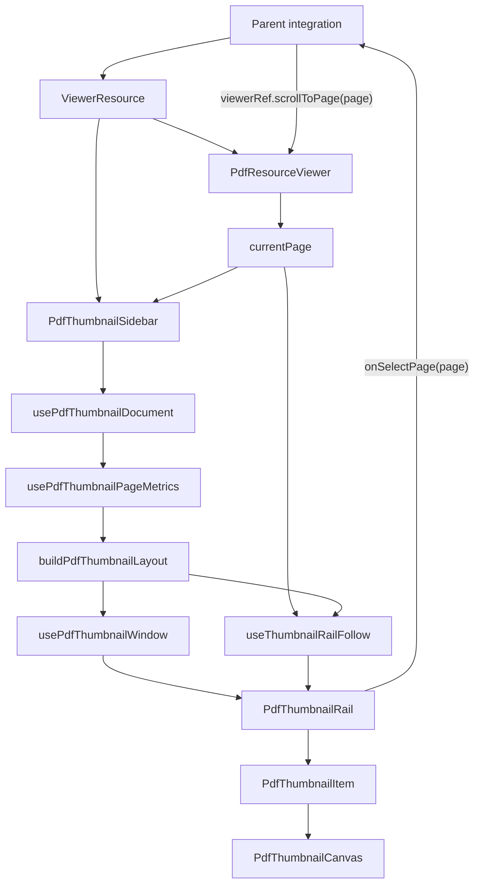

# PDF Thumbnail Sidebar Blueprint

## Standard

The PDF thumbnail sidebar is a navigation rail for `PdfResourceViewer`. It
receives the same `ViewerResource` as the viewer, mirrors the viewer's current
page, emits page navigation intent, and co-scrolls only when that helps the user
keep the active page in view.

The component has exactly these responsibilities:

- share the viewer's document resource
- retain and release that document while mounted
- derive a sparse page-metric model from PDF metadata
- derive thumbnail geometry from that metric model
- mount only the visible thumbnail rows plus overscan
- highlight the current page
- scroll the rail to the current page when appropriate
- let users activate a page by click or keyboard

It does not own document scroll, selected-page state, canvas-derived geometry,
or duplicate source loading.

## Public API

```ts
type PdfThumbnailSidebarProps = {
  resource: ViewerResource
  currentPage?: number | null
  onSelectPage?: (page: number) => void
  width?: number
  className?: string
}
```

Rules:

- `resource` is the same object passed to `PdfResourceViewer`.
- `currentPage` is 1-based and comes from the document viewport.
- `onSelectPage(page)` is the only output; the parent decides how to scroll the
  PDF document.
- The sidebar does not accept `src`; callers create one resource and share it.

## Composition



## Modules

```txt
pdf-thumbnail-sidebar.tsx         public API, error boundary, composition
use-pdf-thumbnail-document.ts     document read/retain/release
use-pdf-thumbnail-page-metrics.ts lazy metadata loading for requested pages
pdf-thumbnail-layout.ts           sparse pure thumbnail geometry
use-pdf-thumbnail-window.ts       visible row window from rail scroll metrics
use-thumbnail-rail-follow.ts      active-page rail follow controller
pdf-thumbnail-rail.tsx            navigation semantics, keyboard, row placement
pdf-thumbnail-item.tsx            current-page thumbnail button
pdf-thumbnail-canvas.tsx          mounted-page canvas rendering only
```

Each module owns one concept and exports the smallest surface needed by its
neighbors.

## Data Model

```txt
ViewerResource -> PDFDocumentProxy -> pageCount
requested page numbers -> PdfThumbnailPageMetric map
pageCount + metric map + width -> PdfThumbnailLayout
rail scrollTop + clientHeight + layout -> visible layout items
currentPage + layout + rail viewport -> follow decision
```

Forbidden state:

```txt
selectedPage
activeThumbnailPage
highlightedPage
scrollSyncedPage
pageSizeByMountedCanvas
followEpoch
imperativeResetRef
```

## Lazy Page Metrics

`usePdfThumbnailPageMetrics` exposes a sparse metric map and an explicit
`requestPageMetrics(pageNumbers)` function.

```ts
type PdfThumbnailPageMetric = {
  pageNumber: number
  width: number
  height: number
}

type PdfThumbnailPageMetrics = {
  pageCount: number
  metricByPageNumber: ReadonlyMap<number, PdfThumbnailPageMetric>
  requestPageMetrics: (pageNumbers: Iterable<number>) => void
  status: "idle" | "loading"
}
```

Rules:

- no page metric is loaded until requested by the sidebar
- requests include the visible thumbnail window plus the active page
- metrics come from `page.getViewport({ scale: 1 })`
- duplicate and in-flight page requests are ignored
- document switches clear metrics and in-flight guards
- stale async results are ignored by document generation
- rendering never waits for full-document metadata

This keeps startup cost proportional to the visible rail, not `doc.numPages`.

## Sparse Layout

`pdf-thumbnail-layout.ts` is pure and DOM-free. It never reads PDF pages and
never renders canvases.

```ts
type PdfThumbnailLayout = {
  pageCount: number
  width: number
  estimatedImageHeight: number
  estimatedItemHeight: number
  labelAndGapHeight: number
  metricByPageNumber: ReadonlyMap<number, PdfThumbnailPageMetric>
  prefixHeightDeltas: readonly PdfThumbnailHeightDelta[]
  totalHeight: number
}
```

The layout does not materialize every row. It exposes accessors:

```ts
getPdfThumbnailLayoutItem(layout, pageNumber)
getVisiblePdfThumbnailItems({ layout, scrollTop, viewportHeight, overscan })
findPdfThumbnailPageByOffset(layout, offset)
```

Rules:

- missing page metrics use deterministic fallback geometry
- page 1's metric, once known, becomes the estimate for unknown pages
- exact metrics contribute sparse prefix-height deltas
- `totalHeight` is estimated height plus all known sparse corrections
- follow and virtualization use accessors, not an all-pages array

This makes the layout fast for ordinary PDFs and structurally ready for very
large PDFs.

## Render Window

`usePdfThumbnailWindow` owns rail scroll metrics only.

```ts
type PdfThumbnailWindow = {
  visibleItems: readonly PdfThumbnailLayoutItem[]
  totalHeight: number
}
```

Rules:

- read rail `scrollTop` and `clientHeight`
- derive visible items through `getVisiblePdfThumbnailItems`
- overscan by page count above and below the viewport
- expose one spacer height from `layout.totalHeight`
- never request metrics
- never render canvases

## Follow Controller

`useThumbnailRailFollow` is the only owner of thumbnail co-scrolling.

```ts
type ThumbnailFollowSuspension = "none" | "pointer" | "user-scroll"
```

Rules:

1. Normalize `currentPage`; invalid pages do nothing.
2. If the current thumbnail is visible with margin, do nothing.
3. If pointer suspension is active, do nothing.
4. If user-scroll suspension is active, do nothing until the idle timer expires.
5. Programmatic scrolls stamp `lastProgrammaticScrollAt` so the rail's own
   `scroll` event does not self-classify as user input.
6. Pointer leave resumes follow immediately.
7. Thumbnail activation clears suspension and scrolls that thumbnail into view.
8. Document reset clears suspension; the normal derived follow effect runs.

The controller has no epoch and no imperative latest-callback reset path.

## Rail Semantics

The rail is navigation, not selection.

```txt
nav[aria-label="PDF pages"]
  ol
    li[data-index]
      button[aria-label="Page N"][aria-current="page" when current]
```

Rules:

- no `role="listbox"`
- no `role="option"`
- no `aria-selected`
- ArrowUp and ArrowDown activate previous/next page
- Home and End activate first/last page
- Enter and Space use native button behavior

## Canvas Renderer

`PdfThumbnailCanvas` renders only mounted pages. It is not a geometry feedback
channel.

Rules:

- read one page resource for the mounted page
- render at thumbnail width with capped DPR
- cancel render tasks on unmount
- surface render failures through the viewer error boundary
- never report page size to the layout

## Browser Regression

The permanent browser test is `e2e/pdf-thumbnail-sidebar.spec.ts`.

It verifies:

- the PDF thumbnails demo opens
- document scroll changes the active page
- the matching thumbnail is visible in the rail
- clicking a later thumbnail scrolls the document
- moving the pointer out of the rail does not leave stale hover/follow state
- the active thumbnail uses `aria-current`
- no thumbnail uses `aria-selected`

Command:

```sh
pnpm test:e2e e2e/pdf-thumbnail-sidebar.spec.ts
```

## Invariants

- One shared `ViewerResource` enters the viewer and sidebar.
- `currentPage` is the only highlight driver.
- `onSelectPage` is the only navigation output.
- Page metrics are sparse and requested, never eagerly loaded for every page.
- Layout is pure and sparse.
- Rendered thumbnail rows are bounded by viewport plus overscan.
- Canvas rendering is not a measurement system.
- Follow state has explicit suspension and resume paths.
- Browser behavior is covered by a real e2e regression.
