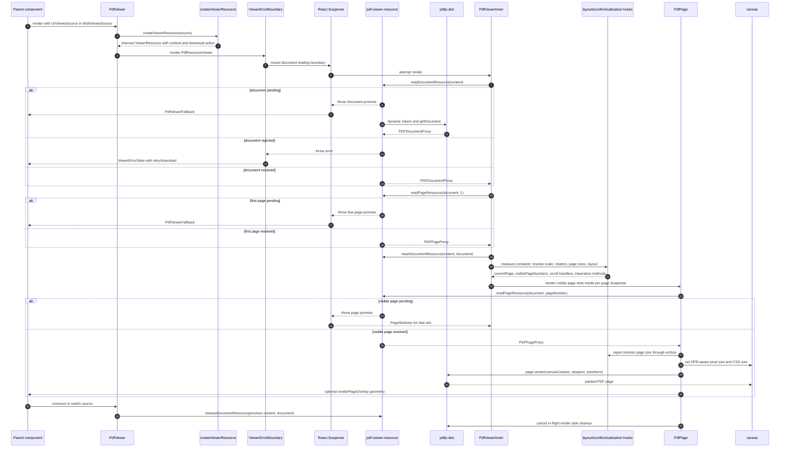
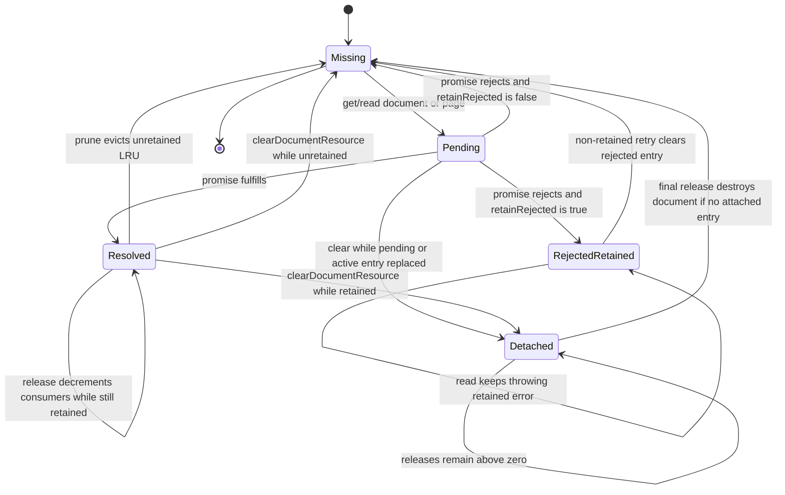
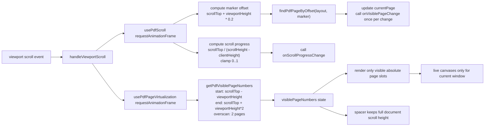

# PDF Viewer System Diagram

This document maps the current PDF viewer implementation as it exists in code.
The registry implementation is the source of truth; `components/ui/pdf-viewer.tsx`
and `components/ui/pdf-viewer-layout.ts` re-export it as the application import
surface.

Current implementation note: page virtualization in `PdfViewer` is scroll-math
based (`getPdfVisiblePageNumbers` plus `requestAnimationFrame` measurement), not
`IntersectionObserver` based. The thumbnail sidebar does use
`IntersectionObserver` to delay thumbnail canvas rendering.

```mermaid
flowchart TD
  %% External callers and public surface.
  subgraph callers["External Callers / Consumers"]
    docs["content/docs/viewers/pdf-viewer.mdx<br/>installation, usage, props, slots, overlays"]
    demo["components/pdf-viewer-demo.tsx<br/>NVIDIA 10-K demo"]
    benchmark["app/(view)/pdf-viewer-benchmark<br/>585-page jump/snapshot harness"]
    scrollbench["app/(view)/scrollbench<br/>viewer viewport benchmark consumer"]
    file_viewers["components/viewers/*<br/>edit, split, partition, classify, parse surfaces"]
    doc_thumb["components/document-thumbnail/renderers/pdf-thumbnail.tsx<br/>first-page PDF thumbnail"]
    registry_blocks["registry/new-york-v4/blocks/*<br/>extract, thumbnails, parse, partition, split examples"]
    parent_callbacks["Parent callbacks<br/>onVisiblePageChange<br/>onScrollProgressChange<br/>onScaleChange"]
    tests["tests/pdf-viewer*.test*<br/>unit, hook, integration, cache, render, layout, fuzz"]
  end

  subgraph public_api["Public Import Surface"]
    components_export["components/ui/pdf-viewer.tsx<br/>export * from registry pdf-viewer"]
    layout_export["components/ui/pdf-viewer-layout.ts<br/>export * from registry layout"]
    pdf_viewer["PdfViewer<br/>source-driven component"]
    pdf_resource_viewer["PdfResourceViewer<br/>prebuilt ViewerResource component"]
    pdf_highlight["PdfHighlight<br/>percentage positioned overlay box"]
    pdf_handle["PdfViewerHandle<br/>scrollToPage<br/>scrollToPageArea<br/>getViewportElement"]
    pdf_resource_exports["getDocumentResource / getPageResource<br/>shared async cache access"]
    layout_exports["createPdfPageLayout / getPdfPageLayout<br/>findPdfPageByOffset / getPdfVisiblePageNumbers"]
  end

  docs --> components_export
  demo --> components_export
  benchmark --> components_export
  scrollbench --> components_export
  file_viewers --> components_export
  registry_blocks --> components_export
  doc_thumb --> pdf_resource_exports
  tests --> components_export
  tests --> layout_exports
  components_export --> pdf_viewer
  components_export --> pdf_resource_viewer
  components_export --> pdf_highlight
  components_export --> pdf_handle
  components_export --> pdf_resource_exports
  layout_export --> layout_exports

  %% Shared viewer source/resource layer.
  subgraph source_resource["Shared Viewer Source + Resource Layer"]
    viewer_source["lib/viewer-source.ts<br/>UrlViewerSource | BlobViewerSource | TextSource<br/>resolveViewerDescriptor<br/>detectCategory from extension or MIME"]
    viewer_resource["lib/viewer-resource.ts<br/>createViewerResource(source, category?)<br/>intern URL, Blob, Text resources<br/>stable load/presentation/resource keys"]
    url_resource["URL resource content<br/>directUrl = source.url<br/>readBlob/readBytes/readText/readStream/readRange via fetch<br/>supports Range requests"]
    blob_resource["Blob resource content<br/>directUrl = null<br/>readBytes = blob.arrayBuffer<br/>readRange = blob.slice"]
    text_resource["Text resource content<br/>not accepted by PdfViewer source type<br/>shared resource implementation"]
    download_actions["lib/viewer-download.ts<br/>createHrefDownloadAction<br/>createBlobDownloadAction<br/>createTextDownloadAction<br/>ViewerDownloadAction"]
    resource_errors["lib/viewer-errors.ts<br/>ResourceError<br/>ViewerFormatError<br/>ViewerStateError<br/>ViewerUnsupportedError<br/>toViewerErrorInfo"]
  end

  pdf_viewer -->|"useMemo(source)"| viewer_resource
  pdf_resource_viewer -->|"receives resource directly"| viewer_resource
  viewer_resource --> viewer_source
  viewer_resource --> url_resource
  viewer_resource --> blob_resource
  viewer_resource --> text_resource
  viewer_resource --> download_actions
  url_resource --> resource_errors
  blob_resource --> resource_errors
  text_resource --> resource_errors

  %% PDF-specific resource layer.
  subgraph pdf_resource_layer["PDF-Specific Resource Layer"]
    pdf_resource_file["registry/new-york-v4/ui/pdf-viewer-resource.ts"]
    load_pdfjs["loadPdfjs()<br/>dynamic import pdfjs-dist<br/>sets GlobalWorkerOptions.workerSrc<br/>pdf.worker.min.mjs from package"]
    document_cache["documentCache: Map loadKey -> DocumentCacheEntry<br/>status pending/resolved/rejected<br/>promise, document, error<br/>consumers, lastUsedAt, retainRejected"]
    page_cache["pageCache: WeakMap PDFDocumentProxy -> Map pageNumber -> PageCacheEntry<br/>status pending/resolved/rejected<br/>promise, page, error, retainRejected"]
    detached_entries["detachedDocumentEntries: Set DocumentCacheEntry<br/>cleared while retained<br/>destroy after final release"]
    prune_cache["PDF_CACHE_MAX = 6<br/>scheduleDocumentPrune via setTimeout(0)<br/>evict least-recent unretained non-pending entries"]
    get_doc["getDocumentResource(content)<br/>returns Promise<PDFDocumentProxy>"]
    read_doc["readDocumentResource(content)<br/>Suspense reader<br/>throw promise while pending<br/>throw error when rejected<br/>return document when resolved"]
    retain_doc["retainDocumentResource / releaseDocumentResource<br/>protect mounted viewers and sidebars from eviction"]
    clear_doc["clearDocumentResource(content)<br/>retry/reset path<br/>delete active entry<br/>clear page cache<br/>destroy now or detach until release"]
    get_page["getPageResource(document, pageNumber)<br/>returns Promise<PDFPageProxy>"]
    read_page["readPageResource(document, pageNumber)<br/>Suspense reader for pages"]
    pdf_get_document["getPdfDocument(content, pdfjs)<br/>if directUrl: pdfjs.getDocument(url)<br/>else readBytes then pdfjs.getDocument({ data })"]
    pdf_errors["toPdfFormatError<br/>preserve ResourceError<br/>wrap parse failures as ViewerFormatError(pdf, parse_failed)"]
  end

  viewer_resource -->|"resource.content"| pdf_resource_file
  pdf_resource_file --> load_pdfjs
  pdf_resource_file --> document_cache
  pdf_resource_file --> page_cache
  pdf_resource_file --> detached_entries
  pdf_resource_file --> prune_cache
  pdf_resource_file --> get_doc
  pdf_resource_file --> read_doc
  pdf_resource_file --> retain_doc
  pdf_resource_file --> clear_doc
  pdf_resource_file --> get_page
  pdf_resource_file --> read_page
  get_doc --> document_cache
  read_doc --> document_cache
  document_cache --> load_pdfjs
  load_pdfjs --> pdf_get_document
  url_resource -->|"directUrl preserves PDF.js range loading"| pdf_get_document
  blob_resource -->|"readBytes for local bytes"| pdf_get_document
  pdf_get_document -->|"PDFDocumentProxy"| document_cache
  pdf_get_document --> pdf_errors
  get_page --> page_cache
  read_page --> page_cache
  page_cache -->|"document.getPage(pageNumber)"| document_cache
  clear_doc --> detached_entries
  clear_doc --> page_cache
  retain_doc --> document_cache
  prune_cache --> document_cache

  %% Main component runtime.
  subgraph runtime["PdfViewer Runtime Tree"]
    is_client["useIsClient()<br/>useSyncExternalStore<br/>SSR/server render returns false"]
    fallback["PdfViewerFallback<br/>optional toolbar skeleton<br/>page aspect skeleton"]
    boundary["ViewerErrorBoundary<br/>resetKey = resource.keys.resource<br/>format = pdf<br/>sourceKind = url/blob<br/>download = originalDownload<br/>onRetry clears document resource"]
    suspense_doc["React.Suspense<br/>document and first-page loading boundary"]
    inner["PdfViewerInner<br/>resolved document runtime"]
    shell["viewer shell<br/>bare or rounded border<br/>data-slot=pdf-viewer"]
    toolbar["PdfViewerToolbar<br/>current page / page count<br/>zoom out, zoom in, fit width, rotate<br/>rail toggle<br/>download control"]
    rails_state["railsOpen state<br/>defaultRailsOpen ?? true<br/>toggle both side rails together"]
    left_rail["PdfViewerRail left<br/>measures natural width with ResizeObserver<br/>animates width to 0 when closed"]
    right_rail["PdfViewerRail right<br/>same collapse mechanics"]
    slot_top["slots.top<br/>strip below toolbar"]
    slot_bottom["slots.bottom<br/>strip below document column"]
    slot_overlay["slots.overlay<br/>absolute layer over scroll area<br/>outer pointer-events none<br/>children pointer-events auto"]
    scroll_area["ScrollArea<br/>viewportRef = setViewportElement<br/>onScroll = handleViewportScroll"]
    spacer["relative centered spacer<br/>height = pageLayout.totalHeight<br/>minWidth = pageLayout.maxPageWidth"]
    page_slots["visible page slots<br/>absolute top = page.offsetTop<br/>width/minHeight from layout<br/>centered with left-1/2 translate-x"]
    page_suspense["per-page React.Suspense<br/>fallback = PageSkeleton"]
    pdf_page["PdfPage<br/>page canvas + optional per-page overlay"]
  end

  pdf_resource_viewer --> is_client
  is_client -->|"false"| fallback
  is_client -->|"true"| boundary
  boundary --> suspense_doc
  suspense_doc --> inner
  suspense_doc -->|"pending document or first page"| fallback
  inner --> read_doc
  inner --> retain_doc
  inner -->|"read first page for default size"| read_page
  inner --> shell
  shell --> toolbar
  shell --> left_rail
  shell --> right_rail
  shell --> slot_top
  shell --> scroll_area
  shell --> slot_bottom
  shell --> slot_overlay
  shell --> rails_state
  rails_state --> toolbar
  rails_state --> left_rail
  rails_state --> right_rail
  scroll_area --> spacer
  spacer --> page_slots
  page_slots --> page_suspense
  page_suspense --> pdf_page
  page_suspense -->|"pending visible page"| fallback

  %% Hooks and layout.
  subgraph hooks_layout["Hooks, Measurement, Layout, Scroll, Virtualization"]
    width_hook["useMeasuredElementWidth<br/>initial clientWidth<br/>ResizeObserver throttled by requestAnimationFrame"]
    scale_hook["usePdfScale<br/>MIN 0.25 / MAX 5 / STEP 1.2<br/>controlled scale if provided<br/>uncontrolled requestedScale otherwise<br/>null requestedScale means fit width"]
    fit_width["getPdfFitWidthScale<br/>(containerWidth - 32) / pageWidth<br/>pageWidth swaps when rotation is 90 or 270"]
    rotation_state["rotationState keyed by document<br/>toolbar rotate adds 90 mod 360<br/>resets to 0 for new document"]
    page_sizes["usePdfPageSizes(document)<br/>pageSizeByNumber map<br/>reset on document change<br/>setPageSize ignores unchanged dimensions"]
    layout_model["createPdfPageLayout<br/>pageCount, totalHeight, maxPageWidth<br/>estimatedWidth/Height from first page<br/>measuredPages and prefixHeightDeltas"]
    page_layout_lookup["getPdfPageLayout<br/>bounds page number<br/>offsetTop = padding + estimated rows + measured deltas"]
    offset_search["findPdfPageByOffset<br/>binary search by page offset"]
    visible_window["getPdfVisiblePageNumbers<br/>start = scrollTop - viewportHeight<br/>end = scrollTop + viewportHeight*2<br/>overscanPages default 2<br/>bounds to 1..pageCount"]
    scroll_hook["usePdfScroll<br/>currentPage state keyed by document<br/>viewport ref/state<br/>reset scrollTop on document change<br/>measure scroll progress and marker page"]
    scroll_marker["visible page marker<br/>scrollTop + viewport height * 0.2"]
    imperative_scroll["scrollToPage(page) / scrollToPageArea({ pageNumber, top })<br/>top percent clamped 0..100<br/>subtract 48px headroom<br/>scrollTo smooth unless options override"]
    virtualization_hook["usePdfPageVirtualization<br/>visiblePageNumbers state keyed by layout + document<br/>coalesces measurements with requestAnimationFrame<br/>cancels pending frames on layout changes/unmount"]
  end

  inner --> width_hook
  width_hook --> scale_hook
  rotation_state --> scale_hook
  fit_width --> scale_hook
  scale_hook --> layout_model
  inner --> rotation_state
  inner --> page_sizes
  page_sizes --> layout_model
  read_page -->|"firstPageSize seeds estimate"| layout_model
  layout_model --> page_layout_lookup
  layout_model --> offset_search
  layout_model --> visible_window
  layout_model --> scroll_hook
  layout_model --> virtualization_hook
  scroll_area --> scroll_hook
  scroll_area --> virtualization_hook
  scroll_hook --> scroll_marker
  scroll_hook --> imperative_scroll
  scroll_hook -->|"currentPage"| toolbar
  scroll_hook -->|"onVisiblePageChange(page)"| parent_callbacks
  scroll_hook -->|"onScrollProgressChange(progress)"| parent_callbacks
  virtualization_hook -->|"visiblePageNumbers"| page_slots
  page_layout_lookup --> page_slots
  pdf_handle --> imperative_scroll
  pdf_handle --> scroll_hook

  %% Page rendering and overlays.
  subgraph page_render["Page Rendering"]
    page_reader["PdfPage readPageResource(document, pageNumber)<br/>Suspense page load"]
    intrinsic_viewport["intrinsicViewport<br/>page.getViewport({ scale: 1, rotation: page.rotate ?? 0 })<br/>reported to setPageSize"]
    rendered_viewport["rendered viewport<br/>page.getViewport({ scale, rotation: (page.rotate + toolbarRotation) mod 360 })"]
    dpr["devicePixelRatio<br/>fallback 1"]
    canvas_size["getPdfCanvasPixelSize(cssSize, dpr)<br/>finite positive floor(css*dpr)<br/>minimum 1"]
    canvas_ref["canvas ref callback<br/>get 2D context<br/>set canvas pixel width/height<br/>CSS width/height stay viewport size"]
    render_task["page.render({ canvas, canvasContext, viewport, transform })<br/>transform applies dpr scaling<br/>cleanup cancels task"]
    render_error["toPdfRenderFailedError<br/>ViewerFormatError(pdf, render_failed)<br/>missing context, sync throw, async task rejection"]
    page_overlay["renderPageOverlay(PageOverlayProps)<br/>pageNumber, width, height, scale, rotation<br/>absolute pointer-events none layer"]
    highlight["PdfHighlight<br/>normalized percent left/top/width/height<br/>border/tint visual"]
  end

  pdf_page --> page_reader
  page_reader --> read_page
  page_reader --> intrinsic_viewport
  page_reader --> rendered_viewport
  intrinsic_viewport --> page_sizes
  rendered_viewport --> dpr
  dpr --> canvas_size
  rendered_viewport --> canvas_size
  canvas_size --> canvas_ref
  canvas_ref --> render_task
  render_task -->|"cancel on unmount, scale change, source switch"| pdf_page
  canvas_ref --> render_error
  render_task --> render_error
  render_error --> boundary
  pdf_page --> page_overlay
  page_overlay --> pdf_highlight
  file_viewers -->|"bbox field overlays"| page_overlay

  %% Download and error UI.
  subgraph error_download["Error and Download UI"]
    viewer_error_state["ViewerErrorState<br/>toViewerErrorInfo<br/>role=alert<br/>retry button if retryable<br/>download button if useful"]
    download_control["ViewerDownloadControl<br/>single action button or menu"]
    download_button["ViewerDownloadButton<br/>href action becomes anchor<br/>blob/text action triggers client download"]
    download_trigger["useViewerDownloadTrigger<br/>AbortController per action<br/>pendingActionId<br/>abort on reset/unmount"]
    trigger_download["triggerViewerDownload<br/>disabled check<br/>getPayload<br/>href click<br/>Blob URL create/revoke<br/>ViewerDownloadError on failure"]
  end

  boundary -->|"caught ResourceError / ViewerFormatError / unknown"| viewer_error_state
  viewer_error_state --> clear_doc
  viewer_error_state --> download_button
  toolbar --> download_control
  download_control --> download_button
  download_button --> download_trigger
  download_trigger --> trigger_download
  trigger_download --> download_actions
  trigger_download --> resource_errors

  %% Thumbnail and shared cache consumers.
  subgraph thumbnails["PDF Thumbnail Consumers Sharing the Cache"]
    thumb_sidebar["PdfThumbnailSidebar<br/>source: URL only<br/>createViewerResource({ kind: url, url: src })<br/>inline ViewerErrorBoundary"]
    thumb_inner["PdfThumbnailSidebarInner<br/>readDocumentResource<br/>retain/release document<br/>renders one button per page"]
    thumb_visibility["Thumbnail visibility gate<br/>IntersectionObserver rootMargin 400px<br/>fallback visible immediately when unavailable"]
    thumb_canvas["ThumbnailCanvas<br/>readPageResource<br/>viewport scaled to width<br/>DPR canvas sizing<br/>page.render and cancel cleanup"]
    first_page_thumb["PdfFirstPage document thumbnail<br/>uses getDocumentResource/getPageResource<br/>renders page 1 into card thumbnail"]
  end

  registry_blocks --> thumb_sidebar
  thumb_sidebar --> viewer_resource
  thumb_sidebar --> boundary
  thumb_sidebar --> thumb_inner
  thumb_inner --> read_doc
  thumb_inner --> retain_doc
  thumb_inner --> thumb_visibility
  thumb_visibility --> thumb_canvas
  thumb_canvas --> read_page
  thumb_canvas --> canvas_size
  thumb_canvas --> render_error
  doc_thumb --> first_page_thumb
  first_page_thumb --> get_doc
  first_page_thumb --> get_page
  first_page_thumb --> canvas_size

  %% Packaging.
  subgraph packaging["Registry Packaging"]
    registry_json["public/r/pdf-viewer.json<br/>name pdf-viewer<br/>title PDF Viewer<br/>description and file payloads"]
    deps["dependencies<br/>pdfjs-dist@5.4.296<br/>lucide-react"]
    registry_deps["registry dependencies<br/>utils, button, scroll-area, separator, skeleton"]
    registry_files["registry files<br/>pdf-viewer.tsx, types, resource, layout<br/>virtualization, page-sizes, page, toolbar, rail, states<br/>canvas, render-error, shared viewer lib/ui files"]
  end

  registry_json --> deps
  registry_json --> registry_deps
  registry_json --> registry_files
  registry_files --> components_export
  registry_files --> viewer_resource
  registry_files --> pdf_resource_file
  registry_files --> pdf_viewer

  %% Test coverage links.
  subgraph coverage["Test Coverage Map"]
    test_layout["layout tests<br/>offsets, deltas, rotation, visible window, fuzz invariants"]
    test_scale["scale tests<br/>clamping, fit-width, controlled/uncontrolled hook behavior"]
    test_scroll["scroll tests<br/>current page, progress, reset-key behavior, latest callbacks"]
    test_virtual["virtualization tests<br/>rAF coalescing, reset churn, stale frame suppression"]
    test_resource["resource tests<br/>PDF.js worker setup, direct URL loading, Blob bytes, dedupe, retention, eviction, retry, stale pending loads"]
    test_component["component tests<br/>fallback, toolbar, source switching, overlays, imperative handle, slots, rails, render failures, DPR, cancellation"]
    test_thumbs["thumbnail tests<br/>shared document cache, thumbnail retry, observer gating, active page, cancellation, render errors"]
  end

  tests --> test_layout
  tests --> test_scale
  tests --> test_scroll
  tests --> test_virtual
  tests --> test_resource
  tests --> test_component
  tests --> test_thumbs
  test_layout --> layout_model
  test_scale --> scale_hook
  test_scroll --> scroll_hook
  test_virtual --> virtualization_hook
  test_resource --> pdf_resource_file
  test_component --> pdf_viewer
  test_thumbs --> thumb_sidebar
```

## Render Lifecycle



## Cache State Machine



## Scroll and Virtualization Loop



## File Ownership

| Area                         | Files                                                                                                                                                                                                                                                                                                                                                                               |
| ---------------------------- | ----------------------------------------------------------------------------------------------------------------------------------------------------------------------------------------------------------------------------------------------------------------------------------------------------------------------------------------------------------------------------------- |
| Public exports               | `components/ui/pdf-viewer.tsx`, `components/ui/pdf-viewer-layout.ts`                                                                                                                                                                                                                                                                                                                |
| Registry source of truth     | `registry/new-york-v4/ui/pdf-viewer.tsx`, `pdf-viewer-types.ts`, `pdf-viewer-resource.ts`, `pdf-viewer-layout.ts`, `pdf-viewer-virtualization.ts`, `pdf-viewer-page-sizes.ts`, `pdf-viewer-page.tsx`, `pdf-viewer-canvas.ts`, `pdf-viewer-render-error.ts`, `pdf-viewer-scroll.ts`, `pdf-viewer-scale.ts`, `pdf-viewer-toolbar.tsx`, `pdf-viewer-rail.tsx`, `pdf-viewer-states.tsx` |
| Shared viewer infrastructure | `lib/viewer-source.ts`, `lib/viewer-resource.ts`, `lib/viewer-download.ts`, `lib/viewer-errors.ts`, `components/ui/viewer-download.tsx`, `components/ui/viewer-error.tsx` plus registry copies                                                                                                                                                                                      |
| PDF cache consumers          | `registry/new-york-v4/ui/pdf-thumbnail-sidebar.tsx`, `components/document-thumbnail/renderers/pdf-thumbnail.tsx`                                                                                                                                                                                                                                                                    |
| Docs/demos/benchmarks        | `content/docs/viewers/pdf-viewer.mdx`, `components/pdf-viewer-demo.tsx`, `app/(view)/pdf-viewer-benchmark/*`, `app/(view)/scrollbench/*`                                                                                                                                                                                                                                            |
| Tests                        | `tests/pdf-viewer*.test*`                                                                                                                                                                                                                                                                                                                                                           |
