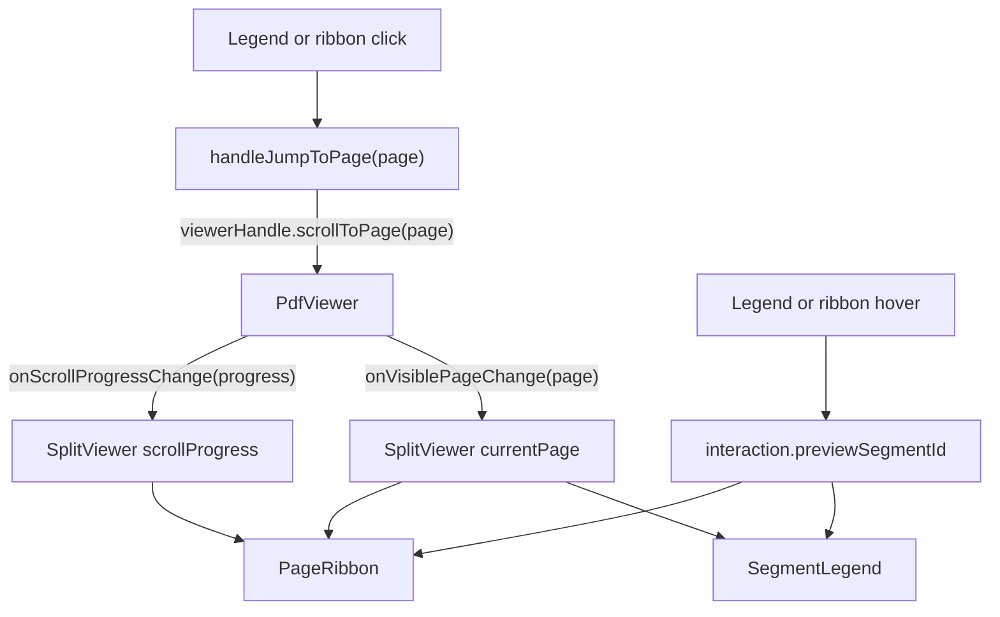
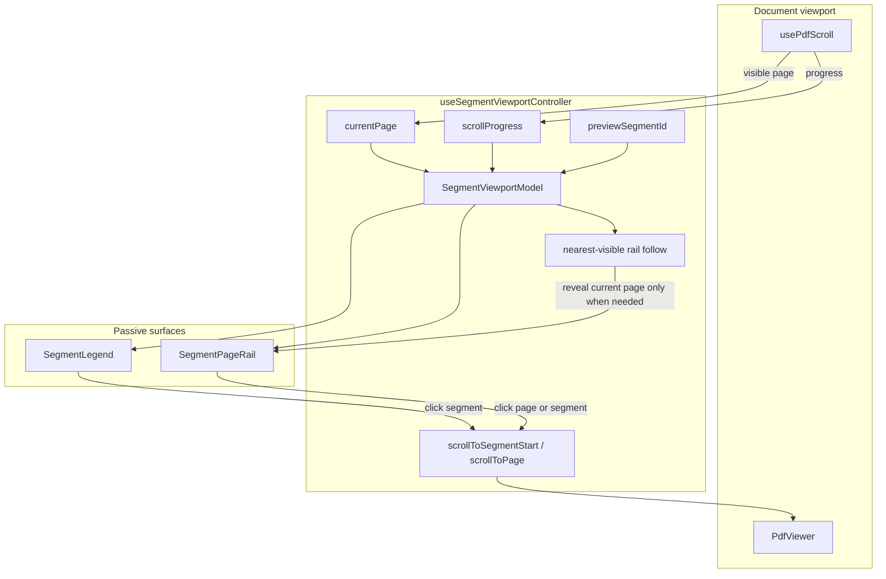
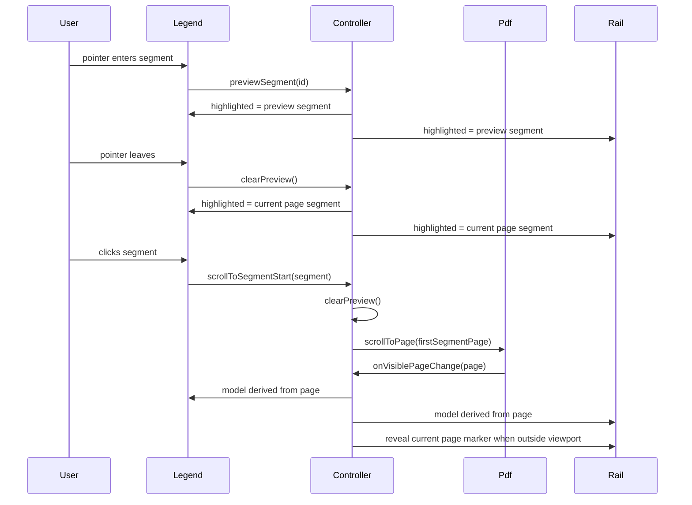

# Segment Rail Co-Scrolling Blueprint

## Standard

This is the target architecture for split-viewer segment highlighting, legend
interaction, and sidebar rail co-scrolling.

The component is complete when it has:

- one source of truth for the document page
- one derived segment model
- one transient preview field
- one document navigation path
- one sidebar rail follow policy
- passive rendering surfaces
- no sticky category state
- no duplicated scroll math
- no ambiguous naming

The system has exactly three inputs:

```txt
currentPage       page reported by the document viewport
scrollProgress    document scroll progress in [0, 1]
previewSegmentId  segment currently under a pointer
```

Everything else is derived.

## Invariants

```ts
type SegmentViewportModel = {
  currentPage: number | null
  currentSegmentId: string | null
  currentSegmentIds: readonly string[]
  previewSegmentId: string | null
  highlightedSegmentId: string | null
  highlightedSegmentIds: readonly string[]
  scrollProgress: number
}
```

```ts
currentSegmentIds = segmentsContaining(currentPage)
currentSegmentId = currentSegmentIds[0] ?? null
highlightedSegmentIds =
  previewSegmentId != null ? [previewSegmentId] : currentSegmentIds
highlightedSegmentId = highlightedSegmentIds[0] ?? null
```

Forbidden stored state:

```txt
activeSegmentId
selectedSegmentId
currentSegmentId
highlightedSegmentId
highlightedSegmentIds
```

Only `previewSegmentId`, `currentPage`, and `scrollProgress` are mutable. A
click is navigation. It is not selection.

## Current Implementation Gap

Current split-viewer flow:



Correct pieces:

- `segment-interaction.ts` derives highlight from preview or current page.
- `use-segment-interaction.ts` stores only transient preview.
- `PdfViewer` exposes `scrollToPage`, `scrollToPageArea`, and
  `getViewportElement`.
- Legend click clears preview before navigation.

Missing piece:

- no explicit controller owns `currentPage -> currentSegmentId ->
highlightedSegmentId`
- no rail viewport API exists
- no policy keeps the current page visible in the rail

## Target Architecture



The controller coordinates. The surfaces render. The PDF viewer scrolls the
document. No other module crosses those boundaries.

## Controller Contract

`useSegmentViewportController` is the only module where document scroll,
segment derivation, navigation, and rail co-scrolling meet.

```ts
type SegmentViewportController = {
  model: SegmentViewportModel
  interaction: SegmentInteraction
  documentHandlers: {
    onCurrentPageChange: (page: number) => void
    onScrollProgressChange: (progress: number) => void
    setViewerHandle: (handle: PdfViewerHandle | null) => void
  }
  navigation: {
    scrollToPage: (page: number) => void
    scrollToSegmentStart: (segment: Segment) => void
  }
  rail: {
    setViewportElement: (element: HTMLElement | null) => void
    setPageElement: (page: number, element: HTMLElement | null) => void
    onPointerEnter: () => void
    onPointerLeave: () => void
    onScroll: () => void
  }
}
```

Controller responsibilities:

- store `currentPage`
- store `scrollProgress`
- store the PDF viewer handle
- create `SegmentInteraction`
- derive `SegmentViewportModel`
- clear preview before document navigation
- call `viewerHandle.scrollToPage(page)`
- no-op document navigation until the viewer handle exists
- keep the rail current page visible through the nearest-visible policy

Controller non-responsibilities:

- render legend rows
- render rail blocks
- render PDF pages
- expose selected category state
- expose setters for derived segment ids

## Module Boundaries

### `segment-interaction.ts`

Owns pure segment state derivation:

- validate `previewSegmentId`
- normalize `currentPage`
- map current page to segment ids
- derive highlighted ids
- derive per-segment view state
- provide shared pointer and click handlers

It imports no React and reads no DOM.

### `use-segment-interaction.ts`

Owns transient preview state:

```ts
type SegmentInteraction = {
  previewSegmentId: string | null
  previewSegment: (segmentId: string) => void
  clearPreview: () => void
}
```

It contains no selected, active, or focus-derived highlight state.

### `SplitViewer`

Owns composition:

- normalize split output into `Segment[]`
- create `useSegmentViewportController`
- build `PdfViewerSlots`
- pass document handlers to `renderDocument`

It contains no scroll math and no highlighted-segment derivation.

### `SegmentLegend`

Owns legend rendering:

- render one button per visible segment
- render swatch and label
- render `aria-current="page"` for current-page segments
- call `onSelect(segment)` on click
- delegate preview events to `interaction`

It knows nothing about PDF handles, rail elements, or scroll policy.

### `SegmentPageRail`

Owns sidebar rail rendering and rail DOM registration:

- render the vertical page-axis rail
- expose its viewport element to the controller
- expose page marker elements to the controller
- render the current-page cursor
- render segment blocks through the shared segment state
- call `onSelectPage(page)` or `onSelect(segment)` on click

It derives no highlighted ids and stores no category state.

### `PageRibbon`

Remains the low-level page-axis drawing primitive. `SegmentPageRail` is the
split-viewer adapter that wraps it with rail viewport ownership.

## Co-Scrolling Policy

The rail uses **nearest-visible follow**.

Rules:

1. Document scroll updates `currentPage`.
2. `currentPage` updates the model immediately.
3. Legend and rail highlights update from the model immediately.
4. Rail auto-scroll runs only after the model changes.
5. Rail auto-scroll targets the current page marker.
6. Rail auto-scroll does nothing when the marker is already visible with margin.
7. Rail auto-scroll centers the marker when it is outside the visible region.
8. Rail auto-scroll is suspended while the pointer is inside the rail.
9. Rail auto-scroll is suspended while the user is actively scrolling the rail.
10. Programmatic rail scroll does not mark the rail as user-scrolling.
11. Hover preview never scrolls the document.
12. Hover preview never scrolls the rail.
13. Click navigation scrolls the document only.
14. The rail follows the click only after the document reports the new
    `currentPage`.

This avoids lockstep scroll. The rail assists orientation without taking control
away from the user.

## Rail Follow Algorithm

State:

```ts
type RailFollowState = {
  isPointerInsideRail: boolean
  isUserScrollingRail: boolean
  lastProgrammaticScrollAt: number
  idleTimer: number | null
}
```

Constants:

```ts
const RAIL_VISIBILITY_MARGIN = 24
const PROGRAMMATIC_SCROLL_WINDOW_MS = 120
const USER_SCROLL_IDLE_MS = 400
```

Follow current page:

```ts
function followCurrentPage(page: number) {
  if (state.isPointerInsideRail) return
  if (state.isUserScrollingRail) return

  const viewport = railViewportRef.current
  const target = pageElementByNumberRef.current.get(page)
  if (!viewport || !target) return

  const viewportRect = viewport.getBoundingClientRect()
  const targetRect = target.getBoundingClientRect()
  const minTop = viewportRect.top + RAIL_VISIBILITY_MARGIN
  const maxBottom = viewportRect.bottom - RAIL_VISIBILITY_MARGIN

  if (targetRect.top >= minTop && targetRect.bottom <= maxBottom) return

  const targetTop =
    target.offsetTop - viewport.clientHeight / 2 + target.offsetHeight / 2

  state.lastProgrammaticScrollAt = performance.now()
  viewport.scrollTo({
    top: Math.max(0, targetTop),
    behavior: "smooth",
  })
}
```

Classify rail scroll:

```ts
function handleRailScroll() {
  const elapsed = performance.now() - state.lastProgrammaticScrollAt
  if (elapsed < PROGRAMMATIC_SCROLL_WINDOW_MS) return

  state.isUserScrollingRail = true
  if (state.idleTimer != null) window.clearTimeout(state.idleTimer)
  state.idleTimer = window.setTimeout(() => {
    state.isUserScrollingRail = false
    state.idleTimer = null
  }, USER_SCROLL_IDLE_MS)
}
```

Cleanup clears `idleTimer`.

## Event Semantics



Click never writes segment highlight state.

## Accessibility Contract

Legend:

- each segment is a `button`
- current-page segments use `aria-current="page"`
- no segment uses `aria-selected`
- preview state is visual only
- keyboard focus remains a focus ring, not highlight state

Rail:

- clickable segment/page blocks are `button` elements
- each block has an accessible name containing segment label and page range
- page ticks are `aria-hidden`
- the current-page cursor is `aria-hidden`
- auto-scroll never moves focus
- auto-scroll never changes selection because there is no selection

Page thumbnails are a separate component. If thumbnails become selectable
operation targets, they use listbox semantics. The segment rail is navigation,
not a listbox.

## Naming Contract

Use exactly these names:

```txt
currentPage
currentSegmentId
currentSegmentIds
previewSegmentId
highlightedSegmentId
highlightedSegmentIds
scrollProgress
railViewport
railFollow
```

Do not introduce:

```txt
activeSegmentId
selectedSegmentId
hoveredSegmentId
focusedSegmentId
pageOwner
coScrollLock
syncScroll
```

`current` means document position. `preview` means pointer intent.
`highlighted` means rendered emphasis. `selected` is not part of this system.

## Performance Contract

Per document scroll frame:

- PDF scroll math computes `currentPage`
- no segment surface queries the PDF DOM
- no rail code iterates over every button
- no React state stores per-page DOM elements

Per current-page change:

- segment derivation is O(number of visible segments)
- rail follow lookup is O(1)
- rail geometry reads one viewport rect and one target rect
- rail scroll writes at most one `scrollTo`

Persistent refs:

```ts
railViewportRef: HTMLElement | null
pageElementByNumberRef: Map<number, HTMLElement>
railFollowStateRef: RailFollowState
```

## Tests

Unit tests:

- derives `currentSegmentIds` from `currentPage`
- derives highlight from current page when no preview exists
- derives highlight from preview while preview exists
- clears preview before segment navigation
- calls `scrollToPage(firstSegmentPage)` on legend click
- never stores or exposes selected segment state
- returns to current-page highlight after pointer leave
- returns to current-page highlight after scrolling outside a clicked segment

Rail tests:

- registers the rail viewport
- registers page marker elements
- does not scroll when the current page marker is visible
- scrolls when the current page marker is above the visible region
- scrolls when the current page marker is below the visible region
- suspends rail follow while the pointer is inside the rail
- suspends rail follow during user rail scroll
- ignores scroll events caused by programmatic rail follow
- clears the rail idle timer on unmount

Browser smoke:

1. Open `/blocks`.
2. Click each legend segment.
3. Verify the document lands on the segment's first page.
4. Scroll the document outside that segment.
5. Verify the old segment is not highlighted.
6. Hover another segment.
7. Verify preview highlight appears immediately.
8. Leave hover.
9. Verify highlight returns to the current page segment.
10. Scroll the document through multiple segments.
11. Verify the rail keeps the current page marker visible.
12. Manually scroll the rail.
13. Verify document scrolling does not yank the rail while the rail is under
    pointer control.

## Implementation Order

1. Add `useSegmentViewportController`.
2. Move `currentPage`, `scrollProgress`, viewer handle, and navigation from
   `SplitViewer` into the controller.
3. Add `SegmentPageRail`.
4. Give `SegmentPageRail` viewport and page-marker registration callbacks.
5. Implement nearest-visible rail follow in the controller.
6. Keep `SegmentLegend` and `PageRibbon` passive.
7. Add controller and rail tests.
8. Run the browser smoke flow.

## Final Shape

```txt
SplitViewer
  normalizes split output
  creates the segment viewport controller
  wires document slots

useSegmentViewportController
  owns current page, progress, preview, navigation, and rail follow
  derives the full segment viewport model

SegmentLegend
  renders segment navigation

SegmentPageRail
  renders page-axis navigation
  registers rail geometry

PdfViewer
  reports current page and progress
  executes document scroll requests
```

That is the whole component. There is no second state model.
