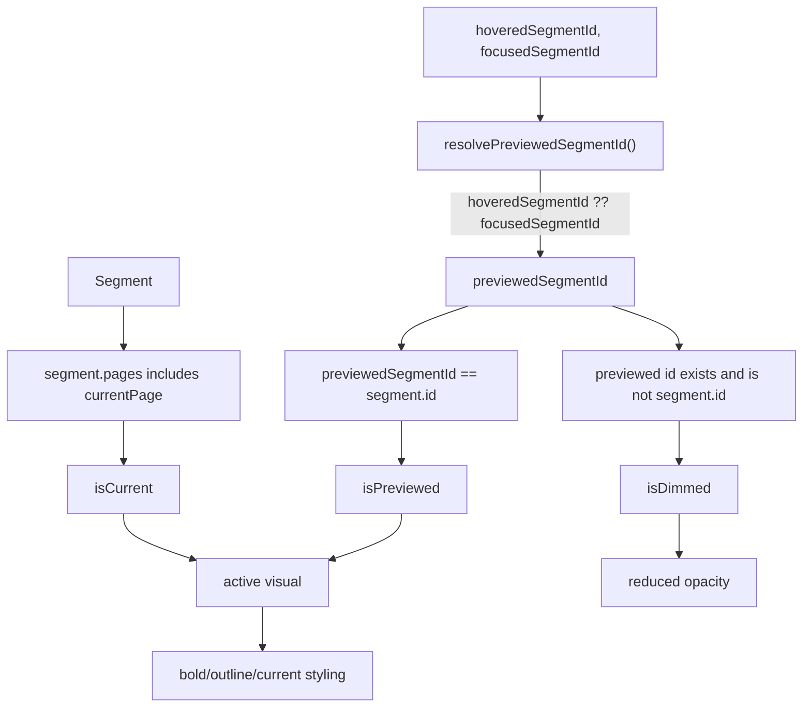
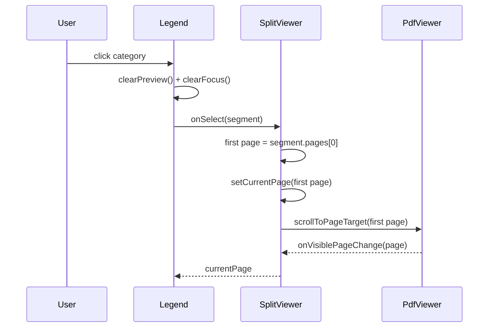
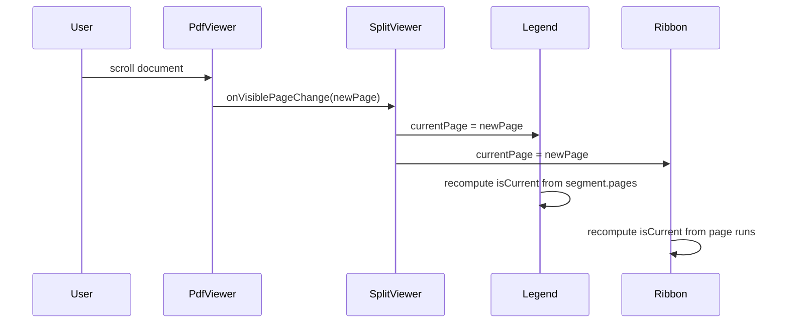
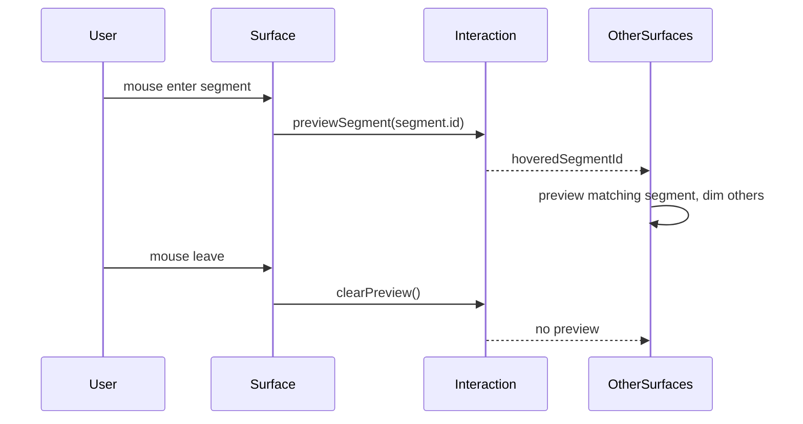
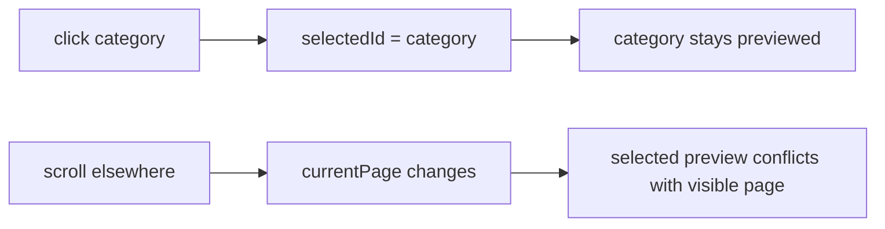

# Segment Navigation Architecture

This document describes the segment navigation model shared by the split
viewer, sidebar, legend, ribbon, and timeline surfaces.

The architecture is intentionally small:

- `currentPage` owns the active category for the visible document position.
- `hoveredSegmentId` and `focusedSegmentId` own temporary preview state.
- Clicks are navigation commands only.
- There is no persistent selected category.
- Segment controls do not emit `aria-pressed` or `data-selected`.

## System Diagram

```mermaid
flowchart TD
  SplitOutput["Split output"] --> ToSegments["toSegments(output)"]
  ToSegments --> Segments["Segment[]\nid, label, pages, color, confidence"]

  PdfViewer["PdfViewer"] -->|onVisiblePageChange(page)| CurrentPage["SplitViewer.currentPage"]
  PdfViewer -->|onScrollProgressChange(progress)| ScrollProgress["SplitViewer.scrollProgress"]
  PdfViewer -->|ref| ViewerHandle["PdfViewerHandle"]

  SplitViewer["SplitViewer"] --> Segments
  SplitViewer --> CurrentPage
  SplitViewer --> ScrollProgress
  SplitViewer --> Interaction["useSegmentInteraction()\nhoveredSegmentId, focusedSegmentId"]
  SplitViewer --> Slots["PdfViewer slots"]

  Slots --> Legend["SegmentLegend\ntop slot"]
  Slots --> Ribbon["PageRibbon\nleft slot"]

  Segments --> Legend
  Segments --> Ribbon
  CurrentPage --> Legend
  CurrentPage --> Ribbon
  ScrollProgress --> Ribbon
  Interaction --> Legend
  Interaction --> Ribbon

  Legend --> SurfaceProps["getSegmentSurfaceProps()"]
  Ribbon --> SurfaceProps

  SurfaceProps --> SurfaceState["Segment state\nisHovered\nisFocused\nisPreviewed\nisCurrent\nisActive\nisDimmed"]

  SurfaceState --> LegendVisuals["Legend visuals\nbold if current or previewed\ndim if unrelated preview exists"]
  SurfaceState --> RibbonVisuals["Ribbon visuals\noutline if current or previewed\ndim if unrelated preview exists"]

  LegendClick["Legend click"] --> FirstPage["first segment page"]
  RibbonClick["Ribbon run click"] --> RunStart["run start page"]
  FirstPage --> Jump["handleJumpToPage(page)"]
  RunStart --> Jump

  Jump --> OptimisticCurrent["setCurrentPage(page)"]
  Jump --> ScrollHandle["viewerHandle.scrollToPageTarget(page)"]
  ScrollHandle --> PdfViewer

  MouseEnter["mouse enter segment"] --> SetHover["previewSegment(segment.id)"]
  MouseLeave["mouse leave segment/surface"] --> ClearHover["clearPreview()"]
  Focus["focus segment"] --> SetFocus["focusSegment(segment.id)"]
  Blur["blur segment"] --> ClearFocus["clearFocus()"]
```

## State Ownership

| State              | Owner                                   | Meaning                                              | Lifetime                     |
| ------------------ | --------------------------------------- | ---------------------------------------------------- | ---------------------------- |
| `segments`         | `SplitViewer` via `toSegments(output)`  | The semantic page ownership model.                   | Until split output changes.  |
| `currentPage`      | `SplitViewer`, fed by `PdfViewer`       | The page currently visible in the document.          | Changes with scroll or jump. |
| `scrollProgress`   | `SplitViewer`, fed by `PdfViewer`       | Fine cursor position for the ribbon rail.            | Changes with scroll.         |
| `hoveredSegmentId` | `useSegmentInteraction`                 | Segment currently under the pointer.                 | Cleared on leave.            |
| `focusedSegmentId` | `useSegmentInteraction`                 | Segment currently keyboard-focused.                  | Cleared on blur.             |
| `viewerHandle`     | `SplitViewer`, fed by document renderer | Imperative bridge into the virtualized PDF scroller. | Mounted with `PdfViewer`.    |

There is deliberately no `selectedId`. A clicked category must not become a
sticky visual state.

## Preview Resolution



Resolution rule:

```ts
previewedSegmentId = hoveredSegmentId ?? focusedSegmentId ?? null
isCurrent = segment.pages.includes(currentPage)
isPreviewed = previewedSegmentId === segment.id
isActive = isCurrent || isPreviewed
isDimmed = previewedSegmentId != null && !isPreviewed
```

The visual active state is:

```ts
isActive = isCurrent || isPreviewed
```

## Interaction Flows

### Click Category



Clicking clears transient preview/focus and does not create selection. The
category is active after click only because the PDF moves to a page owned by
that category.

### Scroll Out Of Category



The old category clears naturally when `newPage` is not in its `pages` array.
No cleanup callback is needed.

### Hover Preview



Hover preview is temporary. It may visually coexist with `currentPage`, but it
does not replace the document-owned current-page state.

## Component Responsibilities

### `SplitViewer`

- Converts split output into `Segment[]`.
- Owns `currentPage`, `scrollProgress`, and `viewerHandle`.
- Creates the shared `interaction` object.
- Provides `SegmentLegend` in the PDF top slot.
- Provides `PageRibbon` in the PDF left slot.
- Implements `handleJumpToPage(page)`.

### `PdfViewer`

- Owns actual document scrolling and virtualization.
- Reports visible page changes to `SplitViewer`.
- Exposes `scrollToPageTarget(page)` through `PdfViewerHandle`.

### `useSegmentInteraction`

- Owns only transient interaction state:
  - `hoveredSegmentId`
  - `focusedSegmentId`
- Exposes semantic methods:
  - `previewSegment(segmentId)`
  - `clearPreview()`
  - `focusSegment(segmentId)`
  - `clearFocus()`
- Does not know about current page or navigation.

### `getSegmentSurfaceProps`

- Derives reusable segment state:
  - `isHovered`
  - `isFocused`
  - `isPreviewed`
  - `isCurrent`
  - `isActive`
  - `isDimmed`
- Provides event handlers for hover, focus, blur, leave, and click.
- Click only calls `onSelect(segment)`.
- Emits only `data-previewed`, `data-current`, and `data-active`.

### `SegmentLegend`

- Renders color-key buttons.
- Uses `currentPage` for document-owned active styling.
- Uses `hoveredSegmentId` / `focusedSegmentId` for preview styling.
- Calls `onSelect(segment)` on click.

### `SegmentSidebar`

- Renders segment rows with page ranges and metadata.
- Uses the same surface props as the legend.
- Calls `onSelect(segment)` on click.

### `PageRibbon`

- Renders page-proportional segment runs.
- Uses `currentPage` and `scrollProgress` for the rail cursor/current run.
- Calls `onSelectPage(start)` for the clicked run start page.

### `PageTimeline`

- Renders page cells mapped to segment owners.
- Shares the same hover/focus model.
- Calls `onSelectPage(page)` on page-cell click.

## Invariants

These rules define the expected behavior:

- A category is visually active if and only if it is current, hovered, or
  focused.
- A clicked category is not selected. It becomes active only if the document
  scrolls to one of its pages.
- Scrolling away from a category removes that category's current-page styling.
- Hovering a category may dim unrelated categories, but leaving hover clears
  that preview state.
- Keyboard focus behaves like hover for preview, but focus does not change the
  current page.
- Segment controls are navigation controls, not toggle buttons.
- Segment controls must not use `aria-pressed`.
- Segment controls must not emit `data-selected`.

## Anti-Model

The old behavior treated click as persistent selection:



That model is removed. Persistent selection is the source of the inconsistent
state where the user has scrolled out of a category but the category remains
previewed.
