# Universal File Viewer Greenfield Blueprint

This blueprint intentionally ignores the current implementation. It describes the file viewer we would build if we were free to cut every legacy path, rename every concept, and optimize for the simplest complete model.

The target is a universal document surface:

- one shell
- many renderer adapters
- one shell geometry contract
- one viewport model
- one anchor model
- one control registry
- no renderer-specific layout policy in the shell
- no shell-specific correction loops in renderers

## Review Revision

Reviewing the current code and shadcn's sidebar changes one important part of the original blueprint: the shell should be primitive-first, not store-first.

The ideal viewer is not a hidden headless runtime that happens to render React primitives. It is a shadcn-style compound component: small owned primitives, semantic state in context, visible `data-*` attributes, CSS variables for dimensions, and a narrow document runtime below the viewport for work that truly needs JavaScript.

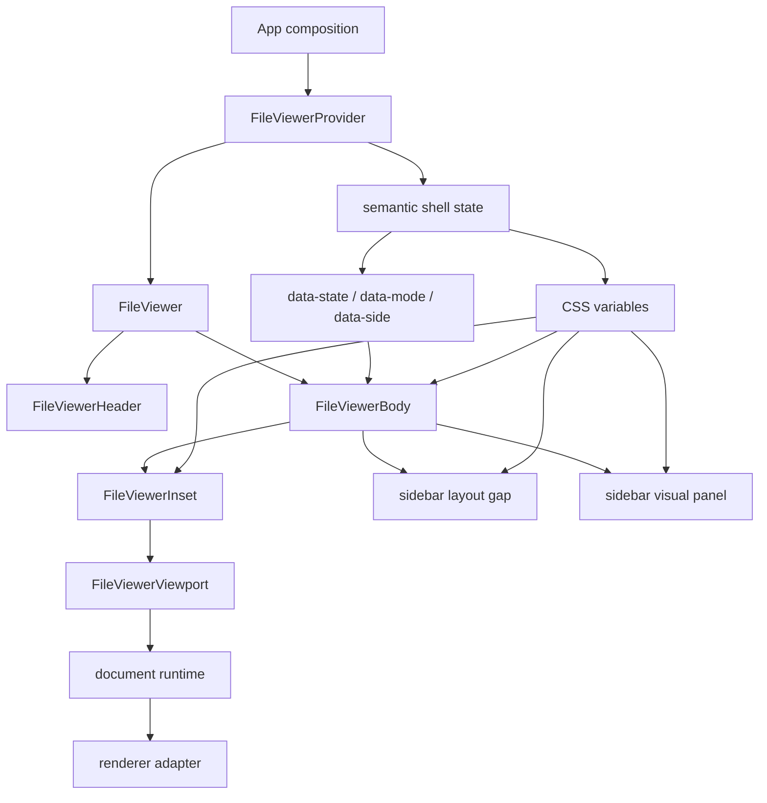

The revision is:

- keep the universal renderer contract
- keep generic document anchors, scroll mapping, and render windows
- make the shell layout shadcn-like and CSS-led
- limit external stores to high-frequency document state
- remove any ambition for one giant store owning every viewer concern

The design smell in the current implementation is not that it has JavaScript. The smell is that shell motion has two authorities: CSS/data-state primitives and a JavaScript geometry transition loop. That makes delay, drift, and mismatch possible by design.

## North Star

The viewer is not a PDF viewer with extra formats. It is a document runtime.

Every supported format answers the same questions:

- What resource is this?
- What is its intrinsic document model?
- What layout does it produce at this viewport size?
- What reading anchor should survive layout changes?
- What render window is needed right now?
- What controls does the document expose?
- What can be downloaded, copied, searched, selected, or cited?

PDF, image, markdown, CSV, DOCX, PPTX, XLSX, HTML, code, and text are adapters. None of them owns the shell.

## Core Diagram

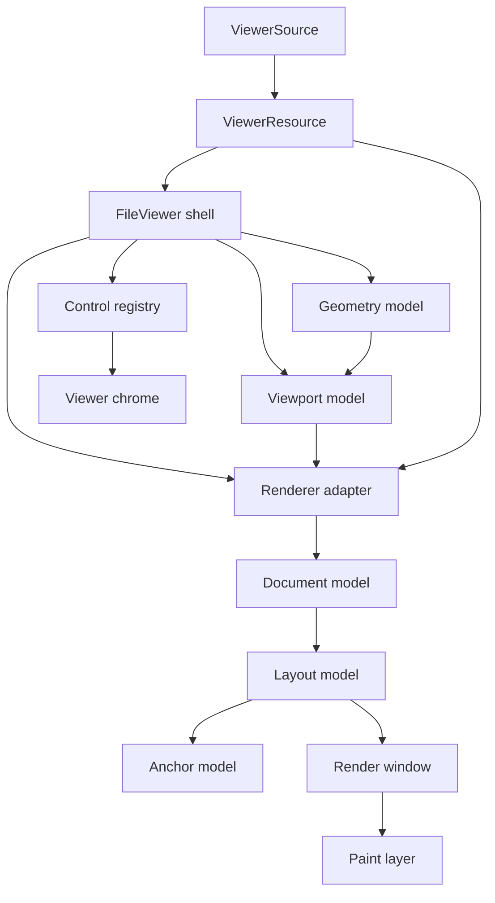

The shell owns space. The renderer owns document meaning.

## Layer Contract

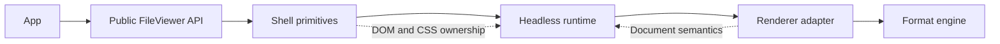

Responsibilities:

| Layer | Owns | Does not own |
| --- | --- | --- |
| App | source, composition, product-specific chrome | document layout algorithms |
| Shell primitives | slots, DOM structure, accessibility, geometry | file parsing |
| Document runtime | viewport metrics, controls, anchor persistence, render scheduling | shell layout animation |
| Renderer adapter | intrinsic layout, anchors, render windows, format controls | sidebar width, app chrome |
| Format engine | low-level parsing/rendering | React composition |

## Shadcn Sidebar Lessons

The shadcn sidebar is a good reference because its architecture makes invalid states hard to express.

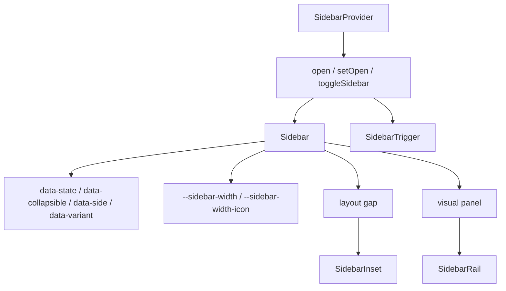

Lessons to keep:

- the provider owns semantic state, not pixel-by-pixel animation state
- dimensions are declared as CSS variables at the primitive boundary
- variants are data attributes, not prop-drilled booleans at every descendant
- the layout gap and the visual panel are separate DOM concerns
- the trigger targets the nearest provider, so consumers cannot wire it to the wrong sidebar
- mobile and desktop are separate paths, not one overloaded layout pretending to be both
- internal helper APIs stay internal; public primitives describe the mental model

For the file viewer, the same pattern applies with one adjustment: the sidebar is attached to the document edge inside the viewer body, not fixed to the viewport edge.

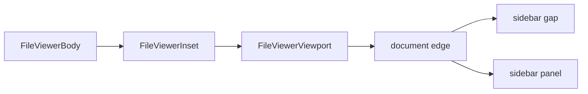

## Current Code Lessons

The current code already moved in the right direction, but it still carries mixed ownership.

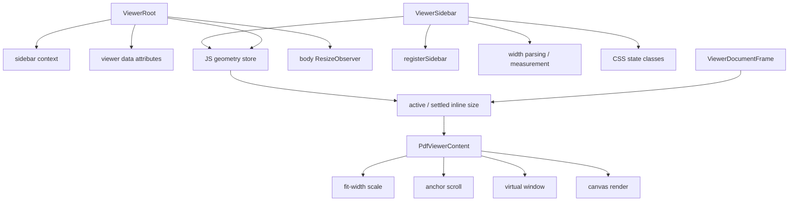

What is good:

- `ViewerRoot` behaves like a real primitive owner: it has context, data attributes, ids, and one registered sidebar.
- `ViewerSidebarTrigger` targets the nearest root implicitly, which is the right composition invariant.
- `viewer-document-geometry.ts` and `viewer-document-scroll.ts` are the right abstraction direction: anchors and scroll transactions are document concepts, not PDF quirks.
- The active/settled size split is the correct idea for smooth visual resize without rerasterizing every frame.

What is not good enough:

- `viewer-internals.tsx` owns too many unrelated concepts: contexts, state attributes, geometry store, CSS parsing, DOM measurement, and mode hysteresis.
- `ViewerSidebar` is half shadcn primitive and half geometry consumer. Inline sidebar motion is driven by `geometry.sidebarInlineSize` rather than a CSS-led gap/panel contract.
- `ViewerRoot` measures body size and also drives a JavaScript transition clock; the DOM/CSS tree has its own timing.
- `PdfViewerContent` is still doing too much: resource lifecycle, frame sizing, scale, scroll, virtualization, controls, and render scheduling.
- The tests prove many good contracts, but some tests now preserve implementation shape rather than just user-visible invariants.

The revised blueprint keeps the hard-won generic document abstractions, but moves shell motion back toward the shadcn model.

## Public API

The public API should be small and inevitable. It should read like the DOM anatomy of the viewer, not like the internal renderer runtime.

```tsx
<FileViewerProvider source={source} renderers={renderers}>
  <FileViewer>
    <FileViewerHeader />
    <FileViewerBody>
      <FileViewerInset>
        <FileViewerViewport>
          <FileViewerDocument />
        </FileViewerViewport>
      </FileViewerInset>
      <FileViewerSidebar />
    </FileViewerBody>
  </FileViewer>
</FileViewerProvider>
```

The default composition should be complete. Custom composition should be possible without changing the runtime model.

```tsx
<FileViewerProvider source={source}>
  <FileViewer sidebarMode="inline" sidebarSide="right">
    <FileViewerHeader>
      <FileViewerIdentity />
      <FileViewerToolbar />
      <FileViewerSidebarTrigger />
    </FileViewerHeader>
    <FileViewerBody>
      <FileViewerInset>
        <FileViewerViewport>
          <FileViewerDocument />
        </FileViewerViewport>
      </FileViewerInset>
      <FileViewerSidebar aria-label="Pages">
        <FileViewerNavigation />
      </FileViewerSidebar>
    </FileViewerBody>
  </FileViewer>
</FileViewerProvider>
```

Public primitives:

- `FileViewerProvider`
- `FileViewer`
- `FileViewerHeader`
- `FileViewerIdentity`
- `FileViewerToolbar`
- `FileViewerBody`
- `FileViewerInset`
- `FileViewerSidebar`
- `FileViewerSidebarTrigger`
- `FileViewerNavigation`
- `FileViewerViewport`
- `FileViewerDocument`
- `FileViewerStatus`

No public `Surface`, `Frame`, geometry store, or PDF-specific layout primitive. `Inset` is public because it is the visible layout counterpart to `Sidebar`, the same way shadcn exposes `SidebarInset`.

The lower-level `ViewerRoot`, `ViewerSidebar`, and `ViewerViewport` primitives can exist as source-owned internals for other compound viewers, but public file-viewer docs should lead with the file-viewer vocabulary.

## Source Contract

The source contract is explicit and boring.

```ts
type ViewerSource =
  | {
      kind: "url"
      url: string
      fileName: string
      mimeType?: string
      byteLength?: number
    }
  | {
      kind: "blob"
      blob: Blob
      fileName: string
      mimeType?: string
    }
  | {
      kind: "text"
      text: string
      fileName: string
      mimeType: string
    }
```

The viewer never guesses identity from layout. It resolves the renderer from explicit resource metadata:

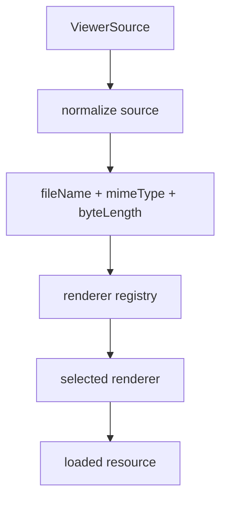

Renderer selection priority:

1. explicit `mimeType`
2. explicit `fileName` extension
3. sniffed bytes only when no explicit metadata exists
4. fallback renderer

No layout-based inference.

## Renderer Contract

The renderer is a pure adapter from resource plus viewport to document model.

```ts
type ViewerRenderer<Resource, Anchor, Target> = {
  id: string
  match(resource: ViewerResource): boolean
  load(resource: ViewerResource, signal: AbortSignal): Promise<Resource>
  getInitialState(resource: Resource): RendererState
  getLayout(input: RendererLayoutInput<Resource>): ViewerDocumentLayout<Anchor>
  getRenderWindow(input: RendererWindowInput<Anchor>): ViewerRenderWindow
  getControls(input: RendererControlsInput<Resource, Target>): ViewerControl[]
  render(input: RendererPaintInput<Resource, Anchor>): React.ReactNode
}
```

The renderer provides document facts. It does not measure the shell.

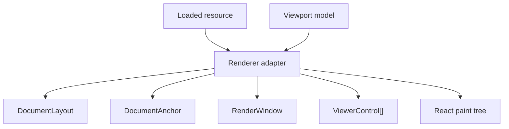

## Document Layout Contract

Every renderer returns the same layout shape.

```ts
type ViewerDocumentLayout<Anchor> = {
  inlineSize: number
  blockSize: number
  captureAnchor(input: AnchorCaptureInput): Anchor | null
  resolveAnchor(input: AnchorResolveInput<Anchor>): number | null
}
```

Examples:

| Format | Anchor |
| --- | --- |
| PDF | page number plus page-relative Y |
| image | normalized X/Y |
| markdown | block id plus offset |
| code | line number plus column |
| CSV/XLSX | row id plus row-relative offset |
| DOCX/PPTX | page/slide id plus offset |

The shell does not know those anchor types. It only stores and asks the adapter to resolve them.

## Geometry Model

The geometry model is one deterministic scalar tree. It must not depend on after-paint correction.

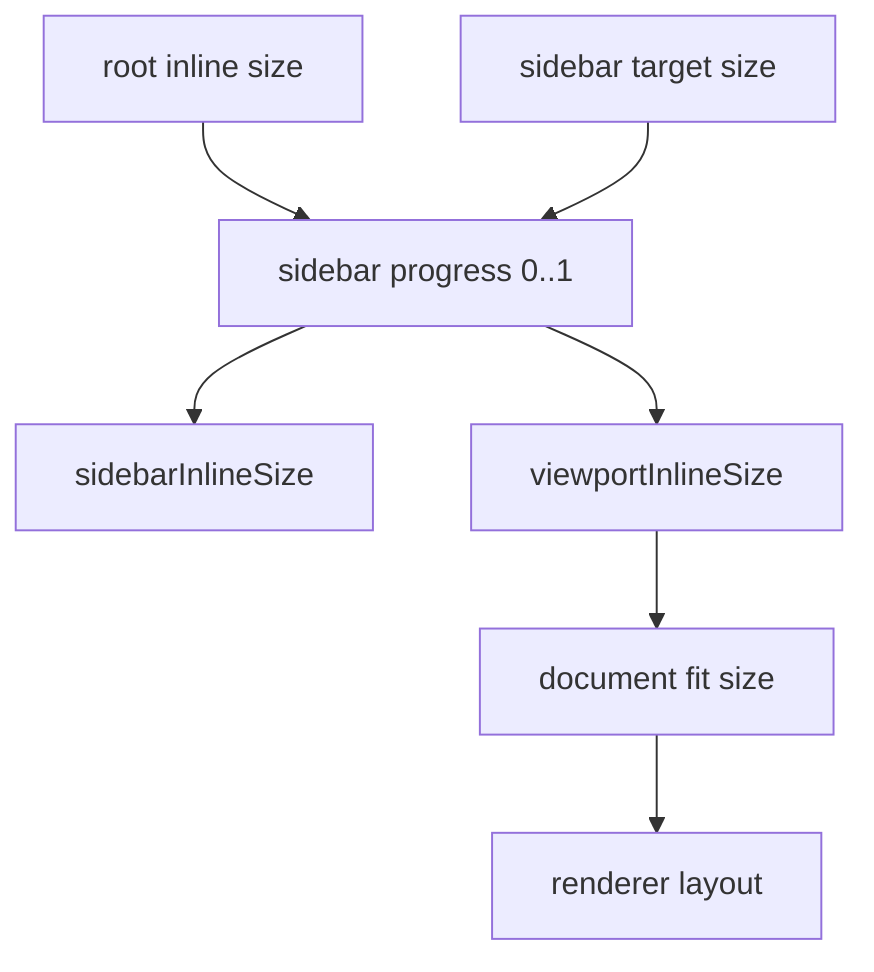

Formula:

```ts
sidebarInlineSize = sidebarWidth * sidebarProgress
viewportInlineSize = rootInlineSize - sidebarInlineSize
documentInlineSize = constrain(viewportInlineSize, documentMaxInlineSize)
```

There is no separate sidebar animation model, document frame model, and PDF scale model. One geometry model feeds all of them.

## Sidebar Animation

The sidebar is a layout participant, not an overlay pretending to be layout.

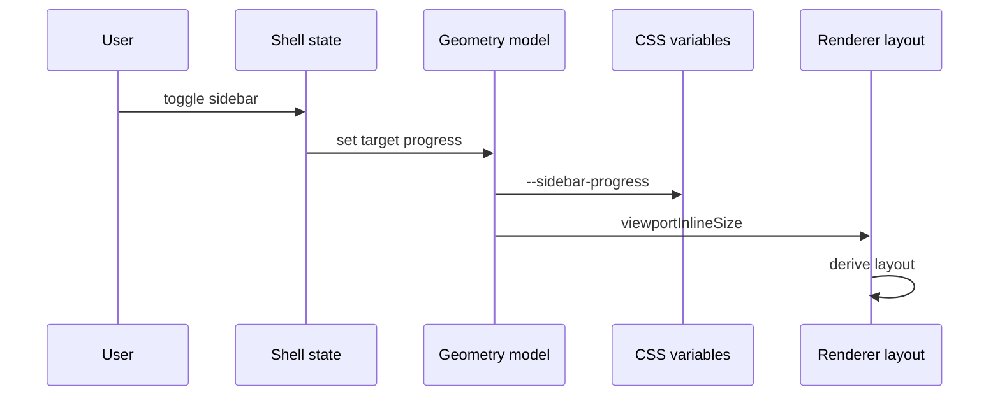

The shell exposes CSS variables:

```css
[data-file-viewer-root] {
  --viewer-sidebar-width: 280px;
  --viewer-sidebar-progress: 0;
  --viewer-sidebar-size: calc(
    var(--viewer-sidebar-width) * var(--viewer-sidebar-progress)
  );
  --viewer-viewport-inline-size: calc(
    100% - var(--viewer-sidebar-size)
  );
}
```

The sidebar panel is anchored to the document boundary:

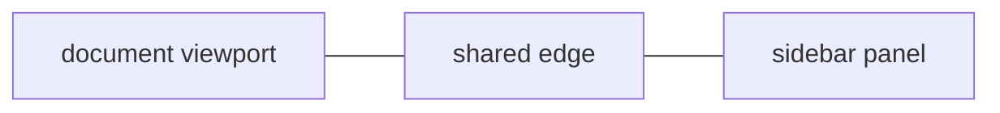

Invariant:

```txt
sidebar panel edge === document viewport edge
```

If that invariant is false, the design is wrong.

## Viewport Model

The viewport model is format-neutral.

```ts
type ViewerViewportModel = {
  inlineSize: number
  blockSize: number
  scrollTop: number
  scrollLeft: number
  scrollIntent: "idle" | "user" | "programmatic" | "layout"
}
```

The runtime owns scroll intent. Renderers should not infer intent from DOM events.

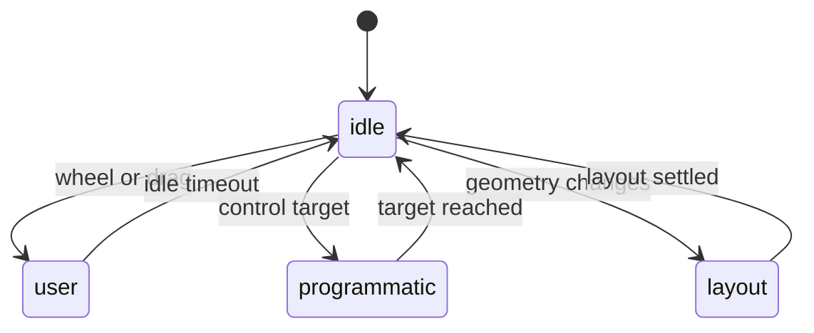

## Anchor Persistence

Anchor persistence is the core behavior. Smooth resizing is a consequence.

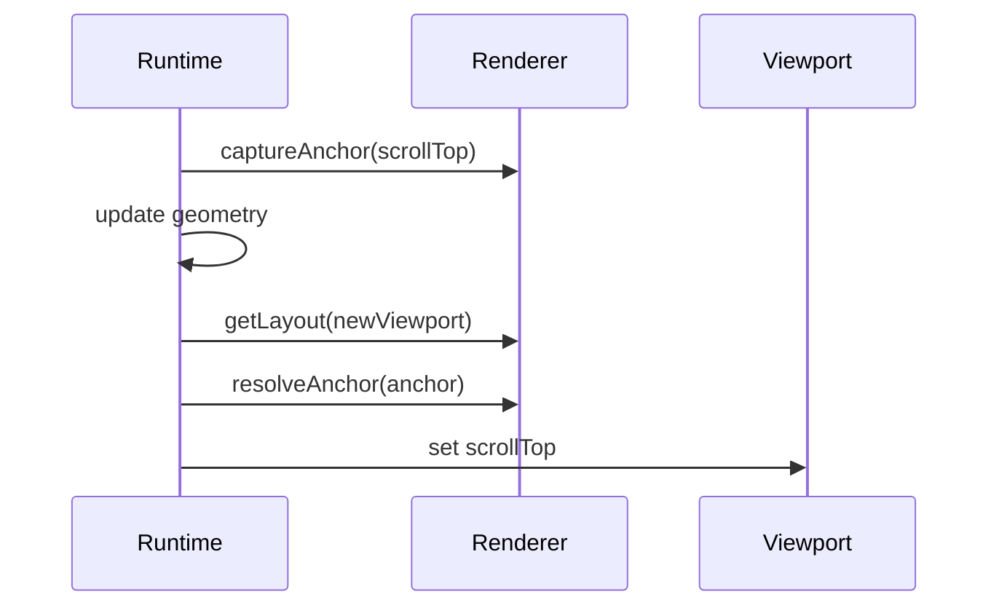

Rules:

- capture before layout changes
- resolve after layout changes
- never ask the DOM what semantic item is visible
- never use page-specific correction loops in the shell
- keep the same anchor through the whole transition

## Render Window

Virtualization is renderer-defined but runtime-coordinated.

```ts
type ViewerRenderWindow = {
  visible: readonly ViewerItemKey[]
  active: readonly ViewerItemKey[]
  preload: readonly ViewerItemKey[]
}
```

The runtime provides viewport metrics. The renderer returns item keys.

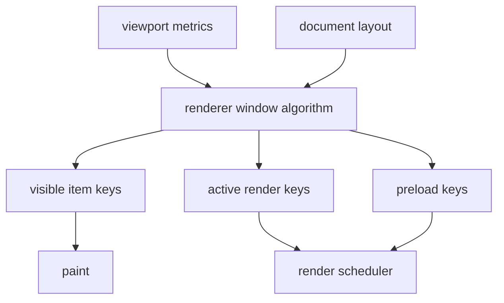

For PDF:

- visible: pages intersecting viewport
- active: visible pages plus overscan
- preload: adjacent pages

For code:

- visible: visible line chunks
- active: visible chunks plus overscan
- preload: next chunks in scroll direction

For markdown:

- visible: block ranges
- active: block ranges plus image/code preloads
- preload: next sections

## Render Quality

Visual resize and render quality are separate.

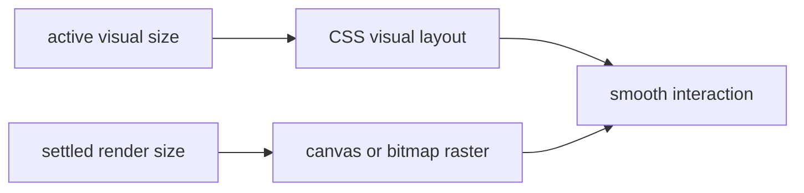

During transition:

- visual layout follows `activeInlineSize`
- expensive render targets use `settledInlineSize`
- after transition, render targets catch up once

This avoids blinking and avoids re-rasterizing on every animation frame.

## Controls

Controls are registered by renderers and rendered by shell chrome.

```ts
type ViewerControl =
  | { kind: "button"; id: string; label: string; icon: Icon; action: () => void }
  | { kind: "toggle"; id: string; label: string; pressed: boolean; action: () => void }
  | { kind: "select"; id: string; label: string; value: string; options: ViewerControlOption[] }
  | { kind: "status"; id: string; label: string; value: string }
```

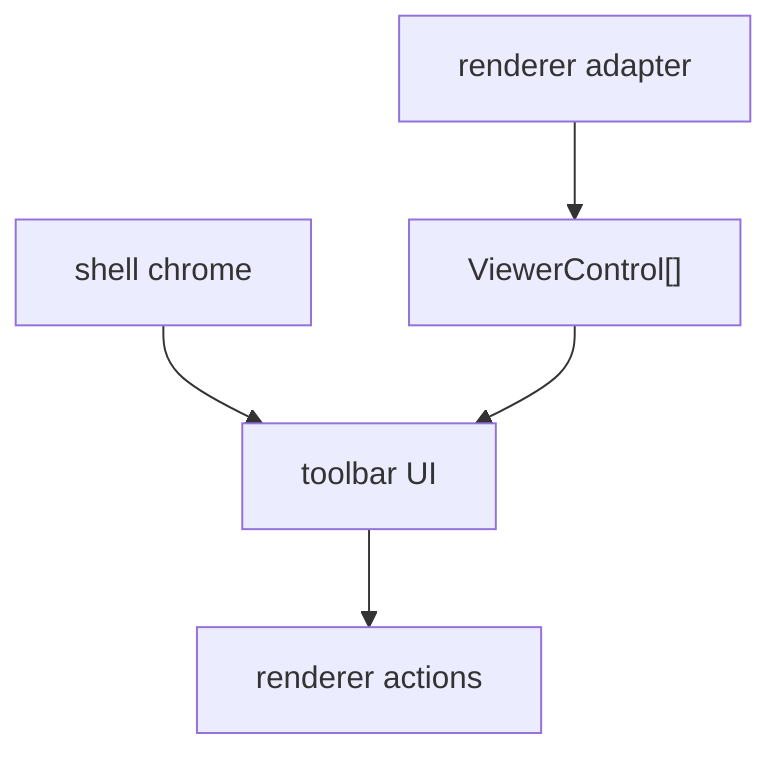

The shell controls placement and accessibility. The renderer controls meaning.

## Resource Lifecycle

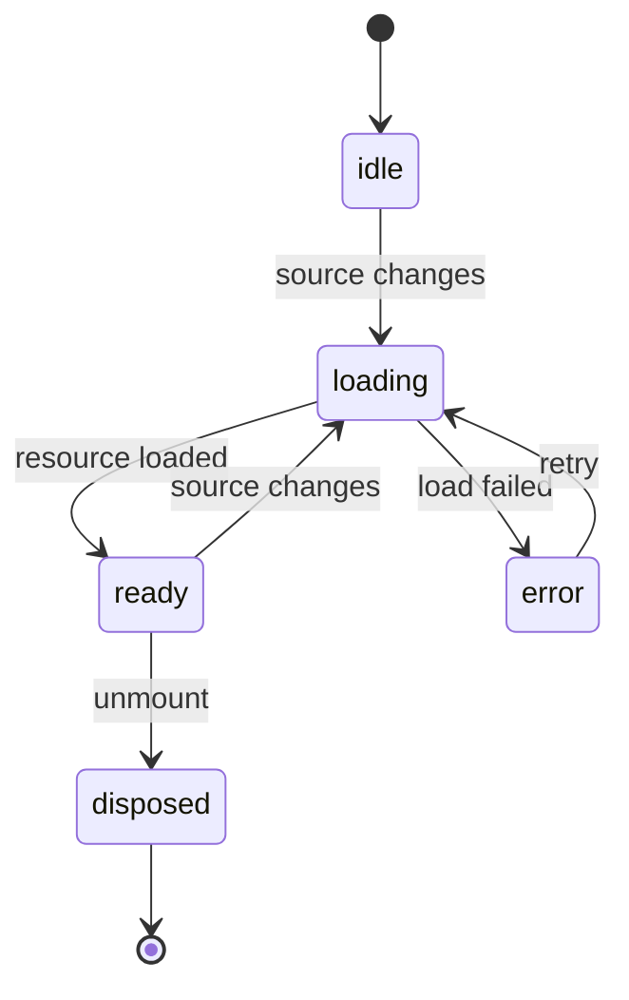

Rules:

- loading is abortable
- loaded resources are retained while visible
- renderer caches are keyed by resource identity and render signature
- disposal is explicit

## Error Model

Errors are typed at the boundary where they occur.

```ts
type ViewerError =
  | { kind: "source"; message: string; retryable: boolean }
  | { kind: "resource"; message: string; retryable: boolean }
  | { kind: "renderer"; rendererId: string; message: string; retryable: boolean }
  | { kind: "unsupported"; mimeType?: string; fileName?: string }
```

The shell renders all errors. Renderers only throw or return typed failures.

## Accessibility

The shell guarantees:

- one labeled viewer region
- one labeled toolbar
- one document viewport
- sidebar trigger with `aria-controls`
- sidebar hidden/inert state while closed
- keyboard scroll works in viewport
- controls are reachable in DOM order
- document items expose meaningful labels when renderer can provide them

Renderer adapters guarantee:

- document item labels
- page/slide/row/line semantics where applicable
- text selection when possible
- fallback text for non-text surfaces

## Native HTML/CSS Bias

Use browser layout as the primary engine.

Use JavaScript for:

- source loading
- renderer selection
- semantic layout calculation
- anchor capture and resolution
- render window calculation
- expensive render scheduling

Use CSS for:

- shell layout
- sidebar motion
- clipping
- stacking
- responsive density
- visual transition timing

Avoid:

- measuring after every frame to decide what should have happened
- renderer-specific DOM correction in the shell
- scrollTop feedback loops that fight user input
- layout state duplicated in CSS and JS under different names

## Module Tree

Greenfield file layout:

```txt
file-viewer/
  public/
    FileViewer.tsx
    primitives.tsx
    types.ts
  runtime/
    viewer-store.ts
    resource-store.ts
    geometry-model.ts
    viewport-model.ts
    anchor-controller.ts
    controls-store.ts
    renderer-registry.ts
  renderers/
    pdf/
      pdf-renderer.tsx
      pdf-layout.ts
      pdf-anchors.ts
      pdf-window.ts
      pdf-controls.ts
      pdf-page.tsx
    image/
    markdown/
    code/
    table/
    office/
  internal/
    css-vars.ts
    dom-size.ts
    warnings.ts
    ids.ts
```

No catch-all `internals.tsx`.

## State Ownership

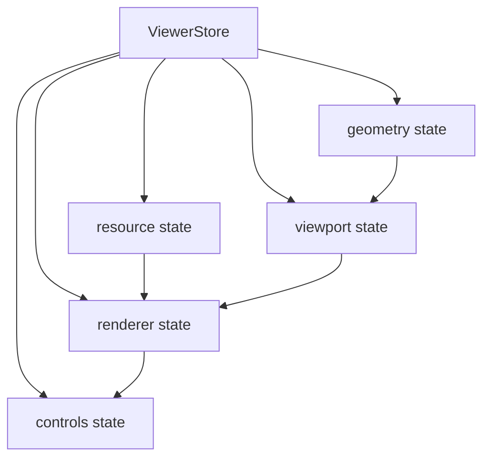

State slices are separate, but composed through one store. That gives one subscription boundary and avoids context soup.

## React Boundary

React renders state. React does not own every state transition.

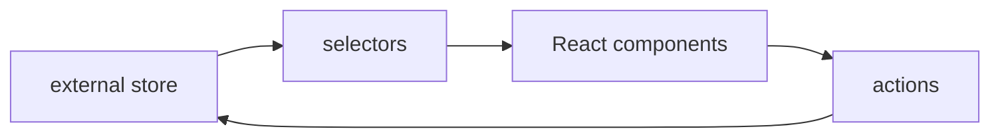

Use `useSyncExternalStore` selectors for high-frequency state:

- geometry progress
- viewport metrics
- render windows
- controls

Use React state for local UI only:

- menu open state
- hover state
- uncontrolled inputs

## Format Adapters

PDF adapter:

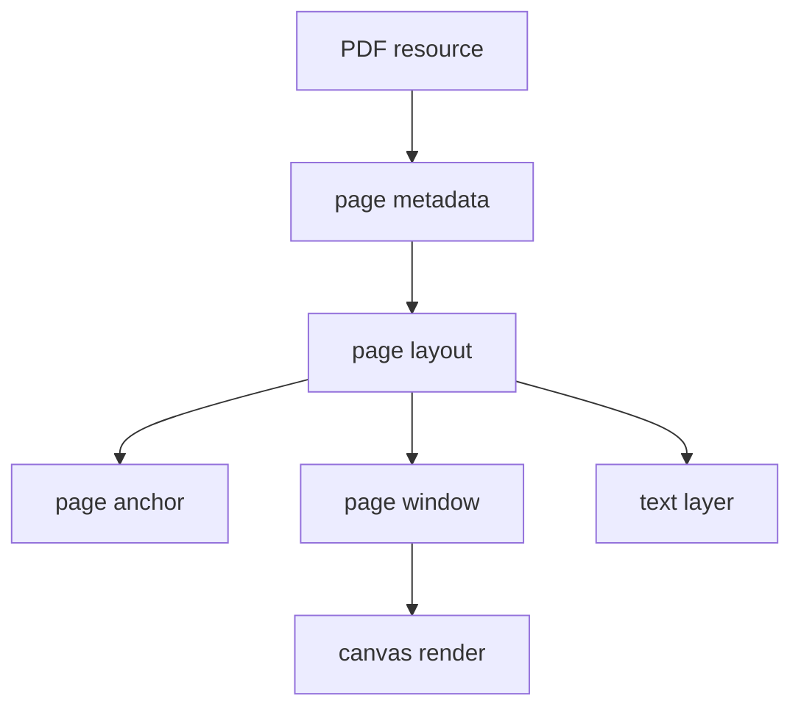

Markdown adapter:

```mermaid
flowchart TD
  Markdown["markdown text"] --> AST["syntax tree"]
  AST --> Blocks["block layout"]
  Blocks --> Anchor["block anchor"]
  Blocks --> Window["block window"]
  Window --> DOM["semantic DOM"]
```

Table adapter:

```mermaid
flowchart TD
  Sheet["table resource"] --> Grid["grid model"]
  Grid --> Rows["row layout"]
  Rows --> Anchor["row anchor"]
  Rows --> Window["row window"]
  Window --> Cells["cell paint"]
```

Image adapter:

```mermaid
flowchart TD
  Image["image resource"] --> Intrinsic["intrinsic size"]
  Intrinsic --> Layout["fit layout"]
  Layout --> Anchor["normalized anchor"]
  Layout --> Paint["image paint"]
```

## No Legacy Cut

Because this is greenfield, these are explicitly excluded:

- compatibility adapters for old primitive names
- duplicate `Surface` and `Inset` concepts
- PDF-specific document frame rules
- legacy layout transition phases
- hidden fallback APIs
- inferred sidebar ownership
- renderer-specific toolbar placement
- measurement loops that preserve old behavior

There is one model. Call sites update to it.

## Implementation Order

1. Define types and invariants.
2. Build headless runtime with a fake renderer.
3. Build shell primitives on top of the runtime.
4. Prove sidebar geometry with a synthetic fixed-size document.
5. Prove anchor persistence with a synthetic paginated document.
6. Add PDF as the first real adapter.
7. Add markdown/text/code as semantic DOM adapters.
8. Add image/table/office adapters.
9. Add docs and examples last.

## Tests

The test suite should prove contracts, not implementation accidents.

Runtime tests:

- source normalization
- renderer matching
- geometry formulas
- sidebar progress
- viewport model
- anchor capture/resolve
- render window calculation
- control registration

Renderer adapter tests:

- layout from intrinsic metadata
- anchor stability across width changes
- render window correctness
- controls exposed
- error state

Browser tests:

- sidebar edge remains attached to document edge
- no scroll jump while resizing
- no blank visible window during resize
- keyboard and pointer controls work
- mobile overlay mode works

## Acceptance Criteria

The greenfield viewer is acceptable only if all of these are true:

- toggling sidebar starts immediately
- sidebar edge and document edge are always the same edge
- resize is monotonic
- current reading anchor is stable
- render window never blanks during geometry transitions
- expensive render quality catches up after transition, not during every frame
- every renderer uses the same shell contract
- shell has no format-specific branch
- renderer has no shell-specific DOM hack
- public API is smaller than the implementation API
- module names match concepts exactly

## Final Shape

```mermaid
flowchart TD
  FileViewer["FileViewer"] --> Runtime["ViewerRuntime"]
  Runtime --> Geometry["Geometry"]
  Runtime --> Viewport["Viewport"]
  Runtime --> Resource["Resource"]
  Runtime --> Renderer["Renderer"]
  Runtime --> Controls["Controls"]

  Renderer --> Layout["Layout"]
  Renderer --> Anchor["Anchor"]
  Renderer --> Window["Window"]
  Renderer --> Paint["Paint"]

  Geometry --> Layout
  Viewport --> Anchor
  Viewport --> Window
  Controls --> FileViewer
  Paint --> FileViewer
```

This is the version I would build from scratch: one viewer runtime, many renderer adapters, no PDF gravity, no legacy aliases, no duplicated geometry, no after-paint negotiation.
