# Universal File Viewer Greenfield Blueprint

This blueprint intentionally ignores the current implementation. It describes the file viewer we would build if we were free to cut every legacy path, rename every concept, and optimize for the simplest complete model.

The target is a universal document surface:

- one shell
- many renderer adapters
- one shell geometry contract
- one viewport model
- one anchor model
- one control registry
- no renderer-specific layout policy in the shell
- no shell-specific correction loops in renderers

## Review Revision

Reviewing the current code and shadcn's sidebar changes one important part of the original blueprint: the shell should be primitive-first, not store-first.

The ideal viewer is not a hidden headless runtime that happens to render React primitives. It is a shadcn-style compound component: small owned primitives, semantic state in context, visible `data-*` attributes, CSS variables for dimensions, and a narrow document runtime below the viewport for work that truly needs JavaScript.

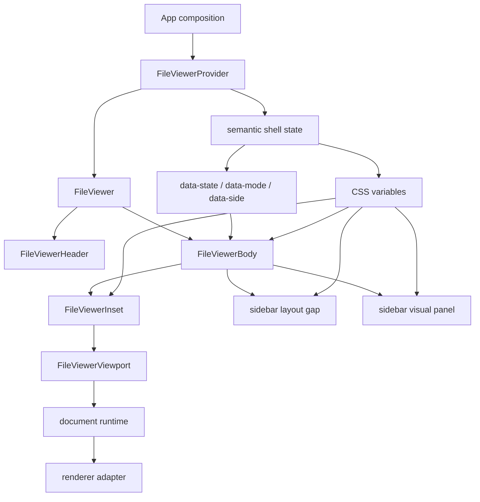

The revision is:

- keep the universal renderer contract
- keep generic document anchors, scroll mapping, and render windows
- make the shell layout shadcn-like and CSS-led
- limit external stores to high-frequency document state
- remove any ambition for one giant store owning every viewer concern

The design smell in the current implementation is not that it has JavaScript. The smell is that shell motion has two authorities: CSS/data-state primitives and a JavaScript geometry transition loop. That makes delay, drift, and mismatch possible by design.

## North Star

The viewer is not a PDF viewer with extra formats. It is a document runtime.

Every supported format answers the same questions:

- What resource is this?
- What is its intrinsic document model?
- What layout does it produce at this viewport size?
- What reading anchor should survive layout changes?
- What render window is needed right now?
- What controls does the document expose?
- What can be downloaded, copied, searched, selected, or cited?

PDF, image, markdown, CSV, DOCX, PPTX, XLSX, HTML, code, and text are adapters. None of them owns the shell.

## Core Diagram

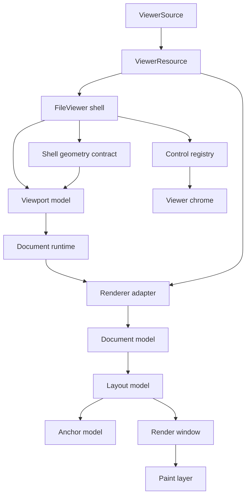

The shell owns space. The renderer owns document meaning.

## Layer Contract

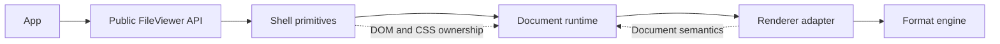

Responsibilities:

| Layer            | Owns                                                              | Does not own               |
| ---------------- | ----------------------------------------------------------------- | -------------------------- |
| App              | source, composition, product-specific chrome                      | document layout algorithms |
| Shell primitives | slots, DOM structure, accessibility, geometry                     | file parsing               |
| Document runtime | viewport metrics, controls, anchor persistence, render scheduling | shell layout animation     |
| Renderer adapter | intrinsic layout, anchors, render windows, format controls        | sidebar width, app chrome  |
| Format engine    | low-level parsing/rendering                                       | React composition          |

## Shadcn Sidebar Lessons

The shadcn sidebar is a good reference because its architecture makes invalid states hard to express.

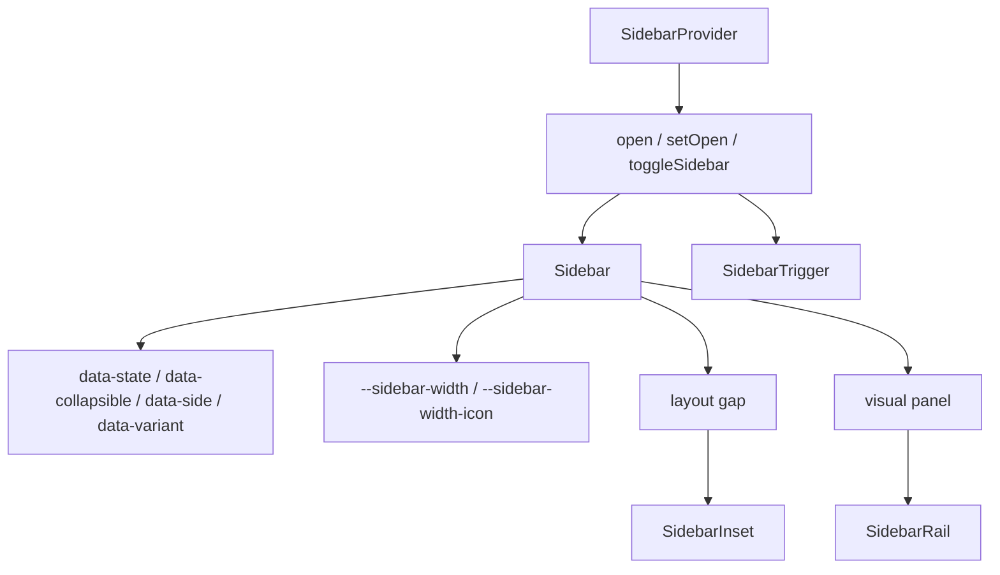

Lessons to keep:

- the provider owns semantic state, not pixel-by-pixel animation state
- dimensions are declared as CSS variables at the primitive boundary
- variants are data attributes, not prop-drilled booleans at every descendant
- the layout gap and the visual panel are separate DOM concerns
- the trigger targets the nearest provider, so consumers cannot wire it to the wrong sidebar
- mobile and desktop are separate paths, not one overloaded layout pretending to be both
- internal helper APIs stay internal; public primitives describe the mental model

For the file viewer, the same pattern applies with one adjustment: the sidebar is attached to the document edge inside the viewer body, not fixed to the viewport edge.

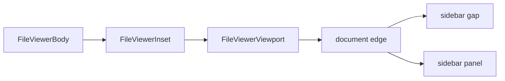

## Current Code Lessons

The current code has moved to the right primitive boundary: File Viewer owns its
own shell instead of borrowing the generic `ViewerRoot` runtime.

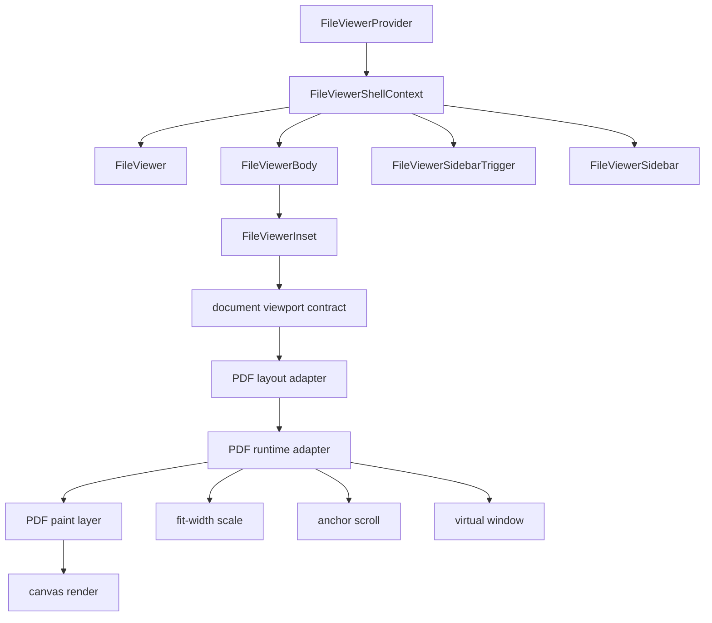

What is good:

- `FileViewer` owns file-viewer shell state directly: open state, side, mode,
  registered sidebar id, declared sidebar width, and transition duration.
- `FileViewerSidebarTrigger` targets the nearest file-viewer shell implicitly,
  which is the right composition invariant.
- Inline sidebar motion is CSS-led through one declared layout scalar:
  the sidebar gap width.
- `FileViewerInset` exposes a document viewport contract: active inline size,
  settled inline size, prepared inline size, and the shell transition duration.
- `viewer-document-geometry.ts` and `viewer-document-scroll.ts` are the right abstraction direction: anchors and scroll transactions are document concepts, not PDF quirks.
- The active/settled size split is the correct idea for smooth visual resize without rerasterizing every frame.

What is not good enough:

- PDF document-runtime concerns now have named modules: resource lifecycle,
  layout/scale, controls, scroll/runtime, and paint. `PdfViewerContent` is the
  public orchestration boundary.
- The generic `viewer-*` runtime still exists for other components and renderer
  dependencies, so the broader viewer ecosystem is not fully greenfield.
- Fit-width PDF rendering still depends on measuring the viewport after layout.
  The measurement is now named and centralized, but not eliminated.
- The tests prove many good contracts, but some tests now preserve implementation shape rather than just user-visible invariants.

The revised blueprint keeps the hard-won generic document abstractions while
keeping shell motion in the shadcn model: semantic state, data attributes, CSS
variables, and renderer-facing contracts.

## Public API

The public API should be small and inevitable. It should read like the DOM anatomy of the viewer, not like the internal renderer runtime.

```tsx
<FileViewerProvider source={source} renderers={renderers}>
  <FileViewer>
    <FileViewerHeader />
    <FileViewerBody>
      <FileViewerInset>
        <FileViewerViewport>
          <FileViewerDocument />
        </FileViewerViewport>
      </FileViewerInset>
      <FileViewerSidebar />
    </FileViewerBody>
  </FileViewer>
</FileViewerProvider>
```

The default composition should be complete. Custom composition should be possible without changing the runtime model.

```tsx
<FileViewerProvider source={source}>
  <FileViewer sidebarMode="inline" sidebarSide="right">
    <FileViewerHeader>
      <FileViewerIdentity />
      <FileViewerControls />
      <FileViewerSidebarTrigger />
    </FileViewerHeader>
    <FileViewerBody>
      <FileViewerInset>
        <FileViewerViewport>
          <FileViewerDocument />
        </FileViewerViewport>
      </FileViewerInset>
      <FileViewerSidebar aria-label="Pages">
        <FileViewerNavigation />
      </FileViewerSidebar>
    </FileViewerBody>
  </FileViewer>
</FileViewerProvider>
```

Public primitives:

- `FileViewerProvider`
- `FileViewer`
- `FileViewerHeader`
- `FileViewerIdentity`
- `FileViewerControls`
- `FileViewerBody`
- `FileViewerInset`
- `FileViewerSidebar`
- `FileViewerSidebarTrigger`
- `FileViewerNavigation`
- `FileViewerViewport`
- `FileViewerDocument`
- `FileViewerStatus`

No public `Surface`, `Frame`, geometry store, or PDF-specific layout primitive. `Inset` is public because it is the visible layout counterpart to `Sidebar`, the same way shadcn exposes `SidebarInset`.

The lower-level `ViewerRoot`, `ViewerSidebar`, and `ViewerViewport` primitives can exist as source-owned internals for other compound viewers, but public file-viewer docs should lead with the file-viewer vocabulary.

## Source Contract

The source contract is explicit and boring.

```ts
type ViewerSource =
  | {
      kind: "url";
      url: string;
      fileName: string;
      mimeType?: string;
      byteLength?: number;
    }
  | {
      kind: "blob";
      blob: Blob;
      fileName: string;
      mimeType?: string;
    }
  | {
      kind: "text";
      text: string;
      fileName: string;
      mimeType: string;
    };
```

The viewer never guesses identity from layout. It resolves the renderer from explicit resource metadata:

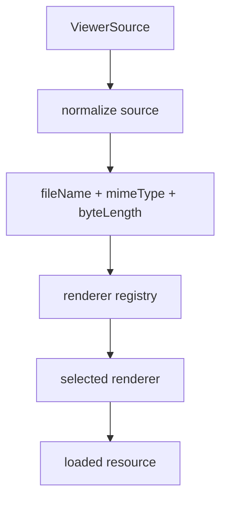

Renderer selection priority:

1. explicit `mimeType`
2. explicit `fileName` extension
3. sniffed bytes only when no explicit metadata exists
4. fallback renderer

No layout-based inference.

## Renderer Contract

The renderer is a pure adapter from resource plus viewport to document model.

```ts
type ViewerRenderer<Resource, Anchor, Target> = {
  id: string;
  match(resource: ViewerResource): boolean;
  load(resource: ViewerResource, signal: AbortSignal): Promise<Resource>;
  getInitialState(resource: Resource): RendererState;
  getLayout(input: RendererLayoutInput<Resource>): ViewerDocumentLayout<Anchor>;
  getRenderWindow(input: RendererWindowInput<Anchor>): ViewerRenderWindow;
  getControls(input: RendererControlsInput<Resource, Target>): ViewerControl[];
  render(input: RendererPaintInput<Resource, Anchor>): React.ReactNode;
};
```

The renderer provides document facts. It does not measure the shell.

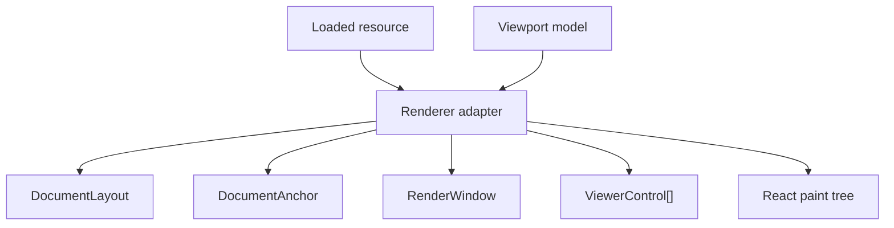

## Document Layout Contract

Every renderer returns the same layout shape.

```ts
type ViewerDocumentLayout<Anchor> = {
  inlineSize: number;
  blockSize: number;
  captureAnchor(input: AnchorCaptureInput): Anchor | null;
  resolveAnchor(input: AnchorResolveInput<Anchor>): number | null;
};
```

Examples:

| Format    | Anchor                           |
| --------- | -------------------------------- |
| PDF       | page number plus page-relative Y |
| image     | normalized X/Y                   |
| markdown  | block id plus offset             |
| code      | line number plus column          |
| CSV/XLSX  | row id plus row-relative offset  |
| DOCX/PPTX | page/slide id plus offset        |

The shell does not know those anchor types. It only stores and asks the adapter to resolve them.

## Geometry Model

The shell geometry contract is one deterministic scalar tree. It must not depend on after-paint correction.

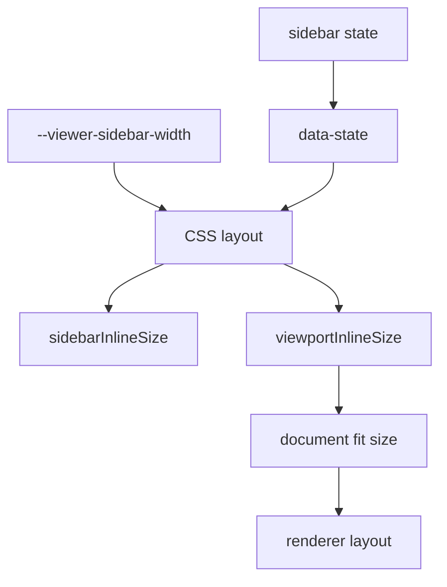

Formula:

```ts
sidebarInlineSize = sidebarWidth * sidebarProgress;
viewportInlineSize = rootInlineSize - sidebarInlineSize;
documentInlineSize = constrain(viewportInlineSize, documentMaxInlineSize);
```

There is no separate sidebar animation model, document frame model, and PDF scale model. There is one shell geometry contract, and every renderer receives that contract through the document runtime.

The implementation should express the same geometry twice with the same names:

| Concept                 | CSS name                            | Runtime name         |
| ----------------------- | ----------------------------------- | -------------------- |
| sidebar target width    | `--viewer-sidebar-width`            | `sidebarWidth`       |
| current sidebar size    | `--viewer-sidebar-inline-size`      | `sidebarInlineSize`  |
| available document size | `--viewer-document-inline-size`     | `documentInlineSize` |
| transition state        | `data-state` / `data-transitioning` | `isTransitioning`    |

The CSS value is authoritative for shell layout. The runtime value exists so renderers can choose visual size, settled raster size, anchors, and render windows.

## Sidebar Animation

The sidebar is a layout participant, not an overlay pretending to be layout.

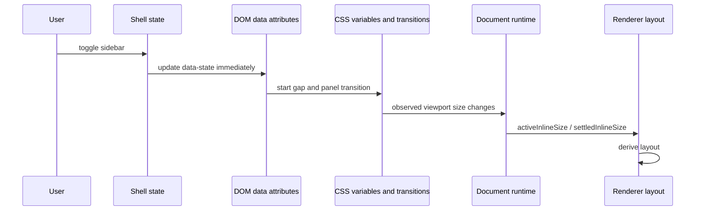

The shell exposes CSS variables:

```css
[data-file-viewer-root] {
  --viewer-sidebar-width: 280px;
  --viewer-sidebar-collapsed-width: 0px;
}

[data-file-viewer-sidebar-gap] {
  inline-size: var(--viewer-sidebar-width);
  transition: inline-size 150ms linear;
}

[data-state="collapsed"] [data-file-viewer-sidebar-gap] {
  inline-size: var(--viewer-sidebar-collapsed-width);
}
```

The sidebar panel is anchored to the document boundary:

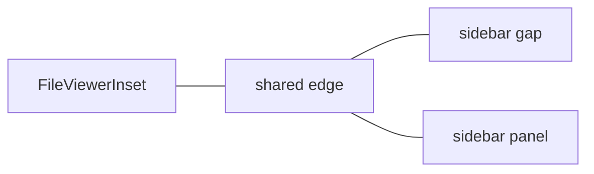

Invariant:

```txt
sidebar panel edge === inset edge === document viewport edge
```

If that invariant is false, the design is wrong.

The runtime may use `ResizeObserver` to publish the viewport size that resulted from CSS layout, but it must not run a second sidebar transition clock. If the runtime interpolates sizes while CSS also transitions widths, the system has two clocks and will eventually drift.

## Viewport Model

The viewport model is format-neutral.

```ts
type ViewerViewportModel = {
  inlineSize: number;
  blockSize: number;
  scrollTop: number;
  scrollLeft: number;
  scrollIntent: "idle" | "user" | "programmatic" | "layout";
};
```

The runtime owns scroll intent. Renderers should not infer intent from DOM events.

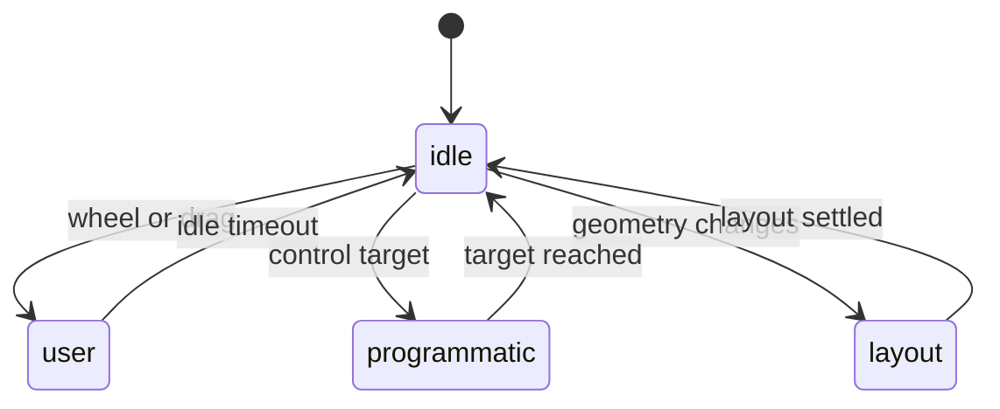

## Anchor Persistence

Anchor persistence is the core behavior. Smooth resizing is a consequence.

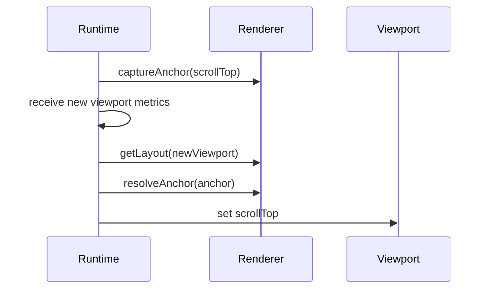

Rules:

- capture before layout changes
- resolve after layout changes
- never ask the DOM what semantic item is visible
- never use page-specific correction loops in the shell
- keep the same anchor through the whole transition

## Render Window

Virtualization is renderer-defined but runtime-coordinated.

```ts
type ViewerRenderWindow = {
  visible: readonly ViewerItemKey[];
  active: readonly ViewerItemKey[];
  preload: readonly ViewerItemKey[];
};
```

The runtime provides viewport metrics. The renderer returns item keys.

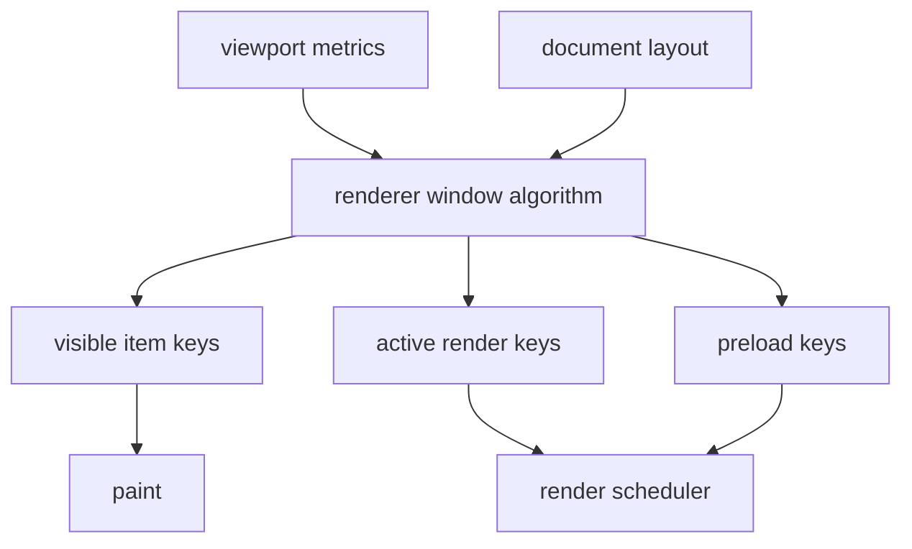

For PDF:

- visible: pages intersecting viewport
- active: visible pages plus overscan
- preload: adjacent pages

For code:

- visible: visible line chunks
- active: visible chunks plus overscan
- preload: next chunks in scroll direction

For markdown:

- visible: block ranges
- active: block ranges plus image/code preloads
- preload: next sections

## Render Quality

Visual resize and render quality are separate.

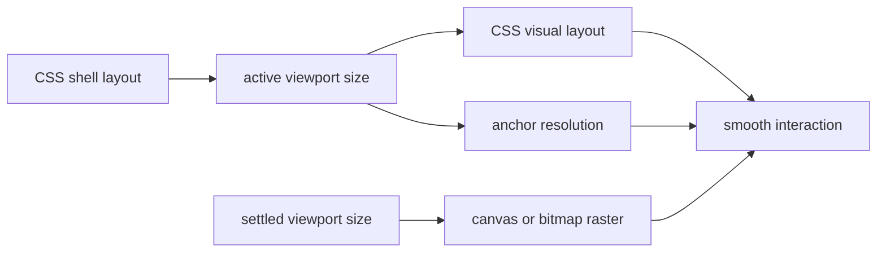

During transition:

- visual layout follows `activeInlineSize`
- expensive render targets use `settledInlineSize`
- after transition, render targets catch up once

This avoids blinking and avoids re-rasterizing on every animation frame.

The active/settled split belongs to the document runtime, not to the PDF renderer alone. PDF pages, images, office previews, and generated thumbnails all need the same rule:

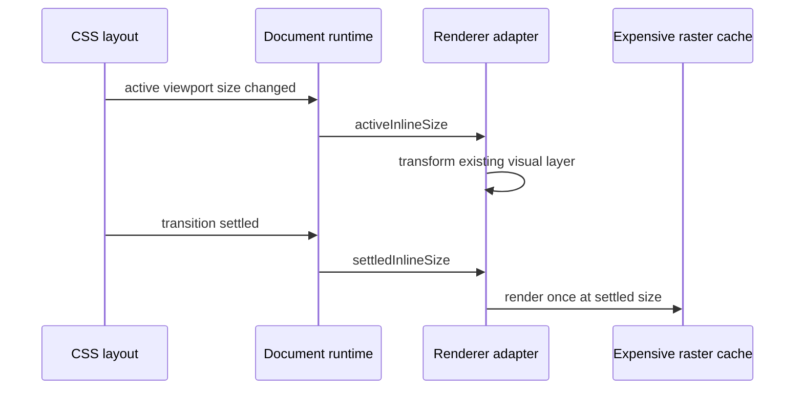

## Controls

Controls are registered by renderers and rendered by shell chrome.

```ts
type ViewerControl =
  | {
      kind: "button";
      id: string;
      label: string;
      icon: Icon;
      action: () => void;
    }
  | {
      kind: "toggle";
      id: string;
      label: string;
      pressed: boolean;
      action: () => void;
    }
  | {
      kind: "select";
      id: string;
      label: string;
      value: string;
      options: ViewerControlOption[];
    }
  | { kind: "status"; id: string; label: string; value: string };
```

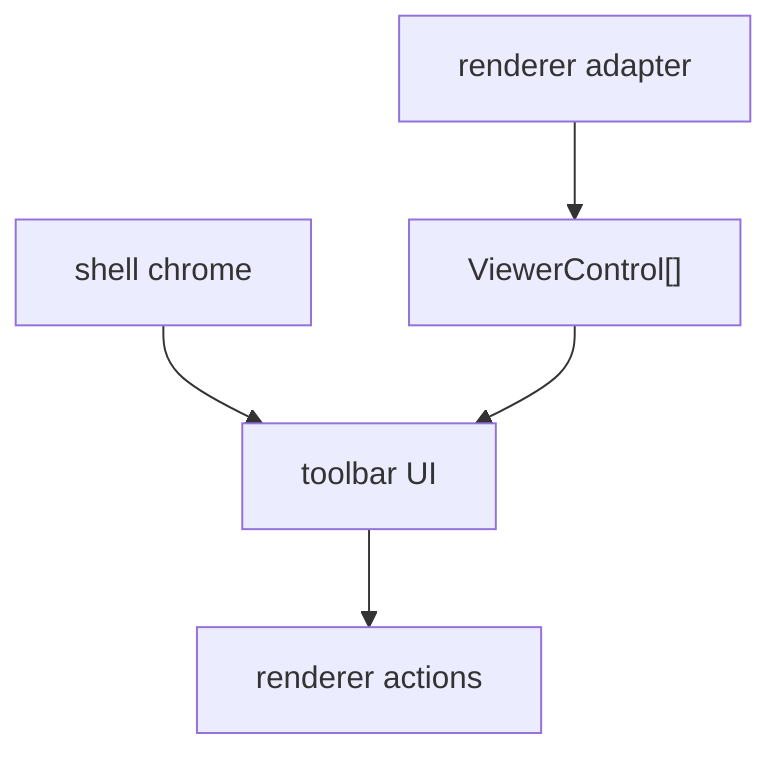

The shell controls placement and accessibility. The renderer controls meaning.

## Resource Lifecycle

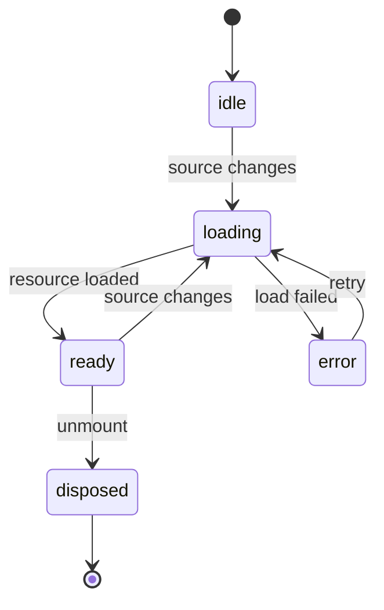

Rules:

- loading is abortable
- loaded resources are retained while visible
- renderer caches are keyed by resource identity and render signature
- disposal is explicit

## Error Model

Errors are typed at the boundary where they occur.

```ts
type ViewerError =
  | { kind: "source"; message: string; retryable: boolean }
  | { kind: "resource"; message: string; retryable: boolean }
  | {
      kind: "renderer";
      rendererId: string;
      message: string;
      retryable: boolean;
    }
  | { kind: "unsupported"; mimeType?: string; fileName?: string };
```

The shell renders all errors. Renderers only throw or return typed failures.

## Accessibility

The shell guarantees:

- one labeled viewer region
- one labeled toolbar
- one document viewport
- sidebar trigger with `aria-controls`
- sidebar hidden/inert state while closed
- keyboard scroll works in viewport
- controls are reachable in DOM order
- document items expose meaningful labels when renderer can provide them

Renderer adapters guarantee:

- document item labels
- page/slide/row/line semantics where applicable
- text selection when possible
- fallback text for non-text surfaces

## Native HTML/CSS Bias

Use browser layout as the primary engine.

Use JavaScript for:

- source loading
- renderer selection
- semantic layout calculation
- anchor capture and resolution
- render window calculation
- expensive render scheduling

Use CSS for:

- shell layout
- sidebar motion
- clipping
- stacking
- responsive density
- visual transition timing
- immediate button-to-motion response

Avoid:

- measuring after every frame to decide what should have happened
- renderer-specific DOM correction in the shell
- scrollTop feedback loops that fight user input
- layout state duplicated in CSS and JS under different names
- JavaScript transition clocks for chrome that CSS already animates
- waiting for renderer work before the sidebar starts moving

The click path must be short:

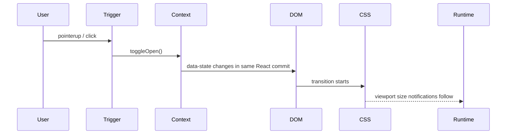

If the sidebar waits for resource loading, page measurement, virtualization, raster cache, or a `requestAnimationFrame` loop before it starts moving, the design is wrong.

## Module Tree

Greenfield file layout:

```txt
file-viewer/
  primitives/
    file-viewer-provider.tsx
    file-viewer-root.tsx
    file-viewer-header.tsx
    file-viewer-body.tsx
    file-viewer-sidebar.tsx
    file-viewer-inset.tsx
    file-viewer-viewport.tsx
    file-viewer-document.tsx
    types.ts
    context.tsx
  runtime/
    document-runtime.ts
    resource-store.ts
    viewport-model.ts
    anchor-controller.ts
    controls-store.ts
    renderer-registry.ts
    render-scheduler.ts
  renderers/
    pdf/
      pdf-renderer.tsx
      pdf-layout.ts
      pdf-anchors.ts
      pdf-window.ts
      pdf-controls.ts
      pdf-page.tsx
    image/
    markdown/
    code/
    table/
    office/
  internal/
    css-vars.ts
    element-size.ts
    warnings.ts
    ids.ts
```

No catch-all `internals.tsx`. If a file name has to say `internals`, the boundary is not precise enough.

## State Ownership

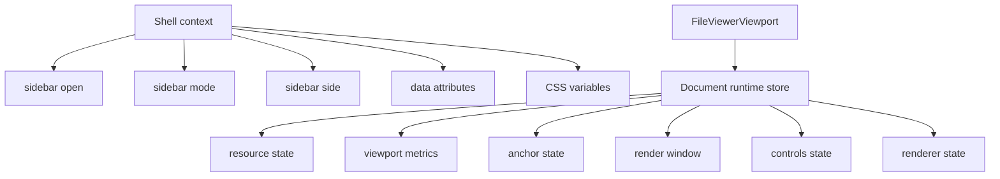

Shell state and document state are separate because they have different update rates and different failure modes.

Shell context owns:

- open state
- controlled/uncontrolled state
- mode resolution
- side
- collapsible behavior
- ids
- trigger wiring
- accessibility state
- data attributes
- CSS variables

Document runtime store owns:

- loaded resource
- selected renderer
- viewport size
- logical scroll position
- reading anchor
- render window
- render quality state
- renderer controls

The shell must not subscribe to render windows. Renderers must not mutate sidebar state.

## React Boundary

React renders state. React does not own every state transition.

```mermaid
flowchart LR
  ShellContext["React shell context"] --> Primitives["compound primitives"]
  Primitives --> DOM["data attributes + CSS variables"]
  DOM --> CSS["browser layout"]
  CSS --> Runtime["document runtime"]
  Runtime --> Selectors["runtime selectors"]
  Selectors --> Document["FileViewerDocument"]
```

Use React context for low-frequency shell state:

- open
- mode
- side
- ids
- accessibility wiring

Use `useSyncExternalStore` selectors for high-frequency document state:

- viewport metrics
- render windows
- controls
- resource status
- render quality

Use React state for local UI only:

- menu open state
- hover state
- uncontrolled inputs

## Format Adapters

PDF adapter:

```mermaid
flowchart TD
  PDF["PDF resource"] --> Pages["page metadata"]
  Pages --> Layout["page layout"]
  Layout --> Anchor["page anchor"]
  Layout --> Window["page window"]
  Window --> Canvas["canvas render"]
  Layout --> Text["text layer"]
```

Markdown adapter:

```mermaid
flowchart TD
  Markdown["markdown text"] --> AST["syntax tree"]
  AST --> Blocks["block layout"]
  Blocks --> Anchor["block anchor"]
  Blocks --> Window["block window"]
  Window --> DOM["semantic DOM"]
```

Table adapter:

```mermaid
flowchart TD
  Sheet["table resource"] --> Grid["grid model"]
  Grid --> Rows["row layout"]
  Rows --> Anchor["row anchor"]
  Rows --> Window["row window"]
  Window --> Cells["cell paint"]
```

Image adapter:

```mermaid
flowchart TD
  Image["image resource"] --> Intrinsic["intrinsic size"]
  Intrinsic --> Layout["fit layout"]
  Layout --> Anchor["normalized anchor"]
  Layout --> Paint["image paint"]
```

## No Legacy Cut

Because this is greenfield, these are explicitly excluded:

- compatibility adapters for old primitive names
- duplicate `Surface` and `Inset` concepts
- PDF-specific document frame rules
- legacy layout transition phases
- hidden fallback APIs
- inferred sidebar ownership
- renderer-specific toolbar placement
- measurement loops that preserve old behavior

There is one model. Call sites update to it.

## Hard Cutover From Current Code

Keep:

- the public file-viewer vocabulary: `FileViewerProvider`, `FileViewer`, `FileViewerBody`, `FileViewerInset`, `FileViewerViewport`, `FileViewerSidebar`, `FileViewerDocument`
- nearest-root trigger targeting
- one registered primary sidebar
- explicit resource identity
- generic document layout model
- generic reading anchors
- generic scroll mapping
- active/settled render quality split
- renderer-controlled controls

Split:

- `viewer-internals.tsx` into context, attributes, ids, geometry, measurement, warnings
- sidebar shell motion from document runtime geometry

Done in the active file viewer:

- `PdfViewerContent` is now orchestration.
- `pdf-viewer-document-resource.ts` owns PDF resource lifetime, first-page size,
  and rotation.
- `pdf-viewer-document-layout.ts` owns document viewport contract consumption,
  fit-width scale, prepared render scale, page layout, and DPR.
- `pdf-viewer-document-controls.ts` owns toolbar/control state and external
  control registration.
- `pdf-viewer-document-runtime.ts` owns scroll anchoring, virtualization, render
  scheduling, cache policy, and scroll-interaction suspension.
- `pdf-viewer-pages-layer.tsx` owns the page-window DOM and page paint.

Remove:

- JavaScript sidebar transition clocks
- inline sidebar sizing driven by a runtime animation store
- public `Surface` vocabulary
- renderer-specific frame rules
- tests that assert private file shapes instead of architecture invariants

The destination should look like this:

```mermaid
flowchart TD
  Primitives["compound primitives"] --> Shell["CSS-led shell"]
  Shell --> RuntimeBoundary["viewport boundary"]
  RuntimeBoundary --> DocumentRuntime["document runtime"]
  DocumentRuntime --> RendererAdapter["renderer adapter"]
  RendererAdapter --> Paint["paint"]

  Shell -. "data attrs + CSS vars" .-> Primitives
  DocumentRuntime -. "anchors + windows + quality" .-> RendererAdapter
```

## Implementation Order

1. Define types and invariants.
2. Build shadcn-style shell primitives with a synthetic fixed-size document.
3. Prove sidebar gap and panel remain attached to the viewport edge.
4. Build the document runtime boundary below `FileViewerViewport`.
5. Prove anchor persistence with a synthetic paginated document.
6. Prove active/settled render quality with a synthetic raster document.
7. Add PDF as the first real adapter.
8. Add markdown/text/code as semantic DOM adapters.
9. Add image/table/office adapters.
10. Add docs and examples last.

## Tests

The test suite should prove contracts, not implementation accidents.

Runtime tests:

- source normalization
- renderer matching
- geometry formulas
- viewport model
- anchor capture/resolve
- render window calculation
- control registration

Renderer adapter tests:

- layout from intrinsic metadata
- anchor stability across width changes
- render window correctness
- controls exposed
- error state

Browser tests:

- sidebar transition starts in the same interaction turn as the trigger click
- sidebar edge remains attached to document edge
- no scroll jump while resizing
- no blank visible window during resize
- no second animation clock drives sidebar geometry
- keyboard and pointer controls work
- mobile overlay mode works

## Acceptance Criteria

The greenfield viewer is acceptable only if all of these are true:

- toggling sidebar starts immediately
- sidebar edge and document edge are always the same edge
- resize is monotonic
- current reading anchor is stable
- render window never blanks during geometry transitions
- expensive render quality catches up after transition, not during every frame
- shell motion is CSS-led and has one clock
- renderer work never blocks shell motion
- every renderer uses the same shell contract
- shell has no format-specific branch
- renderer has no shell-specific DOM hack
- public API is smaller than the implementation API
- module names match concepts exactly

## Final Shape

```mermaid
flowchart TD
  Provider["FileViewerProvider"] --> ShellState["shell state"]
  ShellState --> FileViewer["FileViewer primitives"]
  FileViewer --> CssShell["CSS-led shell layout"]
  CssShell --> Viewport["FileViewerViewport"]
  Viewport --> Runtime["Document runtime"]

  Runtime --> Resource["Resource"]
  Runtime --> ViewportState["Viewport state"]
  Runtime --> Anchor["Anchor"]
  Runtime --> Window["Window"]
  Runtime --> Controls["Controls"]
  Runtime --> Renderer["Renderer"]
  Renderer --> Layout["Layout"]
  Renderer --> Paint["Paint"]

  ViewportState --> Layout
  Anchor --> Layout
  Window --> Paint
  Controls --> FileViewer
  Paint --> FileViewer
```

This is the version I would build from scratch after reviewing the existing code and shadcn sidebar: one shadcn-like shell, one document runtime below the viewport, many renderer adapters, no PDF gravity, no legacy aliases, no duplicated shell motion, no after-paint negotiation for chrome.
