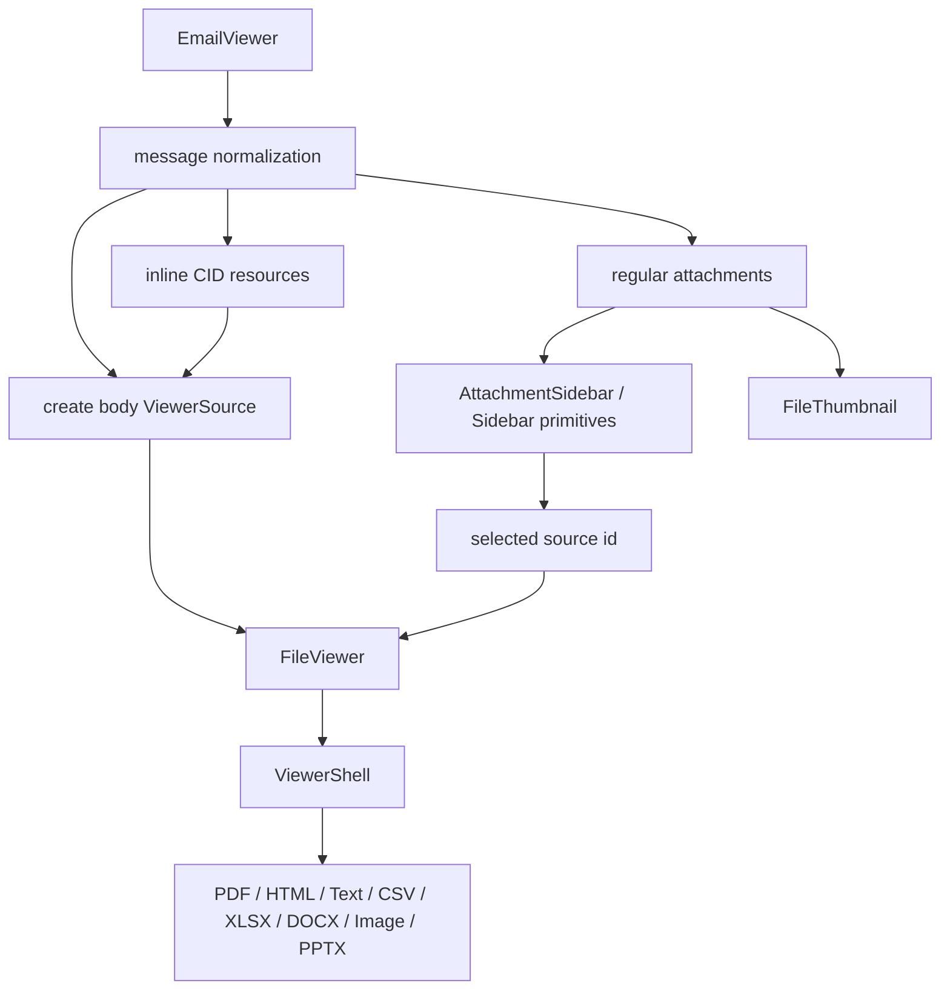

# Viewer Composition Abstractions Design

## Context

The email viewer was useful because it was awkward.

A normal viewer renders one source. A PDF viewer renders a PDF. A CSV viewer
renders a table. An image viewer renders frames. Those components mostly test
format-specific rendering.

An email viewer is different. It is a compound document experience:

- the body is a synthesized source, not necessarily a file;
- inline resources are files, but not user-facing attachments;
- attachments are files, but not part of the body;
- selecting a sidebar item changes the previewed source;
- HTML body rendering must stay isolated;
- thumbnails should come from the same thumbnail system as every other file;
- navigation should use the same sidebar language as the rest of the app.

That makes email a good stress test for the codebase's abstractions. It asks
whether existing primitives can be composed without copying chrome, inventing a
private sidebar, bypassing `FileViewer`, or rendering unsafe HTML directly.

The answer is: mostly yes, but the seams are visible.

## Diagnosis

### What Worked

`FileViewer` is a strong single-source router.

It accepts a `ViewerSource`, resolves the category, creates a viewer resource,
and routes to the concrete renderer. That is exactly the right boundary for an
email body or selected attachment. The email viewer did not need a PDF path, CSV
path, XLSX path, HTML iframe path, or text renderer.

`FileThumbnail` is the right attachment preview abstraction.

The attachment sidebar should not know how to thumbnail a PDF, spreadsheet,
HTML file, CSV, image, or unsupported file. It should hand each source to
`FileThumbnail` and let the thumbnail system own that complexity.

The HTML viewer is the right security boundary.

Email HTML is hostile input. The email component should rewrite `cid:` URLs and
then pass the result to the existing HTML route. It should never render the body
with React `dangerouslySetInnerHTML`.

The `Sidebar` menu pieces are reusable.

`SidebarMenu`, `SidebarMenuItem`, `SidebarMenuButton`, and
`SidebarMenuBadge` gave the attachment list selected state, focus behavior,
data attributes, and sidebar tokens without inventing a second row language.

### What Did Not Work Cleanly

`FileViewer` is not a compound-viewer host.

It renders one selected source. It does not expose a format-neutral shell with
rails, top/bottom slots, overlay, header, or contextual side panels. Individual
viewers such as `PdfViewer`, `PptxViewer`, `DocxViewer`, `ImageViewer`, and
`XlsxViewer` have some slot concepts, but the universal router does not expose
one consistent composition surface.

The first email implementation drifted into custom layout for this reason: the
component needed a preview plus an attachment navigator, and there was no
canonical host boundary for "viewer plus side context".

`Sidebar` is partially app-shell specific.

The sidebar primitive has two layers:

- menu/list primitives that are broadly reusable;
- provider/container/collapse behavior that assumes an application shell.

The second layer includes fixed desktop positioning, mobile sheet behavior,
cookie persistence, and a global keyboard shortcut. Those are good defaults for
docs navigation. They are not necessarily correct inside a viewer card, modal,
split pane, registry demo, or editor.

The email viewer therefore used `collapsible="none"`. That is safe, but it also
reveals a missing mode: embedded, container-scoped sidebars.

`SegmentSidebar` is too easy to confuse with "the sidebar primitive".

`SegmentSidebar` is correct for `Segment[]` page navigation. It is not correct
for attachment navigation. The name is not wrong, but the broader codebase
needs a clearer distinction:

- `Sidebar` is the visual/navigation primitive family.
- `SegmentSidebar` is a domain component for page-segmented document results.
- An attachment sidebar should share `Sidebar` visuals, not `SegmentSidebar`
  data semantics.

Viewer chrome is not centralized.

There are several shell-like concepts:

- `ResourceDocShell` for text-like routed file viewers;
- `PdfViewer` toolbar, rails, overlay, and slots;
- `PptxViewer` slot-shaped layout;
- `DocxViewer` and `XlsxViewer` chrome wrappers;
- `FileViewer` error/fallback/routing boundaries.

These pieces are individually reasonable, but there is no one abstraction that
answers: "I have a document preview and optional surrounding viewer chrome."

## Desired End State

The ideal system has three clear layers:

```txt
ViewerSource / ViewerResource
  -> concrete file renderers
  -> FileViewer router
  -> ViewerShell for compound composition
  -> domain viewers such as EmailViewer, ExtractViewer, SplitViewer
```

The domain viewer should own domain semantics only.

For email, that means:

- normalize message metadata;
- classify inline resources versus attachments;
- rewrite `cid:` references;
- choose the selected source;
- pass body and attachments to shared viewer primitives.

It should not own:

- file parsing;
- file preview rendering;
- thumbnail rendering;
- unsafe HTML isolation;
- generic sidebar behavior;
- viewer shell chrome.

## Proposed Architecture

### 1. Introduce `ViewerShell`

Create a format-neutral shell primitive for viewer composition.

It should own the structural layout that currently gets reinvented:

- outer border, radius, background, and overflow;
- optional header slot;
- optional toolbar slot;
- left and right rails;
- top and bottom document-column slots;
- overlay slot;
- main preview content;
- loading/error placement conventions;
- rail open/closed state when requested.

Proposed public shape:

```ts
type ViewerShellSlots = {
  header?: React.ReactNode
  toolbar?: React.ReactNode
  top?: React.ReactNode
  bottom?: React.ReactNode
  left?: React.ReactNode
  right?: React.ReactNode
  overlay?: React.ReactNode
}

type ViewerShellProps = {
  children: React.ReactNode
  slots?: ViewerShellSlots
  bare?: boolean
  className?: string
  rails?: {
    collapsible?: boolean
    defaultOpen?: boolean
    open?: boolean
    onOpenChange?: (open: boolean) => void
  }
}
```

Rules:

- `children` is the primary document surface.
- `left` and `right` are rails, not arbitrary page columns.
- `top` and `bottom` sit inside the document column.
- `header` is outside the document scroller and describes the compound
  document.
- `toolbar` is for viewer commands.
- `overlay` floats over the main preview region.
- `bare` removes outer border/background so a parent shell can own them.

This shell should be visually quiet. It is not a card factory. It is a document
workspace frame.

### 2. Teach `FileViewer` About Slots

After `ViewerShell` exists, extend `FileViewerProps`:

```ts
interface FileViewerProps {
  source: ViewerSource
  as?: FileCategory
  className?: string
  bare?: boolean
  isolateStyles?: boolean
  slots?: ViewerShellSlots
}
```

The router should pass slots to concrete viewers that support them:

- PDF
- image
- DOCX
- XLSX
- PPTX

Text/code/HTML/CSV routes can initially wrap their existing content in
`ViewerShell` or ignore unsupported slots only if the shell is owned above
them. The better path is to make every route render inside a consistent shell
contract.

Acceptance:

- A caller can provide a right rail to `FileViewer` without knowing the selected
  file format.
- Existing direct viewer APIs remain explicit.
- Existing `PdfViewer` slot behavior is preserved.
- `FileViewer` remains a router, not a domain-specific layout component.

### 3. Add Embedded Sidebar Mode

Keep the current `Sidebar` app-shell behavior intact. Add a container-scoped
mode for embedded surfaces.

Proposed shape:

```ts
type SidebarScope = "app" | "container"

type SidebarProviderProps = {
  scope?: SidebarScope
  persist?: boolean
  keyboardShortcut?: string | false
  // existing props...
}
```

Or, more conservatively, add a separate primitive:

```tsx
<EmbeddedSidebarProvider>
  <EmbeddedSidebar side="right">...</EmbeddedSidebar>
</EmbeddedSidebarProvider>
```

The embedded mode must differ from app mode:

- no fixed viewport positioning;
- no cookie persistence by default;
- no global keyboard shortcut by default;
- mobile behavior is container-relative, not global app sheet;
- width is owned by the containing layout;
- rails collapse inside the container, not off the viewport.

The menu sub-primitives should remain shared:

- `SidebarHeader`
- `SidebarContent`
- `SidebarGroup`
- `SidebarMenu`
- `SidebarMenuButton`
- `SidebarMenuBadge`

This avoids a second visual system while separating app-shell behavior from
embedded viewer behavior.

### 4. Rename Or Document Domain Sidebars More Aggressively

Do not rename everything immediately, but make the distinction unavoidable.

Recommended docs language:

- `Sidebar`: layout and navigation primitive family.
- `SegmentSidebar`: segment result navigator for page-based document analysis.
- `PdfThumbnailSidebar`: page thumbnail navigator for PDF documents.
- `AttachmentSidebar`: file attachment navigator for compound document viewers,
  built from `Sidebar` primitives.

If the codebase grows more domain sidebars, their names should always include
the domain model:

- `SegmentSidebar`
- `PdfThumbnailSidebar`
- `AttachmentSidebar`
- `FieldSidebar`

Avoid exporting a domain component with a name that sounds like the generic
primitive.

The intended hierarchy is:

```txt
Sidebar primitives
  -> SegmentSidebar
  -> AttachmentSidebar
  -> PdfThumbnailSidebar
```

`SegmentSidebar` should not fold into `Sidebar` as a generic mode. It owns real
segment semantics: page ranges, color swatches, confidence bars, current-page
highlighting, shared hover/focus preview state, and click-to-scroll behavior.
Those are document-analysis concerns, not generic sidebar concerns.

The right refactor is to make `SegmentSidebar` use `Sidebar` primitives
internally for its container, groups, rows, active state, and focus behavior.
That gives it the same visual language as every other sidebar surface without
polluting `Sidebar` with segment-specific props.

`PdfThumbnailSidebar` is the exception to structural reuse. Its rows are a
virtualized page rail with absolute positioning, page-window measurement,
active-page follow behavior, and PDF-specific keyboard shortcuts. It should use
sidebar visual tokens for background, borders, foreground, and inactive rings,
but it should not force `SidebarMenuButton` into the thumbnail rail.

The same rule applies to `AttachmentSidebar` and `PdfThumbnailSidebar`:

- they should share `Sidebar` row/container primitives where those primitives
  fit;
- they should keep their domain models and commands outside the primitive;
- they should not force `Sidebar` to understand files, pages, segments,
  confidence, thumbnails, or document scroll.

If a generic row-list behavior appears across several domain sidebars, extract a
small intermediary primitive. Do not push domain behavior downward into
`Sidebar`.

### 5. Add `AttachmentSidebar` As A Reusable Domain Component

Email is not the only place that needs a related-file navigator.

Potential consumers:

- email viewer;
- extraction run result with uploaded source files;
- parse result with supplementary files;
- workflow run detail pages;
- document packet viewer.

A reusable `AttachmentSidebar` could accept a file-oriented model:

```ts
type AttachmentItem = {
  id: string
  source: ViewerSource
  label?: string
  description?: string
  size?: number | null
  isSelected?: boolean
  isDisabled?: boolean
}

type AttachmentSidebarProps = {
  items: readonly AttachmentItem[]
  selectedId?: string | null
  onSelect?: (id: string) => void
  header?: React.ReactNode
  emptyLabel?: React.ReactNode
}
```

It should be implemented from `Sidebar` primitives and `FileThumbnail`.

Email would then own only:

- body row;
- inline filtering;
- selected attachment id;
- metadata header.

The tradeoff: do not introduce this until a second real consumer appears or the
email sidebar becomes too large. The current email implementation can keep the
sidebar local while it proves the shape.

## System Diagram



## Concrete Refactor Plan

### Phase 1: Stabilize The Email Probe

Keep the current email viewer implementation using `Sidebar` primitives.

Do not add the shared shell yet.

Use it to prove:

- the sidebar primitive can represent attachment navigation;
- `FileViewer` can render synthesized body sources and selected attachments;
- `FileThumbnail` handles the sidebar preview surface;
- CID rewriting stays local and testable.

This phase is already mostly complete in the email viewer branch.

### Phase 2: Extract Viewer Shell From Existing Patterns

Create `registry/new-york-v4/ui/viewer-shell.tsx`.

Start by extracting the common layout ideas from:

- `PdfViewer` outer frame and rail placement;
- `PptxViewer` slot placement;
- `DocxViewer`/`XlsxViewer` chrome wrappers;
- `ResourceDocShell`.

Do not attempt to unify all toolbar controls in this phase. The shell owns
placement, not viewer-specific commands.

Acceptance:

- `ViewerShell` can render a main content area with right rail and header.
- `ViewerShell` can be used in a small fixture without any file renderer.
- Existing viewers do not change behavior yet.

### Phase 3: Move One Viewer To `ViewerShell`

Pick the least risky slot-aware viewer, likely `PptxViewer` or `ImageViewer`.

Move only structural layout to `ViewerShell`.

Acceptance:

- visual output matches before/after;
- existing tests pass;
- slots still work;
- no new wrapper divs break sizing.

### Phase 4: Move `PdfViewer` Carefully

PDF has the most sophisticated shell today: toolbar, rails, current page,
overlay, scroll area, and page virtualization.

Move it only after `ViewerShell` has proven itself elsewhere.

Acceptance:

- thumbnail rails still collapse;
- page overlay still aligns;
- current page tracking still works;
- scroll performance is unchanged.

### Phase 5: Extend `FileViewer` Slots

Once enough concrete viewers use `ViewerShell`, add `slots` to `FileViewer`.

The router can pass slots into routes that support them and wrap others with
the shell where appropriate.

Acceptance:

- email viewer can pass the attachment sidebar as `FileViewer` right rail;
- selecting attachments does not remount the entire compound shell;
- body and attachments share consistent chrome;
- unsupported files still show a correct fallback.

### Phase 6: Add Embedded Sidebar Mode

Only after a second embedded sidebar need appears, add container-scoped sidebar
behavior.

Initial consumers:

- email attachment sidebar;
- future viewer rail menus;
- maybe docs examples inside cards.

Acceptance:

- embedded sidebar does not use fixed viewport positioning;
- no cookie write by default;
- no global keyboard shortcut by default;
- mobile behavior is local to the container.

## Email Viewer End State After Refactor

The final email viewer should read like this conceptually:

```tsx
<ViewerShell
  slots={{
    header: <EmailHeader message={message} selectedLabel={selectedLabel} />,
    right: (
      <AttachmentSidebar
        items={attachments}
        selectedId={selectedAttachmentId}
        onSelect={setSelectedAttachmentId}
      />
    ),
  }}
>
  <FileViewer source={selectedSource} as={selectedCategory} bare />
</ViewerShell>
```

Or, if `FileViewer` owns the shell:

```tsx
<FileViewer
  source={selectedSource}
  as={selectedCategory}
  slots={{
    header: <EmailHeader message={message} selectedLabel={selectedLabel} />,
    right: <AttachmentSidebar ... />,
  }}
/>
```

The second shape is cleaner for callers, but it requires the `FileViewer` slot
contract to be real across formats.

## Invariants

These invariants should hold after the refactor:

- Domain viewers own domain semantics, not rendering internals.
- File renderers render files, not surrounding product workflows.
- `FileViewer` routes sources, but does not know about email, extraction,
  parse, split, or workflow concepts.
- Sidebar visuals come from `Sidebar` primitives.
- Domain sidebars own domain data models.
- Unsafe HTML is rendered only through the HTML viewer path.
- Thumbnails come only from `FileThumbnail`.
- Viewer shell placement is centralized.

## Anti-Patterns To Avoid

Do not add another custom rail layout inside the next compound viewer.

Do not pass domain-specific props into `FileViewer`, such as
`emailAttachments`, `sourceFields`, `segments`, or `runFiles`.

Do not make `SegmentSidebar` generic by weakening its model. A generic sidebar
that accepts arbitrary row renderers would become less useful than the existing
`Sidebar` primitives.

Do not make the sidebar app-shell mode do double duty inside embedded viewers.
It will leak global behavior into local surfaces.

Do not centralize toolbar command logic prematurely. Shell placement can be
shared before zoom/download/page controls are unified.

Do not put HTML sanitization policy into email. That belongs to the HTML viewer
or a shared viewer resource policy.

## Testing Strategy

### Structural Tests

For `ViewerShell`:

- renders each slot in the correct region;
- preserves main content sizing;
- supports `bare`;
- supports left and right rails;
- does not remount children on controlled rail open changes.

For embedded sidebar mode:

- no cookie writes by default;
- no global keyboard shortcut by default;
- no fixed viewport class in container mode;
- active menu button behavior matches app sidebar menus.

### Integration Tests

For `FileViewer` slots:

- PDF receives right rail;
- image receives right rail;
- HTML/text route either receives shell slots or explicitly documents the
  wrapper behavior;
- unsupported route still renders fallback with shell integrity.

For email:

- HTML body first;
- text fallback;
- inline CID resolved;
- `contentDisposition: "attachment"` wins over `contentId`;
- regular attachments render in sidebar;
- selected attachment changes only selected preview;
- no custom `<aside>` or raw attachment buttons in the component source.

### Browser Verification

Use a lightweight `(view)` route for compound viewer verification.

The verification should assert:

- body visible;
- sidebar visible;
- active row visible;
- CID rewritten to `blob:` when inline resource exists;
- raw `cid:` absent for resolved inline resources;
- selecting an attachment changes preview and active row;
- mobile viewport stacks or collapses according to the chosen embedded sidebar
  behavior.

## Migration Plan

1. Keep the current email viewer using `Sidebar` primitives.
2. Add `ViewerShell` without migrating existing viewers.
3. Move one simple slot-aware viewer to `ViewerShell`.
4. Move additional viewers only when tests show no behavior drift.
5. Add `FileViewer.slots`.
6. Refactor email to use `FileViewer.slots` or direct `ViewerShell`.
7. Add embedded sidebar mode once another real embedded consumer exists.
8. Extract `AttachmentSidebar` only after a second domain viewer needs it.

This order avoids a speculative rewrite while still moving toward the right
architecture.

## Acceptance Criteria

The abstraction work is complete when:

- compound viewers do not create private sidebar visual systems;
- compound viewers do not create private viewer shells;
- at least two concrete viewers use `ViewerShell`;
- `FileViewer` can host side rails or clearly delegates that responsibility to
  `ViewerShell`;
- embedded sidebars do not carry app-shell side effects;
- email viewer code contains only email-specific semantics plus composition;
- docs describe the distinction between `Sidebar`, `SegmentSidebar`, and
  attachment/file sidebars.

## Recommendation

Do not rush into a full viewer rewrite.

The email viewer should remain the probe. It already proves the immediate
composition story: `FileViewer` plus `FileThumbnail` plus `Sidebar` primitives
can produce a real compound viewer.

The next high-leverage move is `ViewerShell`. It turns the lesson from email
into infrastructure without polluting `FileViewer` with domain concepts.

After `ViewerShell` is proven, `FileViewer.slots` and embedded sidebar mode are
straightforward, targeted improvements rather than speculative abstractions.
